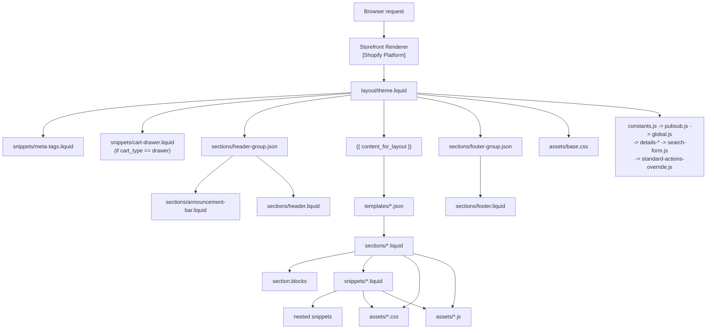
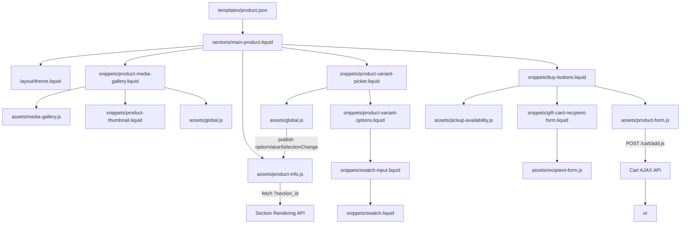
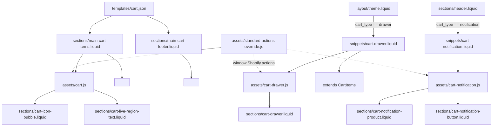
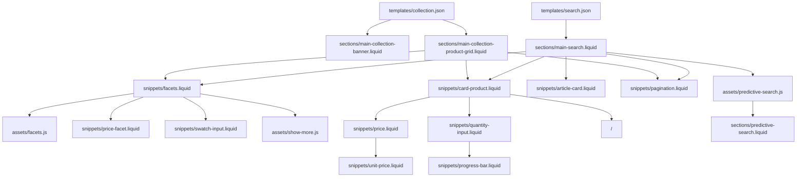
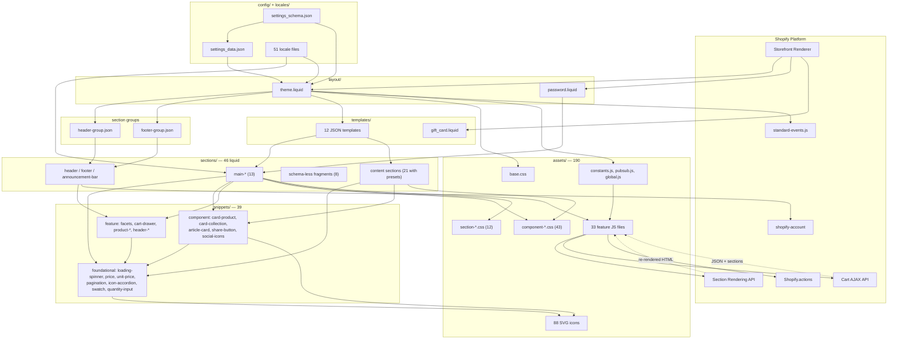
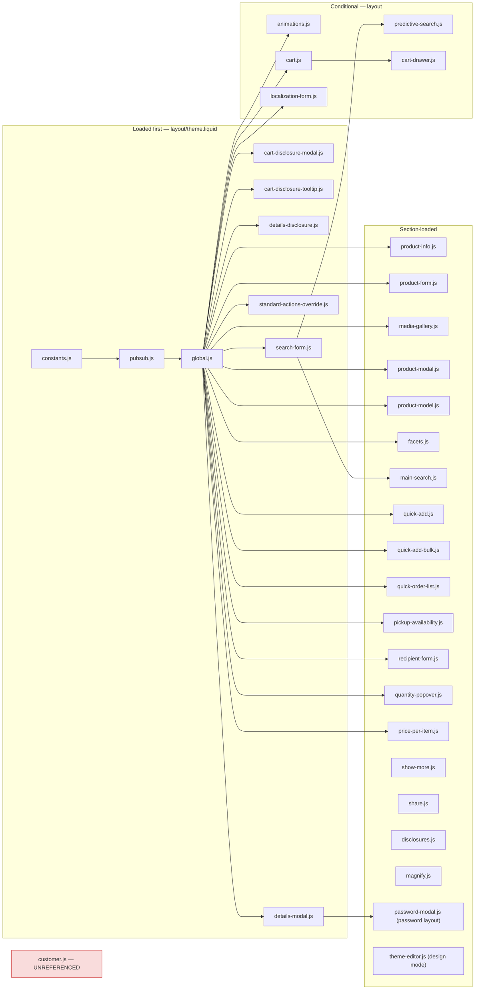

# Dawn Theme — Master Architecture Reference

> **Repository:** Shopify Dawn, version **16.0.0** (`config/settings_schema.json` → `theme_info.theme_version`)
> **Scope:** This document describes *this repository as it exists on disk*. Where behaviour comes from the Shopify platform rather than from code in this repo, it is labelled explicitly.

## Label legend

Throughout this document three labels distinguish the source of each claim:

| Label | Meaning |
| ----- | ------- |
| **[Repository]** | Directly implemented by a file in this repository. A path is always given. |
| **[Dawn Convention]** | A pattern characteristic of Dawn that this repo follows, but which is a convention rather than a platform requirement. |
| **[Shopify Platform]** | Behaviour provided by Shopify's Storefront Renderer / Liquid runtime / Theme Editor. Not implemented by this repo. |

Where something cannot be established from the code, this document says **"Not determinable from the repository."**

---

## Table of contents

1. [Executive Summary](#1-executive-summary)
2. [Technology Stack](#2-technology-stack)
3. [Complete Repository Structure](#3-complete-repository-structure)
4. [Directory-by-Directory Architecture](#4-directory-by-directory-architecture)
5. [File-Level Architecture](#5-file-level-architecture)
6. [Shopify Rendering Architecture](#6-shopify-rendering-architecture)
7. [Layout Architecture](#7-layout-architecture)
8. [Template Architecture](#8-template-architecture)
9. [Section Architecture](#9-section-architecture)
10. [Block Architecture](#10-block-architecture)
11. [Snippet Architecture](#11-snippet-architecture)
12. [Liquid Architecture](#12-liquid-architecture)
13. [Data Flow Architecture](#13-data-flow-architecture)
14. [Product Page Architecture](#14-product-page-architecture)
15. [Collection Architecture](#15-collection-architecture)
16. [Cart Architecture](#16-cart-architecture)
17. [Header & Navigation Architecture](#17-header--navigation-architecture)
18. [Footer Architecture](#18-footer-architecture)
19. [JavaScript Architecture](#19-javascript-architecture)
20. [Web Components Architecture](#20-web-components-architecture)
21. [CSS Architecture](#21-css-architecture)
22. [Theme Settings Architecture](#22-theme-settings-architecture)
23. [Section Schema Architecture](#23-section-schema-architecture)
24. [Localization Architecture](#24-localization-architecture)
25. [Asset Architecture](#25-asset-architecture)
26. [Image & Media Architecture](#26-image--media-architecture)
27. [Forms Architecture](#27-forms-architecture)
28. [AJAX / Fetch Architecture](#28-ajax--fetch-architecture)
29. [Accessibility Architecture](#29-accessibility-architecture)
30. [Responsive Design Architecture](#30-responsive-design-architecture)
31. [Dependency Graph](#31-dependency-graph)
32. [Page Rendering Maps](#32-page-rendering-maps)
33. [Theme Editor Architecture](#33-theme-editor-architecture)
34. [Extension & Customization Guide](#34-extension--customization-guide)
35. ["Where Should I Put This?" Guide](#35-where-should-i-put-this-guide)
36. [Anti-Patterns & Dangerous Changes](#36-anti-patterns--dangerous-changes)
37. [Common Modification Scenarios](#37-common-modification-scenarios)
38. [Development Workflow](#38-development-workflow)
39. [Testing & Validation](#39-testing--validation)
40. [Performance Architecture](#40-performance-architecture)
41. [Security Considerations](#41-security-considerations)
42. [Architecture Decision Summary](#42-architecture-decision-summary)
43. [Complete Dependency Map](#43-complete-dependency-map)
44. [Complete Request-to-UI Examples](#44-complete-request-to-ui-examples)
45. [New Developer Onboarding Guide](#45-new-developer-onboarding-guide)
46. [Architecture Cheat Sheet](#46-architecture-cheat-sheet)
47. [Glossary](#47-glossary)

---

## 1. Executive Summary

### What this project is

This repository is a **Shopify Online Store 2.0 theme** — the source of Shopify's reference theme, **Dawn 16.0.0**. It is not an application with a build step, a server, or a package manager. It is a directory of Liquid templates, JSON configuration, CSS, and vanilla JavaScript that Shopify's Storefront Renderer compiles into HTML on every request.

There is **no `package.json`, no `shopify.theme.toml`, no bundler config, and no `node_modules`** in this repository (verified: `git ls-files` returns 360 files across `assets/`, `config/`, `layout/`, `locales/`, `sections/`, `snippets/`, `templates/`, `.github/`, and six root files). Every file you edit is the file Shopify serves. **[Repository]**

### Architectural philosophy

`README.md` states the four principles the codebase is built around, and the code visibly follows them:

| Principle (from `README.md`) | How the code expresses it |
| --- | --- |
| **Server-rendered** | All HTML is produced by Liquid. `assets/*.js` never builds markup from JSON data — it re-fetches server-rendered HTML fragments and swaps them into the DOM (see `assets/cart.js:114`, `assets/product-info.js:122`, `assets/facets.js:115`). |
| **HTML-first, JavaScript-only-as-needed** | 36 JS files totalling 6,276 lines against 15,298 lines of section Liquid and 6,365 lines of snippet Liquid. |
| **Web-native, no framework** | 50 custom elements registered via `customElements.define`. No React/Vue/jQuery. No polyfills. |
| **Lean and progressively enhanced** | CSS is loaded per-section rather than in one global bundle; scripts are `defer`-loaded; features degrade to plain form POSTs when JS fails. |

### Major architectural layers

```text
                     +--------------------------------------+
   Browser request ->|  SHOPIFY STOREFRONT RENDERER         |  [Shopify Platform]
                     |  resolves route -> resource -> template|
                     +-------------------+------------------+
                                         |
                  +----------------------v----------------------+
                  |  LAYOUT      layout/theme.liquid            |  <html> shell, CSS vars,
                  |              layout/password.liquid         |  global JS, routes, i18n
                  +----------------------+----------------------+
                                         | {{ content_for_layout }}
                  +----------------------v----------------------+
                  |  TEMPLATE    templates/*.json  (12 files)   |  which sections, in what
                  |              templates/gift_card.liquid     |  order, with what settings
                  +----------------------+----------------------+
                                         |
            +----------------------------v----------------------------+
            |  SECTION GROUPS   sections/header-group.json             |  rendered by
            |                   sections/footer-group.json             |  
            +----------------------------+----------------------------+
                                         |
                  +----------------------v----------------------+
                  |  SECTIONS    sections/*.liquid  (46 files)   |   -> Editor
                  +-------+------------------------------+-------+
                          |                              |
            +-------------v-----------+   +--------------v-------------+
            |  BLOCKS                 |   |  SNIPPETS                  |
            |  section.blocks loop,   |   |  snippets/*.liquid         |
            |    |   |  (39 files)                |
            +-------------+-----------+   +--------------+-------------+
                          +--------------+---------------+
                                         |
                  +----------------------v----------------------+
                  |  LIQUID OBJECTS  product, collection, cart,  |  [Shopify Platform]
                  |  settings, section.settings, block.settings, |
                  |  routes, localization, request, paginate     |
                  +----------------------+----------------------+
                                         |
                  +----------------------v----------------------+
                  |  RENDERED HTML                              |
                  +----------------------+----------------------+
                                         |
            +----------------------------+----------------------------+
            |                                                         |
   +--------v-------------------+                +--------------------v----------+
   |  CSS  assets/*.css (65)    |                |  JS  assets/*.js (36)         |
   |  base.css + component-*    |                |  50 custom elements hydrate   |
   |  + section-* + template-*  |                |  the server-rendered markup   |
   +--------+-------------------+                +--------------------+----------+
            |                                                         |
            +----------------------------+----------------------------+
                                         |
                                +--------v--------+
                                |     BROWSER     |
                                +--------+--------+
                                         | user interaction
                                         v
                          fetch() -> Section Rendering API
                          or Cart AJAX API -> new HTML fragment
                          -> swapped into DOM -> loop back
```

### The one idea that explains most of the codebase

**Dawn never renders HTML in JavaScript.** When state changes — a variant is picked, a filter is applied, a cart line is updated — the client asks Shopify to re-render the *same section* with the new state and splices the returned HTML back into the page. This single pattern appears in `assets/cart.js`, `assets/cart-drawer.js`, `assets/cart-notification.js`, `assets/product-info.js`, `assets/facets.js`, `assets/quick-add.js`, `assets/quick-add-bulk.js`, `assets/quick-order-list.js`, `assets/predictive-search.js`, `assets/pickup-availability.js`, and `assets/global.js` (`ProductRecommendations`, `BulkModal`). Understand that loop and you understand Dawn. **[Dawn Convention]**

### Notable characteristics of *this* version

These distinguish Dawn 16.0.0 from older Dawn releases:

1. **Shopify Standard Events integration.** `layout/theme.liquid:32-51` imports `https://cdn.shopify.com/storefront/standard-events.js` as an ES module, exposes it as `window.StandardEvents`, and uses its factory to define two custom elements (`collection-component`, `product-component`). Liquid emits the payloads via the `standard_event_data` filter in 7 places.
2. **Shopify Standard Actions override.** `assets/standard-actions-override.js` (157 lines) reconfigures `window.Shopify.actions.openCart` / `updateCart` so that external (app- or API-driven) cart mutations refresh Dawn's cart sections correctly.
3. **New customer accounts only.** `sections/header.liquid:286-294` renders the platform-supplied `<shopify-account>` element. `release-notes.md` records that the legacy customer-account templates and sections were **removed**. Consequently `assets/customer.js` is present but **referenced by nothing** in the theme.
4. **Product disclosures.** `sections/disclosures.liquid`, `snippets/product-disclosures.liquid`, `snippets/cart-disclosure-indicator.liquid`, `assets/disclosures.js`, `assets/cart-disclosure-modal.js`, `assets/cart-disclosure-tooltip.js` render `product.metafields.shopify.disclosure.value`.
5. **No `blocks/` directory.** This repository does **not** use Shopify's theme-block system. Every block in this theme is a *section block* declared inside a section's ``. See [§10](#10-block-architecture).

---

## 2. Technology Stack

Every technology below was verified present in the repository.

| Technology | Where it lives | Architectural role |
| --- | --- | --- |
| **Shopify Liquid** | `layout/*.liquid`, `sections/*.liquid` (46), `snippets/*.liquid` (39), `templates/gift_card.liquid` | The entire rendering layer. All HTML originates here. |
| **JSON templates (OS 2.0)** | `templates/*.json` (12 files) | Declare which sections render on each page and in what order. Editable by the Theme Editor. |
| **JSON section groups** | `sections/header-group.json`, `sections/footer-group.json` | Editor-managed containers for header/footer sections, injected by `` in `layout/theme.liquid`. |
| **Section schemas** | `` block inside 38 of 46 `sections/*.liquid` | JSON contract that generates the Theme Editor UI. See [§23](#23-section-schema-architecture). |
| **JSON theme settings** | `config/settings_schema.json` (1,470 lines), `config/settings_data.json` (196 lines) | Global settings definition + current/preset values. |
| **Vanilla JavaScript (ES2020+)** | `assets/*.js` (36 files, 6,276 lines) | Progressive enhancement only. No modules, no imports between files — everything is a global script loaded with `defer`. |
| **Web Components / Custom Elements** | 50 elements across 20 JS files + `layout/theme.liquid` + `sections/header.liquid` | The exclusive mechanism for attaching behaviour to server-rendered markup. See [§20](#20-web-components-architecture). |
| **CSS (hand-written, no preprocessor)** | `assets/*.css` (65 files, 16,682 lines) | `base.css` is global; everything else is component- or section-scoped and loaded conditionally. |
| **CSS Custom Properties** | Generated in `` blocks in `layout/theme.liquid`, `layout/password.liquid`, `templates/gift_card.liquid`; consumed throughout `assets/*.css` | The bridge from theme settings to visual output. |
| **SVG icons (inlined)** | `assets/*.svg` (88 files), pulled in with the `inline_asset_content` filter (240 call sites) | Zero-request iconography. |
| **Shopify Section Rendering API** | Consumed by `assets/*.js` via `?section_id=` / `?sections=` query params | Server re-renders fragments for AJAX updates. **[Shopify Platform]** |
| **Shopify Cart AJAX API** | `routes.cart_add_url`, `cart_change_url`, `cart_update_url`, `cart_url` — surfaced to JS in `layout/theme.liquid:352-359` | All cart mutations. **[Shopify Platform]** |
| **Shopify Standard Events** | `layout/theme.liquid:32-51`, `standard_event_data` filter, `window.StandardEvents` consumers in `cart.js`, `product-form.js`, `facets.js`, `global.js`, `cart-notification.js` | Analytics / storefront event contract. **[Shopify Platform]**, wired up **[Repository]**. |
| **Shopify Standard Actions** | `assets/standard-actions-override.js` | Lets apps drive Dawn's cart UI. **[Shopify Platform]** bundle, override **[Repository]**. |
| **Localization (i18n)** | `locales/` — 31 storefront JSON files + 20 `*.schema.json` files (51 total) | `| t` filter, 637 call sites in Liquid. |
| **Theme Check** | `.theme-check.yml`, `.github/workflows/ci.yml` | Linting. Run via `shopify theme check`. |
| **Prettier** | `.prettierrc.json` | Formatting: `printWidth: 120`, `singleQuote: true` (but `false` for `*.liquid`). |
| **GitHub Actions** | `.github/workflows/ci.yml`, `cla.yml`, `stale.yml`; `.github/dependabot.yaml` | CI = Lighthouse audit + Theme Check on every push. |
| **Shopify CLI** | Not configured in-repo; documented in `README.md` | Dev server, push/pull, theme check. **[Shopify Platform]** tool. |

### External runtime dependencies (network-loaded, not vendored)

| Resource | Loaded from | Loaded by |
| --- | --- | --- |
| Standard Events bundle | `https://cdn.shopify.com/storefront/standard-events.js` | `layout/theme.liquid:33` |
| Model Viewer UI stylesheet | `https://cdn.shopify.com/shopifycloud/model-viewer-ui/assets/v1.0/model-viewer-ui.css` | `sections/main-product.liquid:62`, `sections/featured-product.liquid` |
| Shopify fonts CDN | `https://fonts.shopifycdn.com` (preconnect) | `layout/theme.liquid:17`, `layout/password.liquid` |
| QR code library | `{{ 'vendor/qrcode.js' \| shopify_asset_url }}` | `templates/gift_card.liquid:6` |
| Standard Actions bundle | Injected by Storefront Renderer as `window.Shopify.actions` | consumed by `assets/standard-actions-override.js` |

There are **no npm/vendored JS dependencies inside `assets/`**. Every `.js` file in `assets/` was written for this theme.

### Tooling that is referenced but absent

`README.md` links to `/.vscode/extensions.json`. **That file and the `.vscode/` directory do not exist in this repository.** If you want the Theme Check VS Code prompt described in the README, you must create it yourself. **[Repository — discrepancy]**

---

## 3. Complete Repository Structure

```text
dawn/
├── .github/
│   ├── ISSUE_TEMPLATE/
│   │   ├── Bug_issue.md
│   │   └── Feature_request.md
│   ├── workflows/
│   │   ├── ci.yml                 # Lighthouse CI + Theme Check on push
│   │   ├── cla.yml                # Contributor License Agreement bot
│   │   └── stale.yml              # Auto-closes inactive issues/PRs
│   ├── CODE_OF_CONDUCT.md
│   ├── CONTRIBUTING.md
│   ├── PULL_REQUEST_TEMPLATE.md
│   └── dependabot.yaml
│
├── assets/                        # 190 files — flat, no subdirectories
│   ├── *.js     (36)              # Custom elements + utilities
│   ├── *.css    (65)              # base.css + component-* + section-* + template-*
│   ├── *.svg    (88)              # Icons, inlined via inline_asset_content
│   └── sparkle.gif (1)
│
├── config/
│   ├── settings_schema.json       # 1,470 lines — global setting DEFINITIONS
│   └── settings_data.json         # 196 lines — current + preset VALUES
│
├── layout/
│   ├── theme.liquid               # Global shell for every storefront page
│   └── password.liquid            # Shell for the password page only
│
├── locales/                       # 51 files
│   ├── en.default.json            # Storefront strings (531 lines)  → {{ '...' | t }}
│   ├── en.default.schema.json     # Editor strings  (3,401 lines)  → "t:..." in schemas
│   ├── <lang>.json          (30)  # 30 further storefront translations
│   └── <lang>.schema.json   (19)  # 19 further editor translations
│
├── sections/                      # 48 files
│   ├── header-group.json          # Section group: announcement-bar + header
│   ├── footer-group.json          # Section group: footer
│   └── *.liquid             (46)  # 38 with , 8 without
│
├── snippets/                      # 39 .liquid files — reusable partials
│
├── templates/                     # 13 files
│   ├── 404.json
│   ├── article.json
│   ├── blog.json
│   ├── cart.json
│   ├── collection.json
│   ├── gift_card.liquid           # The only Liquid template; uses 
│   ├── index.json
│   ├── list-collections.json
│   ├── page.contact.json          # Alternate template for contact pages
│   ├── page.json
│   ├── password.json              # Declares "layout": "password"
│   ├── product.json
│   └── search.json
│
├── .gitignore
├── .prettierrc.json
├── .theme-check.yml
├── LICENSE.md
├── README.md
└── release-notes.md
```

### Directories Shopify supports that this repository does **not** contain

| Absent directory | Consequence |
| --- | --- |
| `blocks/` | No theme blocks. All blocks are section-scoped. **[Repository]** |
| `templates/customers/` | Legacy customer account pages removed in this version (`release-notes.md`). Account UI is the platform `<shopify-account>` element. |
| `templates/metaobject/` | No metaobject templates. |
| `assets/` subdirectories | `assets/` is flat — Shopify requires this. **[Shopify Platform]** |
| `.vscode/` | Referenced by `README.md` but not present. |

---

## 4. Directory-by-Directory Architecture

### 4.1 `layout/`

**Purpose.** The outermost HTML document. Exactly one layout wraps every page render.

**Contents.**

| File | Lines | When Shopify uses it |
| --- | --- | --- |
| `layout/theme.liquid` | ~390 | Default for every storefront page. **[Shopify Platform]** default resolution. |
| `layout/password.liquid` | ~250 | Used when `templates/password.json` sets `"layout": "password"`. |

**Depends on:** `config/settings_schema.json` (reads ~120 `settings.*` values), `snippets/meta-tags.liquid`, `snippets/cart-drawer.liquid`, `sections/header-group.json`, `sections/footer-group.json`, `sections/main-password-header.liquid`, `sections/main-password-footer.liquid`, `assets/base.css`, and 9–12 JS assets.

**Consumers:** every template. `templates/gift_card.liquid` opts out entirely with ``.

**Extension strategy.** Add a new layout only for a genuinely different document shell (e.g. a print view). Reference it from a JSON template with `"layout": "<name>"`. Adding a `<script>` or `<link>` here makes it global to *every* page — usually the wrong choice; prefer per-section loading (see [§21](#21-css-architecture)).

**What does not belong here:** page content, section markup, anything conditional on a single template.

---

### 4.2 `templates/`

**Purpose.** Declare *what* renders on each page type. In OS 2.0 templates carry no markup — they are ordered lists of section instances plus their saved settings.

**Contents.** 12 JSON templates + 1 Liquid template. Full inventory in [§8](#8-template-architecture).

**Depends on:** `sections/*.liquid` — every `"type"` value in a JSON template must match a section filename.

**Consumers:** the Storefront Renderer, which picks a template from the request path. **[Shopify Platform]**

**Extension strategy.**
- New page type variant → `templates/page.<suffix>.json` (this repo ships `page.contact.json` as the working example). Merchants then pick the suffix in the admin.
- New product/collection variant → `templates/product.<suffix>.json`, `templates/collection.<suffix>.json`.
- Never put Liquid markup in a JSON template — it will not parse. Use `sections/custom-liquid.liquid` if you need arbitrary Liquid on a page.

**Important caution.** `templates/*.json` files are **overwritten by the Theme Editor** whenever a merchant reorders or reconfigures sections on a live theme. Treat committed values as *initial defaults*, not as durable state.

---

### 4.3 `sections/`

**Purpose.** The unit of composition and of merchant configurability. A section is a Liquid file plus an optional `` that generates its Theme Editor UI.

**Contents.** 46 `.liquid` files + 2 section-group `.json` files.

Of the 46 Liquid sections:
- **38 have a ``** and are visible to the Theme Editor.
- **8 have no schema at all** and exist purely as render targets for the Section Rendering API or as includes:
  `cart-drawer.liquid` (1 line), `cart-live-region-text.liquid` (1 line), `cart-notification-button.liquid` (1 line), `cart-icon-bubble.liquid` (15 lines), `cart-notification-product.liquid` (59 lines), `main-404.liquid` (23 lines), `pickup-availability.liquid` (108 lines), `predictive-search.liquid` (268 lines). **[Repository]**

**Depends on:** `snippets/`, `assets/`, `locales/`, `config/settings_schema.json`.

**Consumers:** `templates/*.json`, `sections/*-group.json`, `layout/*.liquid` (via `` / ``), and JS via `?section_id=`.

**Extension strategy.** See [§37](#37-common-modification-scenarios). In short: create `sections/my-section.liquid`, add markup, add `` with `settings`, `blocks`, and a `presets` array (presets are what make a section addable in the Editor), scope CSS to `.section-{{ section.id }}`, and load assets from inside the section file.

**What does not belong here:** logic reused by three or more sections — that becomes a snippet.

---

### 4.4 `snippets/`

**Purpose.** Reusable, parameterised Liquid partials. Rendered with ``.

**Contents.** 39 files, 6,365 lines. Largest: `facets.liquid` (946), `card-product.liquid` (627), `cart-drawer.liquid` (594), `quick-order-list-row.liquid` (453), `product-media-gallery.liquid` (332).

**Depends on:** other snippets (see the dependency map in [§11](#11-snippet-architecture)), `assets/`, `locales/`.

**Consumers:** sections, other snippets, and `layout/theme.liquid` (which renders `meta-tags` and `cart-drawer`).

**Extension strategy.** Promote Liquid to a snippet when it is used in **two or more** places, or when a section exceeds a comfortable reading length. Document parameters in a header comment — every non-trivial snippet in this repo does. Note that `` creates an **isolated scope**: the snippet sees only `settings`, global objects, and the variables you pass explicitly. `section` and `block` are *not* automatically available unless passed (several snippets here rely on `section` being ambiently available because they are only ever called from a section — e.g. `snippets/product-variant-picker.liquid` uses `section.id` directly).

---

### 4.5 `assets/`

**Purpose.** Static files served from Shopify's CDN. Flat directory — subdirectories are not supported. **[Shopify Platform]**

**Contents (190 files).**

| Type | Count | Naming convention |
| --- | --- | --- |
| `.css` | 65 | `base.css`, `component-*.css`, `section-*.css`, `template-*.css`, plus a few unprefixed (`collage.css`, `quick-add.css`, `quick-order-list.css`, `quantity-popover.css`, `mask-blobs.css`, `newsletter-section.css`, `video-section.css`, `collapsible-content.css`) |
| `.js` | 36 | One file per component family; `global.js` holds shared utilities |
| `.svg` | 88 | `icon-*.svg` (icons), `mask-arch.svg`, `square.svg`, `loading-spinner.svg`, `email-signup-banner-background*.svg` |
| `.gif` | 1 | `sparkle.gif` |

**Referenced from:** Liquid via `{{ 'file' | asset_url }}`, `| stylesheet_tag`, `| inline_asset_content`, `| image_url`.

**Unreferenced assets found in this repository [Repository]:**
- `assets/customer.js` — no Liquid file references it. Consistent with `release-notes.md` removing legacy customer account pages.
- `assets/component-progress-bar.css` — no Liquid file references it. The live progress-bar styles are inside `assets/base.css` (section comment `/* Progress bar */`, around line 3604).

Both are safe to leave in place; both are candidates for deletion if you are trimming the theme.

**Extension strategy.** Add new files here and reference them from the *narrowest* scope that needs them — the section, not the layout.

---

### 4.6 `config/`

**Purpose.** Global theme settings.

| File | Role |
| --- | --- |
| `config/settings_schema.json` | **Definition.** 23 setting groups declaring ~120 settings. Committed by developers. |
| `config/settings_data.json` | **Values.** `"current"` (here the string `"Dawn"`, meaning "use the named preset") plus a `"presets"` object. Rewritten by the Theme Editor. |

**Consumers:** every Liquid file, via the `settings` global. 303 distinct `settings.*` references across `sections/`, `snippets/`, `layout/`.

**Extension strategy.** Add a setting object to a group in `settings_schema.json` with a unique `id`, `type`, `label` (usually a `t:` key), and `default`. It becomes `{{ settings.<id> }}` immediately. Add the label string to `locales/en.default.schema.json`.

**Danger.** `settings_data.json` is generated/overwritten by the Editor on a live theme. Never hand-edit it as a way of "configuring" a production theme; edit the schema defaults instead.

---

### 4.7 `locales/`

**Purpose.** All user-facing and Editor-facing strings.

**Two distinct file families:**

| Family | Count | Consumed by | Example key |
| --- | --- | --- | --- |
| `<lang>.json` | 31 | Liquid `{{ 'key' \| t }}` at runtime | `products.product.add_to_cart` |
| `<lang>.schema.json` | 20 | `"t:..."` strings inside `` and `config/settings_schema.json`, resolved by the Theme Editor | `t:sections.main-product.name` |

`en.default.json` and `en.default.schema.json` are the source of truth; the `.default` suffix marks the fallback locale. **[Shopify Platform]** convention.

Note the asymmetry: **31 storefront locales vs 20 schema locales.** Eleven languages (`bg`, `el`, `hr`, `hu`, `id`, `lt`, `ro`, `ru`, `sk`, `sl`, `vi`) have storefront translations but no Editor translations. `.theme-check.yml` disables the `MatchingTranslations` check, which is exactly why this passes CI. **[Repository]**

**Extension strategy.** Add the key to `locales/en.default.json` (storefront) or `locales/en.default.schema.json` (Editor) first. Other locales fall back to English automatically. **[Shopify Platform]**

---

### 4.8 `.github/`

Development-process only; never served. `ci.yml` is the meaningful file: it runs `shopify/lighthouse-ci-action@v1` against home/product/collection pages and `shopify/theme-check-action@v2` on every push.

---

## 5. File-Level Architecture

### 5.1 Layouts and configuration

| File | Responsibility | Used By | Depends On | Notes |
| --- | --- | --- | --- | --- |
| `layout/theme.liquid` | Global HTML shell: `<head>`, CSS custom properties from settings, global JS, `window.routes` / `window.*Strings`, header/footer groups, `{{ content_for_layout }}` | Every template except `gift_card` | `settings.*`, `snippets/meta-tags`, `snippets/cart-drawer`, `sections/header-group.json`, `sections/footer-group.json`, `assets/base.css`, 9 base JS files | Highest-blast-radius file in the repo |
| `layout/password.liquid` | Password-page shell | `templates/password.json` | `assets/section-password.css`, `assets/base.css`, `assets/component-list-social.css`, `global.js`, `details-modal.js`, `password-modal.js`, `sections/main-password-header`, `sections/main-password-footer` | Duplicates most of `theme.liquid`'s `` block; changes to design tokens must be made in both |
| `config/settings_schema.json` | Defines 23 setting groups (~120 settings) | Theme Editor, all Liquid | `locales/*.schema.json` for labels | `theme_info` group carries name/version/author |
| `config/settings_data.json` | Current + preset setting values | Storefront Renderer | `settings_schema.json` ids | Editor-owned; do not hand-edit on live themes |

### 5.2 Templates

| File | Resource | Sections (in order) |
| --- | --- | --- |
| `templates/index.json` | Home | `image-banner`, `featured-collection` |
| `templates/product.json` | Product | `main-product`, `disclosures`, `related-products` |
| `templates/collection.json` | Collection | `main-collection-banner`, `main-collection-product-grid` |
| `templates/cart.json` | Cart | `main-cart-items`, `main-cart-footer` |
| `templates/search.json` | Search | `main-search` |
| `templates/blog.json` | Blog | `main-blog` |
| `templates/article.json` | Article | `main-article` (4 blocks) |
| `templates/page.json` | Page | `main-page` |
| `templates/page.contact.json` | Page (contact suffix) | `main-page`, `contact-form` |
| `templates/list-collections.json` | Collections index | `main-list-collections` |
| `templates/404.json` | Not-found | `main-404` |
| `templates/password.json` | Password | `email-signup-banner`; sets `"layout": "password"` |
| `templates/gift_card.liquid` | Gift card | none — full standalone document, `` |

### 5.3 Architecturally significant sections

| File | Responsibility | Used By | Depends On | Notes |
| --- | --- | --- | --- | --- |
| `sections/main-product.liquid` (2,326 ln) | Entire product page body | `templates/product.json` | 11 snippets, 10 JS, 15 CSS | Largest file in the repo. 18 block types. `limit: 1` |
| `sections/featured-product.liquid` (1,565 ln) | Standalone product block for any page | Editor presets | Near-identical dependency set to `main-product` | Deliberate duplication of `main-product`; keep in sync |
| `sections/header.liquid` (687 ln) | Header, nav, search, cart icon, account, sticky behaviour | `sections/header-group.json` | 7 snippets, `cart-notification.js`, 6 CSS | Contains an inline `` block defining `sticky-header` |
| `sections/footer.liquid` (545 ln) | Footer menus, newsletter, social, payment icons, localization | `sections/footer-group.json` | `social-icons`, `country-localization`, `language-localization`, 5 CSS | 4 block types + `@app` |
| `sections/main-collection-product-grid.liquid` (416 ln) | Filterable, sortable, paginated product grid | `templates/collection.json` | `facets`, `card-product`, `pagination`, `loading-spinner`; `facets.js`, `quick-add*.js` | Wrapped in `<collection-component>` |
| `sections/main-search.liquid` (530 ln) | Search results (products + articles + pages) | `templates/search.json` | `facets`, `card-product`, `article-card`, `pagination`; `main-search.js`, `facets.js` | Hosts `<main-search>` and optionally `<predictive-search>` |
| `sections/main-cart-items.liquid` (507 ln) | Cart line items table | `templates/cart.json` | `cart-disclosure-indicator`, `loading-spinner`, `unit-price`; `cart.js`, `quantity-popover.js` | `id="main-cart-items"`, `.js-contents` are AJAX swap targets |
| `sections/main-cart-footer.liquid` (188 ln) | Subtotal, discounts, checkout button | `templates/cart.json` | `component-cart.css`, `component-totals.css` | `id="main-cart-footer"`, blocks: `subtotal`, `buttons`, `@app` |
| `sections/predictive-search.liquid` (268 ln) | Typeahead results markup | Fetched by `predictive-search.js` via `?section_id=predictive-search` | `loading-spinner`, `price` | **No schema** — never appears in the Editor |
| `sections/cart-icon-bubble.liquid` (15 ln) | Cart count badge | Fetched by every cart mutation path | none | **No schema**. The canonical "AJAX fragment section" |
| `sections/cart-drawer.liquid` (1 ln) | `` | Fetched via `?section_id=cart-drawer` | `snippets/cart-drawer.liquid` | Exists solely to make the drawer addressable by the Section Rendering API |
| `sections/pickup-availability.liquid` (108 ln) | Store pickup list for a variant | Fetched by `pickup-availability.js` | none | **No schema** |
| `sections/disclosures.liquid` (77 ln) | Product disclosure metafield display | `templates/product.json` | `snippets/product-disclosures` | `enabled_on.templates: ["product"]` |
| `sections/related-products.liquid` (256 ln) | Product recommendations | `templates/product.json` | `card-product`; `<product-recommendations>` | Lazily fetched on scroll |
| `sections/custom-liquid.liquid` | Renders merchant-authored Liquid from a setting | Editor presets | none | `{{ section.settings.custom_liquid }}` — see [§41](#41-security-considerations) |
| `sections/apps.liquid` | Container for `@app` blocks | Editor presets | none | The supported way to host app blocks |

### 5.4 High-reuse snippets

Ordered by number of render call sites across `sections/` + `snippets/` + `layout/`:

| Snippet | Call sites | Responsibility | Key parameters |
| --- | --- | --- | --- |
| `loading-spinner.liquid` | 22 | Inline SVG spinner | `class` |
| `price.liquid` | 8 | Price, compare-at, badges, unit price | `product`, `use_variant`, `show_badges`, `price_class` |
| `unit-price.liquid` | 8 | Unit-price line | `price`, `measurement` |
| `card-product.liquid` | 8 | The product card | `card_product`, `media_aspect_ratio`, `image_shape`, `show_secondary_image`, `show_vendor`, `show_rating`, `quick_add`, `section_id`, `skip_styles`, `lazy_load`, `horizontal_class`, `placeholder_image`, `product_view_context` |
| `pagination.liquid` | 7 | Paginator nav | `paginate`, `anchor` |
| `icon-accordion.liquid` | 6 | Maps an icon setting name to an inline SVG | `icon` |
| `card-collection.liquid` | 5 | Collection card | `card_collection`, `columns`, `media_aspect_ratio` |
| `swatch-input.liquid` | 4 | Radio/checkbox swatch input | `swatch`, `shape`, `input_*` |
| `social-icons.liquid` | 4 | Social link list from global settings | `class` |
| `share-button.liquid` | 4 | Web Share API + copy-link fallback | `block`, `share_link` |
| `product-variant-options.liquid` | 4 | `<option>` / `<input>` per option value | `product`, `option`, `block`, `picker_type` |
| `country-localization.liquid` / `language-localization.liquid` | 4 each | Country / language selector bodies | `localPosition` |
| `article-card.liquid` | 4 | Blog article card | `article`, `media_height`, `show_image`, `show_date`, `show_author` |

### 5.5 Core JavaScript files

| File | Lines | Responsibility | Depends On (globals) | DOM / API interaction |
| --- | --- | --- | --- | --- |
| `assets/global.js` | 1,440 | Shared utilities + 11 custom elements + `Shopify.*` helpers + `CartPerformance` | `pubsub.js`, `constants.js` | Focus trapping, media pause, `fetch` for recommendations and bulk modal |
| `assets/constants.js` | 9 | `ON_CHANGE_DEBOUNCE_TIMER`, `PUB_SUB_EVENTS` | — | none |
| `assets/pubsub.js` | 25 | `subscribe()` / `publish()` returning `Promise.all` | — | none |
| `assets/cart.js` | 415 | `cart-items`, `cart-drawer-items` base, `cart-remove-button`, `cart-note` | `global.js`, `pubsub.js`, `window.routes` | `POST /cart/change.js`, `GET /cart?section_id=` |
| `assets/cart-drawer.js` | 142 | `cart-drawer`, `cart-drawer-items` | `cart.js`, `global.js` | Drawer open/close, focus trap, section swap |
| `assets/cart-notification.js` | 112 | `cart-notification` popup | `global.js` | `GET /cart.json` |
| `assets/product-form.js` | 192 | `product-form` — add to cart | `global.js`, `pubsub.js`, `constants.js` | `POST /cart/add.js` with `sections` |
| `assets/product-info.js` | 445 | `product-info` — variant change orchestration | `global.js`, `pubsub.js` | `GET <product-url>?section_id=&option_values=` |
| `assets/facets.js` | 442 | `facet-filters-form`, `price-range`, `facet-remove` | `global.js` | `GET <path>?section_id=&<filters>`, History API |
| `assets/predictive-search.js` | 303 | `predictive-search` typeahead | `search-form.js`, `global.js` | `GET /search/suggest?...&section_id=predictive-search` |
| `assets/standard-actions-override.js` | 157 | Bridges Shopify Standard Actions to Dawn's cart DOM | `window.Shopify.actions`, `pubsub.js`, `window.routes` | `GET /cart.js?sections=` |
| `assets/quick-order-list.js` | 500 | `quick-order-list`, `quick-order-list-remove-all-button` | `global.js` (`BulkAdd`) | `POST /cart/update.js`, paginated section fetch |
| `assets/quick-add.js` | 124 | `quick-add-modal` | `global.js` (`ModalDialog`) | Fetches full product page, extracts `product-info` |
| `assets/quick-add-bulk.js` | 206 | `quick-add-bulk` | `global.js` (`BulkAdd`) | `POST /cart/update.js` |
| `assets/media-gallery.js` | 117 | `media-gallery` | `global.js` (`SliderComponent`) | Slide sync, live region announcements |
| `assets/animations.js` | 102 | Scroll-reveal + zoom-in via `IntersectionObserver` | `global.js` (`throttle`) | Conditionally loaded by `settings.animations_reveal_on_scroll` |
| `assets/theme-editor.js` | 54 | Handles `shopify:*` Editor events | — | Only loaded when `request.design_mode` |
| `assets/customer.js` | 85 | `CustomerAddresses` — legacy account address form | — | **Unreferenced** in this version |

---

## 6. Shopify Rendering Architecture

### 6.1 The full lifecycle

```text
 1. Browser requests  https://shop.example.com/products/blue-shirt
                 |
 2. [Shopify Platform] Storefront Renderer resolves the route:
                 |    - resource: product with handle "blue-shirt"
                 |    - template: templates/product.json
                 |      (or templates/product.<suffix>.json if the product names one)
                 v
 3. Layout selected. The JSON template may declare "layout"; product.json
    does not, so the default layout/theme.liquid is used.
                 |
 4. layout/theme.liquid renders top-to-bottom:
    a. <head>: meta, , standard-events module,
       9 deferred <script> tags, {{ content_for_header }},
        block generating ~100 CSS custom properties from settings,
       base.css, conditional CSS (cart drawer, predictive search, localization)
    b. <body>: skip link, optional ,
       
                 v
 5.  reads sections/header-group.json and renders
    its "order": announcement-bar, then header.
                 v
 6. {{ content_for_layout }} expands to the template's sections in "order":
       main -> sections/main-product.liquid
       disclosures -> sections/disclosures.liquid
       related-products -> sections/related-products.liquid
                 v
 7. Inside sections/main-product.liquid:
    a. CSS <link>s and <script defer>s are emitted inline
    b.  emits .section-<id>-padding rules
    c. 
    d.  ... dispatch
       to inline markup or to snippets (product-variant-picker, buy-buttons,
       price, share-button, product-disclosures, icon-with-text, ...)
                 v
 8. Snippets render, some rendering further snippets
    (product-variant-picker -> product-variant-options -> swatch-input -> swatch)
                 v
 9.  renders sections/footer.liquid
                 v
10. Layout tail: hidden a11y live-region <ul>, window.routes +
    window.cartStrings + window.variantStrings + window.quickOrderListStrings +
    window.accessibilityStrings, conditional predictive-search.js / cart-drawer.js
                 v
11. HTML sent to browser. CSS applies. Deferred scripts execute in order,
    registering 50 custom elements.
                 v
12. Custom elements upgrade in place. <product-info>, <variant-selects>,
    <product-form>, <media-gallery> etc. attach listeners to already-rendered DOM.
                 v
13. User interacts -> fetch() -> Section Rendering API -> HTML fragment
    -> DOM swap -> publish() -> other components react. Loop.
```

### 6.2 What each layer contributes

| Layer | File(s) | Contributes | Owned by |
| --- | --- | --- | --- |
| Route → resource | — | `product`, `collection`, `article`, `blog`, `page`, `cart`, `search` globals | **[Shopify Platform]** |
| Route → template | `templates/*.json` | The section list | **[Repository]** + Editor |
| Layout | `layout/theme.liquid` | Document shell, design tokens, global JS/CSS, JS-visible strings and routes | **[Repository]** |
| Section group | `sections/*-group.json` | Header/footer composition | **[Repository]** + Editor |
| Section | `sections/*.liquid` | Page region markup + `section.settings` + `section.blocks` | **[Repository]** |
| Block | `.blocks` | Repeatable, orderable sub-units | **[Repository]** + Editor |
| Snippet | `snippets/*.liquid` | Reusable markup | **[Repository]** |
| Liquid objects | — | Store data | **[Shopify Platform]** |
| Asset | `assets/*` | CSS, JS, SVG | **[Repository]** |

### 6.3 Section Rendering API — the second rendering path

Beyond the initial page render, Shopify can re-render a *single section* on demand. **[Shopify Platform]** This repository consumes it in two forms:

**Form A — `?section_id=<id>` on any storefront URL.** Returns the section's HTML.

```javascript
// assets/cart.js:114
fetch(`${routes.cart_url}?section_id=cart-drawer`)
// assets/product-info.js:160
params.push(`section_id=${this.sectionId}`);
// assets/facets.js:51
const url = `${window.location.pathname}?section_id=${section.section}&${searchParams}`;
// assets/pickup-availability.js:22
const variantSectionUrl = `${rootUrl}variants/${variantId}/?section_id=pickup-availability`;
```

**Form B — `sections=` parameter on Cart AJAX API calls.** Returns a `sections` object in the JSON response.

```javascript
// assets/cart.js:176-181
const body = JSON.stringify({
  line, quantity,
  sections: sectionsToRender.map((section) => section.section),
  sections_url: window.location.pathname,
});
fetch(`${routes.cart_change_url}`, { ...fetchConfig(), ...{ body } })
```

The `getSectionsToRender()` method is the theme-side contract for Form B. It is implemented on `cart-items` (`assets/cart.js:141`), `cart-drawer-items` (`assets/cart-drawer.js:126`), `cart-drawer` (`assets/cart-drawer.js:103`), and `cart-notification` (`assets/cart-notification.js:82`), and is read by `assets/product-form.js:36` and `assets/standard-actions-override.js:44`. **[Repository]**

This is why sections like `cart-icon-bubble.liquid` and `cart-live-region-text.liquid` exist as one-to-fifteen-line schema-less files: they are *addressable fragments*, not Editor-visible page regions.

---

## 7. Layout Architecture

### 7.1 `layout/theme.liquid` — the application shell

Structurally the file divides into eight responsibilities.

**(1) Document head and SEO.** Charset, viewport, canonical, favicon from `settings.favicon`, a composed `<title>` that appends current tags / page number / shop name, `page_description`, and `` for Open Graph and Twitter cards.

**(2) Standard Events bootstrap** (`layout/theme.liquid:32-51`). An inline ES module — the only `type="module"` script in the theme:

```html
<script type="module">
  import * as StandardEvents from 'https://cdn.shopify.com/storefront/standard-events.js';
  window.StandardEvents = StandardEvents;
  customElements.define('collection-component', StandardEvents.createViewEventElement());
  customElements.define(
    'product-component',
    StandardEvents.createViewEventElement(HTMLElement, { defaultTrigger: 'intersect' }),
  );
  document.addEventListener('DOMContentLoaded', () => {
    const template = document.querySelector('main[data-template]')?.dataset.template || '';
    document.dispatchEvent(new StandardEvents.PageViewEvent({ page: { template, ... } }));
  }, { once: true });
</script>
```

Two of the theme's 50 custom elements are defined here, not in `assets/`. Their payloads come from the `standard_event_data` Liquid filter (7 call sites). **[Repository]** wiring of a **[Shopify Platform]** contract.

**(3) Base script loading** (lines 53-65). Nine `defer` scripts, in dependency order:

```text
constants.js  ->  pubsub.js  ->  global.js  ->  cart-disclosure-modal.js
              ->  cart-disclosure-tooltip.js  ->  details-disclosure.js
              ->  details-modal.js  ->  search-form.js  ->  standard-actions-override.js
```

Order matters. `defer` guarantees execution in document order, and later files reference earlier globals (`global.js` needs `PUB_SUB_EVENTS` from `constants.js`; `details-disclosure.js` subclasses nothing but `main-search.js` later subclasses `SearchForm` from `search-form.js`). **This is the theme's entire module system.** **[Dawn Convention]**

Conditionally, `animations.js` is added when `settings.animations_reveal_on_scroll` is on.

**(4) `{{ content_for_header }}`** — Shopify injects analytics, app scripts, and the Standard Actions bundle here. **[Shopify Platform]** Must never be removed.

**(5) The `` design-token block** (lines 70-300). The single most architecturally important block in the theme. It converts theme settings into CSS custom properties:

- **Font faces** via `font_face` for body, bold, italic, bold-italic, and heading.
- **Colour schemes.** A `` loop emits a `.color-<scheme.id>` class per scheme, each defining `--color-background`, `--gradient-background`, `--color-foreground`, `--color-background-contrast`, `--color-shadow`, `--color-button`, `--color-button-text`, `--color-secondary-button`, `--color-secondary-button-text`, `--color-link`, `--color-badge-*`, `--payment-terms-background-color`. The first scheme also targets `:root`.
- **Auto-contrast.** `--color-background-contrast` is computed in Liquid, not CSS:

  ```liquid
  assign background_color_brightness = background_color | color_brightness
  if background_color_brightness <= 26
    assign background_color_contrast = background_color | color_lighten: 50
  elsif background_color_brightness <= 65
    assign background_color_contrast = background_color | color_lighten: 5
  else
    assign background_color_contrast = background_color | color_darken: 25
  endif
  ```

- **A `:root` block** defining roughly 90 further tokens: typography scales, page width, and full border/radius/shadow token sets for product cards, collection cards, blog cards, badges, popups, drawers, text boxes, buttons, inputs, variant pills, media, and grid/section spacing.
- **A minimal reset**: `box-sizing`, `html { font-size: calc(var(--font-body-scale) * 62.5%) }` (so `1rem` ≈ 10px scaled by the merchant's body-size setting), and a flex-column `body`.

Note the RGB-triplet convention: colours are emitted as `R,G,B` (not `rgb(...)`) so CSS can compose alpha — `rgba(var(--color-foreground), 0.75)`. This appears throughout `assets/*.css`. **[Dawn Convention]**

**(6) Stylesheet loading** (lines 302-330).

```liquid
{{ 'base.css' | asset_url | stylesheet_tag }}
<link rel="stylesheet" href="{{ 'component-cart-items.css' | asset_url }}" media="print" onload="this.media='all'">


  {{ 'component-cart-drawer.css' | asset_url | stylesheet_tag }}
  {{ 'component-cart.css' | asset_url | stylesheet_tag }}
  {{ 'component-totals.css' | asset_url | stylesheet_tag }}
  {{ 'component-price.css' | asset_url | stylesheet_tag }}
  {{ 'component-discounts.css' | asset_url | stylesheet_tag }}

```

Only `base.css` is render-blocking. `media="print" onload="this.media='all'"` is the theme's async-CSS idiom. Fonts are preloaded unless the merchant chose a system font. Localization CSS/JS load only if more than one country or language is available; predictive-search CSS only if the setting is on.

**(7) Design-mode flag.**

```html
<script>
  if (Shopify.designMode) { document.documentElement.classList.add('shopify-design-mode'); }
</script>
```

**(8) Body.** Skip link → optional cart drawer → `` → `<main id="MainContent" data-template="{{ template.name }}">{{ content_for_layout }}</main>` → `` → hidden a11y message list → the JS globals block.

The **JS globals block** (lines 348-390) is the Liquid→JavaScript bridge. It is the *only* sanctioned way for JS to learn about routes and localized strings:

```javascript
window.shopUrl = '{{ request.origin }}';
window.routes = { cart_add_url, cart_change_url, cart_update_url, cart_url, predictive_search_url };
window.cartStrings = { error, quantityError };
window.variantStrings = { addToCart, soldOut, unavailable, unavailable_with_option };
window.quickOrderListStrings = { itemsAdded, itemAdded, itemsRemoved, itemRemoved, viewCart, each, min_error, max_error, step_error };
window.accessibilityStrings = { imageAvailable, shareSuccess, pauseSlideshow, playSlideshow, recipientFormExpanded, recipientFormCollapsed, countrySelectorSearchCount };
```

Placeholders such as `[quantity]`, `[value]`, `[index]`, `[min]` are substituted client-side with `String.replace` (e.g. `assets/cart.js:88`, `assets/media-gallery.js:88`). **[Repository]**

### 7.2 `layout/password.liquid`

Same shape, smaller surface. Differences from `theme.liquid`:

| Aspect | `theme.liquid` | `password.liquid` |
| --- | --- | --- |
| `<html>` classes | `js` | `js full-height` |
| Title | Composed with tags/page/shop | Just `{{ shop.name }}` |
| Standard Events | Yes | No |
| Scripts | 9 base + conditionals | 3: `global.js`, `details-modal.js`, `password-modal.js` |
| Stylesheets | `base.css` + conditionals | `section-password.css`, `base.css`, `component-list-social.css` |
| Sections | `` / `'footer-group'` | `` / `'main-password-footer'` (singular tag — not groups) |
| Design tokens | Full set incl. `--color-background-contrast`, popup/drawer tokens, `--font-body-weight-bold` | Subset — **no** `--color-background-contrast`, no popup/drawer/variant-pill-adjacent extras |

**Maintenance risk:** the two `` blocks are near-duplicates. A new design token added to `theme.liquid` will be `undefined` on the password page unless added to `password.liquid` too. **[Repository]**

### 7.3 `` — the third path

`templates/gift_card.liquid:1` opts out of layouts entirely and emits its own `<!doctype html>` through `</html>`, with a third copy of a reduced `` token block. It loads `assets/template-giftcard.css` and pulls `vendor/qrcode.js`, `gift-card/card.svg`, and `gift-card/add-to-apple-wallet.svg` from `shopify_asset_url`. **[Repository]**

---

## 8. Template Architecture

### 8.1 JSON vs Liquid templates

| | JSON template | Liquid template |
| --- | --- | --- |
| Files here | 12 | 1 (`templates/gift_card.liquid`) |
| Contains | `sections`, `order`, optional `layout` | Arbitrary Liquid/HTML |
| Editor-editable | Yes — add/remove/reorder sections, edit settings | No |
| Written back by Editor | Yes | No |
| Use when | Any merchant-facing page | The page must not participate in section composition |

**[Shopify Platform]** resolves `templates/<type>.json` before `templates/<type>.liquid`; only one may exist per type.

### 8.2 Anatomy of a JSON template

```jsonc
{
  "sections": {
    "main": {                        // instance id, arbitrary but must be unique
      "type": "main-product",        // must match sections/main-product.liquid
      "blocks": {
        "vendor": {                  // block instance id
          "type": "text",            // must match a type in the section's schema.blocks
          "settings": { "text": "{{ product.vendor }}", "text_style": "uppercase" }
        }
      },
      "block_order": ["vendor", "title", "price", ...],
      "settings": { "enable_sticky_info": true, "media_position": "left", ... }
    }
  },
  "order": ["main", "disclosures", "related-products"]   // render order
}
```

Note the `"{{ product.vendor }}"` value in `templates/product.json` — a **dynamic source**. The Editor stores a Liquid expression as the setting value and the platform evaluates it at render time. **[Shopify Platform]**

### 8.3 Template inventory in detail

#### `templates/index.json` — Home

Two sections: `image_banner` (with `heading` and `buttons` blocks; `heading_size: "h0"`, `color_scheme: "scheme-3"`, `image_height: "large"`) and `featured_collection` (8 products, 4 desktop columns, `show_view_all: true`, sourced from the `all` collection). Everything here is a starting point a merchant will replace.

#### `templates/product.json` — Product

Three sections. `main` (`main-product`) carries eight blocks in `block_order`:

```text
vendor -> title -> price -> variant_picker -> quantity_selector -> buy_buttons -> description -> share
```

Section settings of note: `enable_sticky_info: true`, `media_position: "left"`, `gallery_layout: "stacked"`, `media_size: "large"`, `image_zoom: "lightbox"`, `mobile_thumbnails: "hide"`, `hide_variants: true`. Then `disclosures` and `related-products` follow.

#### `templates/collection.json` — Collection

`banner` (`main-collection-banner`, description shown, image hidden) then `product-grid` (`main-collection-product-grid`: 16 per page, 4 desktop / 2 mobile columns, `enable_filtering: true`, `filter_type: "horizontal"`, `enable_sorting: true`, `quick_add: "none"`).

#### `templates/cart.json` — Cart

`cart-items` (`main-cart-items`) then `cart-footer` (`main-cart-footer` with `subtotal` and `buttons` blocks). Both section instance ids are referenced indirectly by `assets/cart.js` — but through the DOM ids `main-cart-items` / `main-cart-footer` set in the section markup and `data-id="{{ section.id }}"`, not through the JSON keys.

#### `templates/search.json` — Search

One `main-search` section combining product results, article results, faceting, and sorting.

#### `templates/blog.json` / `templates/article.json`

`blog.json`: `main-blog` with `layout: "collage"`, images on, dates on, authors off.
`article.json`: `main-article` with four blocks — `featured_image` (`image_height: "adapt"`), `title` (date on, author off), `share`, `content`.

#### `templates/page.json` / `templates/page.contact.json`

`page.json` is just `main-page`. `page.contact.json` demonstrates **suffix templates**: `main-page` followed by `contact-form`. A merchant assigns the "contact" template to a page in the admin. This is the pattern to copy for any alternate page layout. **[Repository]**

#### `templates/list-collections.json`

`main-list-collections`, alphabetical sort, square images, 3 desktop / 2 mobile columns.

#### `templates/404.json`

`main-404` only — a schema-less section, so nothing is configurable here.

#### `templates/password.json`

The only template that overrides the layout:

```json
{ "layout": "password", "sections": { "main": { "type": "email-signup-banner", ... } }, "order": ["main"] }
```

`sections/email-signup-banner.liquid` declares `"enabled_on": { "templates": ["password"] }`, so the Editor will not offer it anywhere else.

#### `templates/gift_card.liquid`

Standalone document. See [§7.3](#73--layout-none----the-third-path).

### 8.4 Section groups as pseudo-templates

`sections/header-group.json` and `sections/footer-group.json` are structurally identical to JSON templates but add `"name"` and `"type"` keys:

```json
{
  "name": "t:sections.header.name",
  "type": "header",
  "sections": { "announcement-bar": { ... }, "header": { ... } },
  "order": ["announcement-bar", "header"]
}
```

They are rendered by `` / `` in `layout/theme.liquid:333,345`. Because they live in the layout, their content appears on every page while remaining merchant-editable. Sections opt in/out of groups with `enabled_on.groups` / `disabled_on.groups` — see [§9.3](#93-template-and-group-gating).

---

## 9. Section Architecture

### 9.1 Categorised inventory

**Layout / chrome (rendered from section groups)**

| Section | Schema | Blocks | Presets | Key dependencies |
| --- | --- | --- | --- | --- |
| `header.liquid` | yes | `@app` | no | `header-drawer`, `header-dropdown-menu`, `header-mega-menu`, `header-search`, `cart-notification`, `country-localization`, `language-localization`; `cart-notification.js`; inline `` `sticky-header` |
| `announcement-bar.liquid` | yes, `enabled_on.groups: ["header"]` | `announcement` | yes | `country-localization`, `language-localization`, `social-icons`; `theme-editor.js` |
| `footer.liquid` | yes | `link_list`, `brand_information`, `text`, `image`, `@app` | no | `social-icons`, `country-localization`, `language-localization` |

**Page-specific "main" sections** (one per template; all `limit: 1` where a limit is declared)

| Section | Template | Blocks | Notes |
| --- | --- | --- | --- |
| `main-product.liquid` | product | 18 types | `limit: 1`, `tag: "section"` |
| `main-collection-banner.liquid` | collection | — | no `tag` |
| `main-collection-product-grid.liquid` | collection | — | hosts faceting |
| `main-cart-items.liquid` | cart | — | AJAX target |
| `main-cart-footer.liquid` | cart | `subtotal`, `buttons`, `@app` | `limit: 1` |
| `main-search.liquid` | search | — | `tag: "section"` |
| `main-blog.liquid` | blog | — | — |
| `main-article.liquid` | article | `featured_image`, `title`, `content`, `share`, `@app` | `limit: 1` |
| `main-page.liquid` | page | — | `tag: "section"` |
| `main-list-collections.liquid` | list-collections | — | — |
| `main-404.liquid` | 404 | — | **no schema** |
| `main-password-header.liquid` | password | — | rendered by `layout/password.liquid` |
| `main-password-footer.liquid` | password | — | rendered by `layout/password.liquid` |

**Reusable content sections (have `presets`, so merchants can add them anywhere)**

`collage.liquid`, `collapsible-content.liquid`, `collection-list.liquid`, `contact-form.liquid`, `custom-liquid.liquid`, `email-signup-banner.liquid`, `featured-blog.liquid`, `featured-collection.liquid`, `featured-product.liquid`, `image-banner.liquid`, `image-with-text.liquid`, `multicolumn.liquid`, `multirow.liquid`, `newsletter.liquid`, `page.liquid`, `rich-text.liquid`, `slideshow.liquid`, `video.liquid`, `apps.liquid`, `disclosures.liquid`, `quick-order-list.liquid`

**Product-page-scoped sections** (`enabled_on.templates: ["product"]`)

`disclosures.liquid`, `quick-order-list.liquid`, `bulk-quick-order-list.liquid`

**Utility / AJAX-fragment sections (no schema — invisible to the Editor)**

| Section | Lines | Fetched as |
| --- | --- | --- |
| `cart-drawer.liquid` | 1 | `?section_id=cart-drawer` |
| `cart-icon-bubble.liquid` | 15 | `sections=cart-icon-bubble` |
| `cart-live-region-text.liquid` | 1 | `sections=cart-live-region-text` |
| `cart-notification-button.liquid` | 1 | `sections=cart-notification-button` |
| `cart-notification-product.liquid` | 59 | `sections=cart-notification-product` |
| `predictive-search.liquid` | 268 | `?section_id=predictive-search` |
| `pickup-availability.liquid` | 108 | `?section_id=pickup-availability` |
| `main-404.liquid` | 23 | rendered by `templates/404.json` |
| `related-products.liquid` (has schema) | 256 | `routes.product_recommendations_url` |

### 9.2 The anatomy every schema'd section shares

Nearly every section in this repo follows the same five-part shape. `sections/main-collection-product-grid.liquid` is representative:

```liquid
{# 1. CSS — unconditional then conditional #}
{{ 'template-collection.css' | asset_url | stylesheet_tag }}
{{ 'component-card.css' | asset_url | stylesheet_tag }}

  {{ 'mask-blobs.css' | asset_url | stylesheet_tag }}


{# 2. JS — conditional on settings #}

  <script src="{{ 'quick-add.js' | asset_url }}" defer="defer"></script>
  <script src="{{ 'product-form.js' | asset_url }}" defer="defer"></script>


{# 3. Per-instance padding, scoped by section.id #}

  .section-{{ section.id }}-padding {
    padding-top: {{ section.settings.padding_top | times: 0.75 | round: 0 }}px;
    padding-bottom: {{ section.settings.padding_bottom | times: 0.75 | round: 0 }}px;
  }
  @media screen and (min-width: 750px) {
    .section-{{ section.id }}-padding {
      padding-top: {{ section.settings.padding_top }}px;
      padding-bottom: {{ section.settings.padding_bottom }}px;
    }
  }


{# 4. Markup #}
<div class="section-{{ section.id }}-padding gradient color-{{ section.settings.color_scheme }}">...</div>

{# 5. Schema #}
{ ... }
```

**31 of the 46 sections contain a `` block**, almost all of them for exactly this padding pattern. The `times: 0.75` on mobile and full value at `min-width: 750px` is a theme-wide convention. **[Dawn Convention]**

Three further conventions visible in the markup:

- `color-{{ section.settings.color_scheme }}` applies one of the scheme classes generated in `layout/theme.liquid`.
- `gradient` is a companion class from `assets/base.css` that paints `--gradient-background`.
- `scroll-trigger animate--slide-in` / `animate--fade-in` are appended when `settings.animations_reveal_on_scroll` is on, and are picked up by `assets/animations.js`.

### 9.3 Template and group gating

Sections restrict where the Editor may place them:

```json
"enabled_on":  { "templates": ["product"] }        // disclosures, quick-order-list, bulk-quick-order-list
"enabled_on":  { "templates": ["password"] }       // email-signup-banner
"enabled_on":  { "groups": ["header"] }            // announcement-bar
"disabled_on": { "groups": ["header", "footer"] }  // 12 content sections
"disabled_on": { "groups": ["header"] }            // newsletter
```

Full list (verified against every schema in `sections/`):

| Gate | Sections |
| --- | --- |
| `enabled_on.templates: ["product"]` | `bulk-quick-order-list`, `disclosures`, `quick-order-list` |
| `enabled_on.templates: ["password"]` | `email-signup-banner` |
| `enabled_on.groups: ["header"]` | `announcement-bar` |
| `disabled_on.groups: ["header","footer"]` | `collage`, `collapsible-content`, `collection-list`, `contact-form`, `featured-blog`, `featured-collection`, `featured-product`, `image-banner`, `image-with-text`, `multicolumn`, `multirow`, `page`, `rich-text`, `slideshow`, `video` |
| `disabled_on.groups: ["header"]` | `newsletter` |

### 9.4 Section instance limits

```json
"limit": 1   // bulk-quick-order-list, email-signup-banner, featured-product, image-banner,
             // image-with-text, main-article, main-cart-footer, main-product, newsletter,
             // quick-order-list
"limit": 3   // rich-text
"limit": 5   // slideshow
```

`limit` caps how many instances of a section may exist per template. **[Shopify Platform]** enforcement.

### 9.5 `tag` and `class`

```json
"tag": "section",
"class": "section"
```

Twenty-three sections declare `"tag": "section"`, which makes Shopify wrap the section in `<section class="shopify-section ...">` instead of the default `<div>`. Sections that must not introduce a landmark (header, footer, cart pieces, collection grid) omit it. **[Shopify Platform]** wrapper, **[Repository]** choice.

### 9.6 Detailed profile: `sections/main-product.liquid`

| Aspect | Detail |
| --- | --- |
| **Path** | `sections/main-product.liquid` (2,326 lines — the largest file in the repo) |
| **Used by** | `templates/product.json` |
| **Root element** | `<product-info id="MainProduct-{{ section.id }}" data-section data-product-id data-update-url="true" data-url data-zoom-on-hover?>` |
| **Section settings** | `color_scheme`, `media_position`, `media_size`, `gallery_layout`, `constrain_to_viewport`, `media_fit`, `image_zoom`, `mobile_thumbnails`, `hide_variants`, `enable_video_looping`, `enable_sticky_info`, `padding_top`, `padding_bottom` |
| **Block types (18)** | `@app`, `text`, `title`, `price`, `inventory`, `sku`, `description`, `custom_liquid`, `collapsible_tab`, `quantity_selector`, `variant_picker`, `buy_buttons`, `share`, `popup`, `rating`, `complementary`, `icon-with-text`, `disclosures` |
| **Snippets rendered** | `product-media-gallery`, `product-media-modal`, `product-variant-picker`, `buy-buttons`, `price`, `share-button`, `product-disclosures`, `icon-with-text`, `icon-accordion`, `card-product`, `loading-spinner` |
| **JS loaded** | `product-info.js`, `product-form.js` always; `show-more.js` + `price-per-item.js` if `product.quantity_price_breaks_configured?`; `magnify.js` if `image_zoom == 'hover'`; `theme-editor.js` if `request.design_mode`; plus `media-gallery.js`, `product-modal.js`, `product-model.js`, `quick-add.js` |
| **CSS loaded** | `section-main-product.css`, `component-accordion.css`, `component-price.css`, `component-slider.css`, `component-rating.css`, `component-deferred-media.css` always; variant-picker/swatch CSS `unless product.has_only_default_variant`; `component-volume-pricing.css` if quantity price breaks; `component-product-model.css` + remote model-viewer CSS if a 3D model exists |
| **Liquid objects** | `product`, `section`, `block`, `settings`, `cart`, `shop`, `routes`, `recommendations`, `request`, `form` |
| **Reusable?** | No — `limit: 1`, tied to the product template |

Its conditional-loading logic is worth reading as the canonical example of Dawn's "pay for what you use" approach:

```liquid

  {{ 'component-product-variant-picker.css' | asset_url | stylesheet_tag }}
  {{ 'component-swatch-input.css' | asset_url | stylesheet_tag }}
  {{ 'component-swatch.css' | asset_url | stylesheet_tag }}


  {{ 'component-volume-pricing.css' | asset_url | stylesheet_tag }}



  {{ 'component-product-model.css' | asset_url | stylesheet_tag }}
  <link id="ModelViewerStyle" rel="stylesheet" href="https://cdn.shopify.com/.../model-viewer-ui.css" media="print" onload="this.media='all'">

```

### 9.7 `sections/featured-product.liquid` — the deliberate duplicate

1,565 lines that re-implement most of `main-product` so a product can be embedded on any page. It has its own block set, `limit: 1`, `disabled_on.groups: ["header","footer"]`, and loads the same JS/CSS families. **A change to product-page behaviour usually needs to be made in both files.** The shared parts that *were* extracted live in `snippets/` — `buy-buttons`, `product-variant-picker`, `product-media-gallery`, `product-media-modal`, `price`, `product-disclosures`, `icon-with-text`, `share-button`. **[Repository]**

---

## 10. Block Architecture

### 10.1 This theme uses section blocks only

There is **no `blocks/` directory**. Every block is declared in the `"blocks"` array of a section's `` and rendered by looping `section.blocks`. **[Repository]**

```text
Editor UI                    JSON template                  Section Liquid
---------                    -------------                  --------------
"Add block" ->  templates/product.json                ->  
                  "blocks": {                               
                    "price": {                                
                      "type": "price",                          ... {{ block.settings.* }}
                      "settings": {...}                          {{ block.shopify_attributes }}
                    }                                       
                  },                                      
                  "block_order": ["price", ...]
```

### 10.2 The dispatch pattern

Every block-bearing section uses the same `for` + `case` dispatch. From `sections/main-product.liquid`:

```liquid

  
    
      
    
      <p class="product__text inline-richtext..." {{ block.shopify_attributes }}>
        {{- block.settings.text -}}
      </p>
    
      
    
      
  

```

Two invariants hold across the codebase:

1. **`{{ block.shopify_attributes }}` must appear on the block's outermost element.** It emits `data-shopify-editor-block="..."` so the Editor can highlight, select, and scroll to the block. Omitting it silently breaks Editor interaction. **[Shopify Platform]** contract, **[Repository]** obligation.
2. **``** is how app blocks are hosted. Sections offering `@app`: `main-product`, `main-article`, `main-cart-footer`, `header`, `footer`, `apps`, `featured-product`.

### 10.3 Block schema shape

From `sections/multicolumn.liquid`:

```json
"blocks": [
  {
    "type": "column",
    "name": "t:sections.multicolumn.blocks.column.name",
    "settings": [
      { "type": "image_picker",    "id": "image",      "label": "t:...image.label" },
      { "type": "inline_richtext", "id": "title",      "default": "t:...title.default", "label": "t:...title.label" },
      { "type": "richtext",        "id": "text",       "default": "t:...text.default",  "label": "t:...text.label" },
      { "type": "text",            "id": "link_label", "label": "t:...link_label.label", "info": "t:...link_label.info" },
      { "type": "url",             "id": "link",       "label": "t:...link.label" }
    ]
  }
]
```

`type` is the machine key matched by ``. `name` is the Editor label. `settings` become `block.settings.<id>`.

### 10.4 Presets seed blocks

`sections/slideshow.liquid`:

```json
"presets": [
  {
    "name": "t:sections.slideshow.presets.name",
    "blocks": [ { "type": "slide" }, { "type": "slide" } ]
  }
]
```

When a merchant adds this section it arrives with two slides already present. **A section without a `presets` array cannot be added from the Editor at all** — which is exactly why `main-*` sections have no presets: they are placed by the template, not by the merchant. **[Shopify Platform]** rule.

### 10.5 Block inventory by section

| Section | Block types |
| --- | --- |
| `main-product` | `@app`, `text`, `title`, `price`, `inventory`, `sku`, `description`, `custom_liquid`, `collapsible_tab`, `quantity_selector`, `variant_picker`, `buy_buttons`, `share`, `popup`, `rating`, `complementary`, `icon-with-text`, `disclosures` |
| `featured-product` | Similar set, scoped to the featured-product context |
| `footer` | `link_list`, `brand_information`, `text`, `image`, `@app` |
| `header` | `@app` only |
| `announcement-bar` | `announcement` |
| `main-article` | `featured_image`, `title`, `content`, `share`, `@app` |
| `main-cart-footer` | `subtotal`, `buttons`, `@app` |
| `apps` | `@app` |
| `slideshow` | `slide` |
| `multicolumn` | `column` |
| `multirow` | `row` |
| `collage` | image/product/collection/video variants |
| `collapsible-content` | collapsible row |
| `collection-list` | featured collection |
| `image-banner`, `email-signup-banner` | `heading`, `paragraph`, `buttons`, `email_form` |
| `rich-text` | `heading`, `text`, `buttons`, `caption` |
| `image-with-text`, `newsletter` | content blocks |

### 10.6 Nested blocks

**Not present.** No section in this repository nests one block inside another; `section.blocks` is always a flat list. Nested/theme blocks are a Shopify capability this theme version does not use. **[Repository]**

---

## 11. Snippet Architecture

### 11.1 Why snippets exist here

Three distinct motivations are visible in the code:

1. **Cross-section reuse.** `card-product` is rendered by 8 different sections; `price` by 8; `pagination` by 7.
2. **Section decomposition.** `snippets/cart-drawer.liquid` is 594 lines and `snippets/facets.liquid` is 946 — extracted so their host sections stay readable, even though each has one real consumer.
3. **Recursive rendering.** `header-mega-menu`, `header-dropdown-menu`, and `header-drawer` render nested menu levels.

### 11.2 Parameter passing

`` creates an **isolated scope**. Only `settings` and global objects cross the boundary automatically; everything else must be named. **[Shopify Platform]**

Dawn documents parameters in a header comment. 31 of 39 snippets open with a `` header:

```liquid

  Renders a product card

  Accepts:
  - card_product: {Object} Product Liquid object (optional)
  - media_aspect_ratio: {String} "square" | "portrait" | "adapt"
  - show_secondary_image: {Boolean} Show the secondary image on hover. Default: false
  - skip_styles: {Boolean} Don't include component styles. Useful when rendering
                 multiple product cards in a loop. Default: false (optional)
  - quick_add: {Boolean} Show the quick add button.
  - section_id: {String} The ID of the section that contains this card.

  Usage:
  

```

**One snippet uses the newer `` tag instead** — `snippets/header-drawer.liquid`:

```liquid

  Renders a header drawer menu for mobile and desktop.

  @param {boolean} [show_country_selector] - Whether to render the country selector in the drawer.
  @param {boolean} [show_language_selector] - Whether to render the language selector in the drawer.
  @param {boolean} [show_social_links] - Whether to render social links list in the drawer.

  @example
  

```

This is the only `` block in the repository. The codebase is mid-migration between the two conventions. **[Repository]**

### 11.3 Ambient scope caveat

Several snippets read `section.*` without it being passed. `snippets/product-variant-picker.liquid` uses `section.id` and `snippets/product-media-gallery.liquid` reads `section.settings.gallery_layout`, `hide_variants`, `media_size`, `mobile_thumbnails`, `enable_sticky_info`. These work because Shopify exposes `section` inside a section's render tree. **The practical consequence: these snippets cannot be rendered from a layout or from another snippet outside a section context.** **[Repository]**

### 11.4 Snippet dependency map

```text
sections/main-product.liquid
 |
 +-> product-media-gallery ------> product-thumbnail ------> loading-spinner
 |                                         (also renders itself recursively)
 +-> product-media-modal ---------> product-media
 |
 +-> product-variant-picker ------> product-variant-options --> swatch-input --> swatch
 |                              \-> swatch
 |
 +-> buy-buttons -----------------> gift-card-recipient-form
 |                              \-> loading-spinner
 |                              (+ inlines <pickup-availability> and pickup-availability.js)
 |
 +-> price -----------------------> unit-price
 +-> product-disclosures           (+ disclosures.js)
 +-> icon-with-text --------------> icon-accordion
 +-> share-button                  (+ share.js)
 +-> card-product                  (for the 'complementary' block)
 +-> icon-accordion
 +-> loading-spinner


sections/main-collection-product-grid.liquid
 |
 +-> facets ----------------------> price-facet
 |                              \-> swatch-input --> swatch
 |                              \-> loading-spinner
 |                              (+ show-more.js)
 +-> card-product ----------------> price ---------> unit-price
 |                              \-> quantity-input --> progress-bar
 |                              \-> loading-spinner
 +-> pagination
 +-> loading-spinner


layout/theme.liquid
 |
 +-> meta-tags
 +-> cart-drawer -----------------> cart-disclosure-indicator
                                \-> card-collection
                                \-> unit-price
                                \-> loading-spinner
                                (+ cart.js, quantity-popover.js)


sections/header.liquid
 |
 +-> header-drawer ---------------> country-localization
 |        (self-recursive)      \-> language-localization
 +-> header-dropdown-menu (self-recursive)
 +-> header-mega-menu     (self-recursive)
 +-> header-search ---------------> loading-spinner
 +-> cart-notification
 +-> country-localization
 +-> language-localization
```

### 11.5 Foundational vs feature-specific

| Tier | Snippets | Characteristics |
| --- | --- | --- |
| **Foundational** (safe to depend on, dangerous to change) | `loading-spinner`, `price`, `unit-price`, `pagination`, `icon-accordion`, `swatch`, `swatch-input`, `progress-bar`, `quantity-input` | Small, generic, many consumers |
| **Component** (high reuse, moderate risk) | `card-product`, `card-collection`, `article-card`, `share-button`, `social-icons`, `country-localization`, `language-localization`, `icon-with-text` | Rendered by several sections |
| **Feature-specific** (one or two consumers) | `facets`, `cart-drawer`, `cart-notification`, `product-media-gallery`, `product-media-modal`, `product-media`, `product-thumbnail`, `product-variant-picker`, `product-variant-options`, `buy-buttons`, `gift-card-recipient-form`, `quick-order-list*`, `header-*`, `meta-tags`, `price-facet`, `product-disclosures`, `cart-disclosure-indicator` | Large, contextual, coupled to a specific JS component |

Changing anything in the foundational tier propagates widely — `loading-spinner` alone appears at 22 call sites.

### 11.6 The `skip_styles` pattern

`snippets/card-product.liquid` emits five `stylesheet_tag`s at the top:

```liquid

  {{ 'component-rating.css' | asset_url | stylesheet_tag }}
  {{ 'component-volume-pricing.css' | asset_url | stylesheet_tag }}
  {{ 'component-price.css' | asset_url | stylesheet_tag }}
  {{ 'quick-order-list.css' | asset_url | stylesheet_tag }}
  {{ 'quantity-popover.css' | asset_url | stylesheet_tag }}

```

Callers rendering many cards set the flag after the first, e.g. `sections/related-products.liquid`:

```liquid


  
  

```

A hand-rolled deduplication mechanism, because a snippet cannot know whether a stylesheet has already been emitted. **[Repository]**

---

## 12. Liquid Architecture

### 12.1 Tag census

| Construct | Where it appears in this repo |
| --- | --- |
| `` | 2 sites, both in `layout/password.liquid` (`main-password-header`, `main-password-footer`) |
| `` | 2 sites, both in `layout/theme.liquid` (`header-group`, `footer-group`) |
| `` | ~190 call sites across sections, snippets, layout |
| `` | 7 sites — the `@app` block dispatch |
| `` | **Zero.** The deprecated tag is not used anywhere. **[Repository]** |
| `` | 38 sections |
| `` | 1 site — `sections/header.liquid` (defines `sticky-header`) |
| `` | **Zero.** All CSS lives in `assets/`. |
| `` / `` | 31 sections + both layouts + `templates/gift_card.liquid` |
| `` | 18 sites — see [§27](#27-forms-architecture) |
| `` | 6 sites |
| `` | Widely used for multi-line logic blocks |
| `` | Used for `sizes`/`widths` strings and for deferred output (`sections/disclosures.liquid`) |
| `` | 1 site — `templates/gift_card.liquid` |
| `` | 1 site — `snippets/header-drawer.liquid` |
| `` | Snippet parameter docs (31 snippets) + `theme-check-disable` pragmas |

### 12.2 Objects actually used

**Global objects** (available everywhere): `settings`, `shop`, `cart`, `customer`, `routes`, `localization`, `request`, `template`, `linklists`, `content_for_header`, `content_for_layout`, `canonical_url`, `page_title`, `page_description`, `page_image`, `current_tags`, `current_page`.

**Resource objects** (available on their template): `product`, `collection`, `article`, `blog`, `page`, `search`, `predictive_search`, `gift_card`, `recommendations`, `paginate`, `form`.

**Theme objects**: `section` (`.id`, `.settings`, `.blocks`), `block` (`.id`, `.type`, `.settings`, `.shopify_attributes`), `forloop`.

Representative usages:

| Object | Example site |
| --- | --- |
| `product` | `sections/main-product.liquid` — `product.media`, `product.options_with_values`, `product.selected_or_first_available_variant`, `product.has_only_default_variant`, `product.quantity_price_breaks_configured?`, `product.gift_card?` |
| `collection` | `sections/main-collection-product-grid.liquid` — `collection.products`, `collection.products_count`, `collection.all_products_count`, `collection.sort_by`, `collection.default_sort_by` |
| `cart` | `sections/main-cart-items.liquid`, `snippets/cart-drawer.liquid` — `cart.items`, `cart.item_count`, `cart.total_price`, `cart.note`, `cart.taxes_included`, `cart.duties_included`, `cart.cart_level_discount_applications`, `cart.currency.iso_code` |
| `customer` | `snippets/cart-drawer.liquid:51` — `customer == null` to decide whether to show a login prompt. Deep customer data is not used; account UI is the platform `<shopify-account>` element. |
| `localization` | `layout/theme.liquid:322` — `localization.available_countries.size`, `localization.available_languages.size` |
| `routes` | `layout/theme.liquid:353-358`, `sections/main-404.liquid`, `snippets/cart-drawer.liquid` — `cart_url`, `cart_add_url`, `cart_change_url`, `cart_update_url`, `predictive_search_url`, `root_url`, `all_products_collection_url`, `search_url`, `account_login_url`, `product_recommendations_url` |
| `request` | `sections/header.liquid` — `request.page_type == 'index'` to decide `<h1>` vs `<a>`; `request.design_mode` to load `theme-editor.js`; `request.locale.iso_code`; `request.origin` |
| `template` | `layout/theme.liquid:341` — `data-template="{{ template.name }}"`, read back by the Standard Events page-view script and by `assets/facets.js:71` |
| `paginate` | `snippets/pagination.liquid` — `paginate.parts`, `.previous`, `.next`, `.current_page`, `.pages` |
| `predictive_search` | `sections/predictive-search.liquid` — `predictive_search.resources.{queries,collections,pages,articles,products}` |
| `recommendations` | `sections/related-products.liquid` — `recommendations.performed`, `recommendations.products_count`, `recommendations.products` |

### 12.3 Metafields

Only three metafield namespaces are read, all standard Shopify ones:

| Metafield | Sites | Used in |
| --- | --- | --- |
| `product.metafields.reviews.rating` | 24 | `main-product`, `featured-product`, `card-product` (star ratings) |
| `product.metafields.reviews.rating_count` | 6 | same |
| `product.metafields.shopify.disclosure` | 2 | `snippets/product-disclosures.liquid`, `snippets/cart-disclosure-indicator.liquid` |

`snippets/product-disclosures.liquid` shows the pattern:

```liquid


  
  
    
    
```

No custom metafield namespaces are used. **[Repository]**

### 12.4 Filters that carry architectural weight

| Filter | Purpose | Representative site |
| --- | --- | --- |
| `t` | Translation. **637 call sites.** | everywhere |
| `asset_url` | CDN URL for a file in `assets/` | every section |
| `stylesheet_tag` | Emits a `<link>` (accepts `preload: true`) | `layout/theme.liquid:323` |
| `inline_asset_content` | Inlines an SVG's contents. **240 call sites.** | `sections/cart-icon-bubble.liquid` |
| `image_url` | Sized CDN image URL. **138 call sites.** | `snippets/card-product.liquid` |
| `image_tag` | Full responsive ``. **24 call sites.** | `sections/header.liquid` (logo) |
| `font_face`, `font_url`, `font_modify` | Shopify font loading | `layout/theme.liquid` |
| `color_brightness`, `color_lighten`, `color_darken` | Auto-contrast computation | `layout/theme.liquid` |
| `standard_event_data` | Serialises a resource for Standard Events. **7 sites.** | `sections/main-product.liquid:76` |
| `payment_button` | Renders the dynamic checkout button | `snippets/buy-buttons.liquid:99` |
| `money`, `money_with_currency`, `money_without_currency`, `money_without_trailing_zeros`, `money_amount` | Currency formatting — **always server-side** | `snippets/price.liquid`, `sections/cart-live-region-text.liquid` |
| `escape` | HTML-escapes. **209 call sites.** | everywhere untrusted text is output |
| `json` | Serialises to JSON. **19 call sites.** | `snippets/product-variant-picker.liquid:93` |
| `shopify_asset_url` | Shopify-hosted assets | `templates/gift_card.liquid` |
| `default`, `append`, `prepend`, `divided_by`, `times`, `plus`, `minus`, `at_least`, `at_most`, `round`, `ceil`, `floor`, `abs`, `modulo` | Arithmetic in `` token generation | `layout/theme.liquid` |
| `where`, `map`, `compact`, `size`, `first`, `last`, `join`, `split`, `replace`, `strip_html` | Collection manipulation | `sections/main-product.liquid:74` |

### 12.5 Liquid → JSON → JavaScript handoff

Two mechanisms, both used deliberately:

**(a) `<script type="application/json">` islands.** `snippets/product-variant-picker.liquid:92-94`:

```liquid
<script type="application/json" data-selected-variant>
  {{ product.selected_or_first_available_variant | json }}
</script>
```

Read back by `assets/product-info.js:136`:

```javascript
parseJsonScript(parent, selector) {
  try { return JSON.parse(parent?.querySelector(selector)?.textContent); }
  catch { return null; }
}
```

**(b) `data-*` attributes.** `sections/main-product.liquid:1-11` sets `data-section`, `data-product-id`, `data-update-url`, `data-url`, `data-zoom-on-hover`; `snippets/product-variant-picker.liquid` sets `data-product-handle`, `data-product-title`, `data-currency-code`, `data-selected-price-amount`.

Notably absent: a giant `window.productJSON`-style dump. Dawn keeps the payload minimal because JS re-fetches HTML rather than re-rendering from data. **[Dawn Convention]**

### 12.6 Theme-check pragmas

The codebase suppresses specific lint rules inline where the deviation is intentional:

```liquid
theme-check-disable AssetPreload
<link rel="preload" as="font" href="{{ settings.type_body_font | font_url }}" type="font/woff2" crossorigin>
theme-check-enable AssetPreload
```

Also used: `` in `snippets/product-variant-picker.liquid:19` and `theme-check-disable ImgLazyLoading` in `sections/predictive-search.liquid:1`. Globally, `.theme-check.yml` disables `MatchingTranslations` and `TemplateLength`. **[Repository]**

---

## 13. Data Flow Architecture

### 13.1 The two directions

```text
=========================  SERVER RENDER (initial page load)  =========================

Shopify store data (products, collections, cart, settings, translations)
        |
        v
Liquid objects populated by the Storefront Renderer            [Shopify Platform]
        |
        v
templates/*.json  chooses sections + supplies section.settings / block.settings
        |
        v
sections/*.liquid  reads section.settings, section.blocks, resource objects
        |
        v
snippets/*.liquid  receives explicit parameters via 
        |
        v
HTML  +  data-* attributes  +  <script type="application/json"> islands
        |
        v
Browser DOM


=========================  CLIENT UPDATE (after interaction)  =========================

User event (change, click, input)
        |
        v
Custom element handler  (e.g. VariantSelects 'change' listener)
        |
        v
publish(PUB_SUB_EVENTS.*, payload)          assets/pubsub.js
        |
        v
Subscriber (e.g. ProductInfo.handleOptionValueChange)
        |
        v
fetch(url + '?section_id=<id>&...')          [Shopify Platform] Section Rendering API
        |
        v
Server re-renders THE SAME Liquid with new state
        |
        v
new DOMParser().parseFromString(text, 'text/html')
        |
        v
Targeted DOM swap (innerHTML / replaceWith / HTMLUpdateUtility.viewTransition)
        |
        v
publish() again -> other components react
```

### 13.2 The pub/sub bus

`assets/constants.js` defines five channels:

```javascript
const PUB_SUB_EVENTS = {
  cartUpdate: 'cart-update',
  quantityUpdate: 'quantity-update',
  optionValueSelectionChange: 'option-value-selection-change',
  variantChange: 'variant-change',
  cartError: 'cart-error',
};
```

`assets/pubsub.js` implements it in 25 lines. `publish()` returns `Promise.all` of the callbacks' return values, which lets publishers await subscriber completion — `assets/product-form.js:75-80` uses this to time how long subscribers take.

| Channel | Published by | Subscribed by |
| --- | --- | --- |
| `cart-update` | `cart.js` (`CartItems.updateQuantity`), `product-form.js`, `standard-actions-override.js`, `quick-add-bulk.js`, `quick-order-list.js` | `cart.js` (`CartItems.onCartUpdate`), `product-info.js` (`fetchQuantityRules`), `quick-add-bulk.js`, `price-per-item.js` |
| `option-value-selection-change` | `global.js` (`VariantSelects` change handler) | `product-info.js` (`handleOptionValueChange`) |
| `variant-change` | `product-info.js` after a successful variant update | quick-add / bulk components |
| `quantity-update` | `product-info.js` (`setQuantityBoundries`) | quantity-aware components |
| `cart-error` | `product-form.js` on an add-to-cart failure | error surfaces |

Subscribers are expected to unsubscribe:

```javascript
// assets/cart.js:33-40
connectedCallback() {
  super.connectedCallback();
  this.cartUpdateUnsubscriber = subscribe(PUB_SUB_EVENTS.cartUpdate, (event) => {
    if (event.source === 'cart-items') return;   // ignore own events
    return this.onCartUpdate();
  });
}
disconnectedCallback() {
  if (this.cartUpdateUnsubscriber) this.cartUpdateUnsubscriber();
}
```

The `event.source` guard is the theme's loop-prevention convention. **[Repository]**

### 13.3 Worked example — variant selection

```text
templates/product.json
   |  "type": "main-product", blocks include "variant_picker"
   v
sections/main-product.liquid
   |  <product-info data-section data-url data-update-url="true">
   |   
   v
snippets/product-variant-picker.liquid
   |  <variant-selects data-product-id data-product-handle data-currency-code>
   |    <fieldset><input type="radio" data-option-value-id="..."></fieldset>
   |    <script type="application/json" data-selected-variant>{{ variant | json }}</script>
   v
HTML in the browser
   |
   |  user clicks a colour swatch -> 'change' event
   v
assets/global.js  class VariantSelects
   |  updateSelectionMetadata(event)         // swatch/label visual state
   |  dispatchProductSelectEvent()           // Standard Events ProductSelectEvent
   |  publish(optionValueSelectionChange, { event, target, selectedOptionValues })
   v
assets/product-info.js  ProductInfo.handleOptionValueChange
   |  buildRequestUrlWithParams(url, optionValues)
   |    -> "/products/blue-shirt?section_id=template--123__main&option_values=1,2"
   v
fetch() -> Shopify re-renders sections/main-product.liquid with the new variant
   v
assets/product-info.js  handleUpdateProductInfo(html)
   |  resolvePendingSelectPromise(variant)
   |  pickupAvailability.update(variant)
   |  updateOptionValues(html)     -> HTMLUpdateUtility.viewTransition on <variant-selects>
   |  updateURL(productUrl, variant.id)  -> history.replaceState
   |  updateVariantInputs(variant.id)    -> sets <input name="id">
   |  updateMedia(html, variant.featured_media.id)  -> reconciles <media-gallery> <li>s
   |  updateSourceFromDestination('price' | 'Sku' | 'Inventory' | 'Volume' | 'Price-Per-Item')
   |  productForm.toggleSubmitButton(disabled?, window.variantStrings.soldOut)
   |  publish(variantChange, { sectionId, html, variant })
   v
DOM reflects the new variant. No price was formatted in JavaScript.
```

### 13.4 Worked example — add to cart

```text
snippets/buy-buttons.liquid
   |  <product-form data-section-id>
   |    
   |      <input type="hidden" name="id" value="{{ variant.id }}" class="product-variant-id">
   |      <button id="ProductSubmitButton-{{ section_id }}" name="add">
   v
assets/product-form.js  onSubmitHandler
   |  formData = new FormData(this.form)
   |  formData.append('sections', this.cart.getSectionsToRender().map(s => s.id))
   |  formData.append('sections_url', window.location.pathname)
   |  dispatch CartLinesUpdateEvent (Standard Events)
   v
POST {{ routes.cart_add_url }}   ->  /cart/add.js
   |
   |  response = { ...line item..., sections: { "cart-notification-product": "<html>", ... } }
   v
publish(cartUpdate, { source: 'product-form', productVariantId, cartData: response })
   |
   v
this.cart.renderContents(response)
   |     cart = document.querySelector('cart-notification') || document.querySelector('cart-drawer')
   v
assets/cart-notification.js OR assets/cart-drawer.js
   |  getSectionsToRender().forEach(section =>
   |    document.getElementById(section.id).innerHTML =
   |      getSectionInnerHTML(parsedState.sections[section.id], section.selector))
   |  open()  -> trapFocus()
   v
Drawer or notification appears, cart bubble count updated
```

Which of the two runs is decided in Liquid, not JS: `layout/theme.liquid:317` renders `` only when `settings.cart_type == 'drawer'`, and `sections/header.liquid:325` renders `` only when `settings.cart_type == 'notification'`. `product-form.js:14` then simply queries for whichever exists.

---

## 14. Product Page Architecture

### 14.1 Composition

```mermaid
graph TD
    T["templates/product.json"] --> MP["sections/main-product.liquid"]
    T --> D["sections/disclosures.liquid"]
    T --> RP["sections/related-products.liquid"]

    MP --> PMG["snippets/product-media-gallery.liquid"]
    MP --> PMM["snippets/product-media-modal.liquid"]
    MP --> PVP["snippets/product-variant-picker.liquid"]
    MP --> BB["snippets/buy-buttons.liquid"]
    MP --> PR["snippets/price.liquid"]
    MP --> SB["snippets/share-button.liquid"]
    MP --> IWT["snippets/icon-with-text.liquid"]
    MP --> PD1["snippets/product-disclosures.liquid"]
    MP --> CP1["snippets/card-product.liquid"]

    PMG --> PT["snippets/product-thumbnail.liquid"]
    PMM --> PM["snippets/product-media.liquid"]
    PVP --> PVO["snippets/product-variant-options.liquid"]
    PVP --> SW["snippets/swatch.liquid"]
    PVO --> SWI["snippets/swatch-input.liquid"]
    SWI --> SW
    BB --> GCR["snippets/gift-card-recipient-form.liquid"]
    BB --> LS["snippets/loading-spinner.liquid"]
    PR --> UP["snippets/unit-price.liquid"]
    IWT --> IA["snippets/icon-accordion.liquid"]
    D --> PD2["snippets/product-disclosures.liquid"]
    RP --> CP2["snippets/card-product.liquid"]

    MP -.loads.-> JS1["product-info.js"]
    MP -.loads.-> JS2["product-form.js"]
    MP -.loads.-> JS3["media-gallery.js"]
    MP -.loads.-> JS4["product-modal.js"]
    MP -.loads.-> JS5["product-model.js"]
    MP -.loads.-> JS6["magnify.js (image_zoom=hover)"]
    MP -.loads.-> JS7["show-more.js + price-per-item.js (volume pricing)"]
    MP -.loads.-> JS8["theme-editor.js (design mode)"]
    BB -.loads.-> JS9["pickup-availability.js"]
    SB -.loads.-> JS10["share.js"]
    PD1 -.loads.-> JS11["disclosures.js"]
```



### 14.2 The DOM contract

```html
<product-info id="MainProduct-{{ section.id }}"
              data-section="{{ section.id }}"
              data-product-id="{{ product.id }}"
              data-update-url="true"
              data-url="{{ product.url }}">
  <product-component view-event-payload="...">
    <div class="product ...">
      <div class="product__media-wrapper">
        <media-gallery id="MediaGallery-{{ section.id }}" data-desktop-layout="...">
          <slider-component id="GalleryViewer-{{ section.id }}"> ... </slider-component>
          <slider-component id="GalleryThumbnails-{{ section.id }}"> ... </slider-component>
        </media-gallery>
      </div>
      <div class="product__info-wrapper">
        <section id="ProductInfo-{{ section.id }}">
          <!-- blocks in section.blocks order -->
          <div id="price-{{ section.id }}"> ... </div>
          <variant-selects id="variant-selects-{{ section.id }}"> ... </variant-selects>
          <div class="product-form__quantity"><quantity-input> ... </quantity-input></div>
          <product-form data-section-id="{{ section.id }}">
            <form id="product-form-{{ section.id }}"> ... </form>
          </product-form>
          <pickup-availability data-root-url data-variant-id> ... </pickup-availability>
          <share-button> ... </share-button>
        </section>
      </div>
    </div>
  </product-component>
</product-info>
```

**The id-suffix convention is load-bearing.** `assets/product-info.js` matches elements between the fetched document and the live one by appending the section id:

```javascript
const source = html.getElementById(`${id}-${this.sectionId}`);
const destination = this.querySelector(`#${id}-${this.dataset.section}`);
```

with `id` drawn from the list `['price', 'Sku', 'Inventory', 'Volume', 'Price-Per-Item']` (`assets/product-info.js:205-209`). Renaming any of those DOM ids in Liquid silently breaks variant switching. **[Repository]**

Note also `sectionId` vs `dataset.section` — `product-info.js:441` defines `get sectionId() { return this.dataset.originalSection || this.dataset.section; }`, which is how a product rendered inside a quick-add modal knows which section to re-request.

### 14.3 Media gallery

`snippets/product-media-gallery.liquid` computes visibility rules in Liquid before emitting markup:

```liquid
{%- liquid
  if section.settings.hide_variants and variant_images.size == product.media.size
    assign single_media_visible = true
  endif
  assign media_count = product.media.size
  if section.settings.hide_variants and media_count > 1 and variant_images.size > 0
    assign media_count = media_count | minus: variant_images.size | plus: 1
  endif
  if section.settings.media_size == 'large'
    assign media_width = 0.65
  elsif section.settings.media_size == 'medium'
    assign media_width = 0.55
  elsif section.settings.media_size == 'small'
    assign media_width = 0.45
  endif
-%}
```

`variant_images` is prepared by the section: `sections/main-product.liquid:74`

```liquid

```

`assets/media-gallery.js` then handles slide↔thumbnail synchronisation, `aria-current` on the active thumbnail, live-region announcements using `window.accessibilityStrings.imageAvailable`, calling `window.pauseAllMedia()` before playing new media, and dispatching `preventHeaderReveal` at the sticky header so it does not cover a scrolled-to image.

When the variant changes, `assets/product-info.js:264-317` performs a full list reconciliation of `<li data-media-id>` nodes — prepending new ones, removing absent ones, and re-ordering the rest — rather than replacing the gallery wholesale, so in-progress video/3D state survives.

### 14.4 Variant selection

`snippets/product-variant-picker.liquid` chooses one of four picker types per option:

```liquid
assign swatch_count = option.values | map: 'swatch' | compact | size
assign picker_type = block.settings.picker_type
if swatch_count > 0 and block.settings.swatch_shape != 'none'
  if block.settings.picker_type == 'dropdown'
    assign picker_type = 'swatch_dropdown'
  else
    assign picker_type = 'swatch'
  endif
endif
```

→ `swatch` (radio + colour), `button` (radio pills), `swatch_dropdown` (select + swatch preview), or `dropdown` (plain select). Each renders through `snippets/product-variant-options.liquid`.

The whole picker is wrapped in ``, so single-variant products emit no picker and no picker CSS.

### 14.5 Quantity, buy buttons, pickup

- **Quantity.** `snippets/quantity-input.liquid` emits `<quantity-input>` (defined in `global.js:217`) with `data-min`, `data-max`, `step`, `data-cart-quantity`. `assets/product-info.js:335-357` (`setQuantityBoundries`) recomputes bounds accounting for what is already in the cart.
- **Buy buttons.** `snippets/buy-buttons.liquid` wraps `` in `<product-form>`. Disabled state is computed in Liquid from `available`, `quantity_rule.min` vs `inventory_quantity`, and `inventory_policy`. `{{ form | payment_button }}` renders dynamic checkout — but only when a gift-card recipient form is *not* active:

  ```liquid
  assign show_dynamic_checkout = false
  if block.settings.show_dynamic_checkout and gift_card_recipient_feature_active == false
    assign show_dynamic_checkout = true
  endif
  ```

- **Pickup availability.** The same snippet emits `<pickup-availability data-root-url data-variant-id>` containing a `<template>` fallback. `assets/pickup-availability.js:22` fetches `${rootUrl}variants/${variantId}/?section_id=pickup-availability` and injects the result; `<pickup-availability-drawer>` handles the expanded list.

### 14.6 Recommendations

Two lazy, IntersectionObserver-driven surfaces both using `<product-recommendations>` (`assets/global.js:1193`):

| Surface | Data URL | Rendered by |
| --- | --- | --- |
| Related products | `{{ routes.product_recommendations_url }}?limit={{ products_to_show }}` | `sections/related-products.liquid` |
| Complementary products | `{{ routes.product_recommendations_url }}?limit=...&intent=complementary` | `main-product` `complementary` block |

```javascript
// assets/global.js:1206-1215
this.observer = new IntersectionObserver((entries, observer) => {
  if (!entries[0].isIntersecting) return;
  observer.unobserve(this);
  this.loadRecommendations(productId);
}, { rootMargin: '0px 0px 400px 0px' });
```

The section renders an empty `<product-recommendations>` on first paint (`recommendations.performed` is false), so this costs nothing until the user scrolls near it.

---

## 15. Collection Architecture

### 15.1 Flow

```text
GET /collections/summer
        |
        v  [Shopify Platform] resolves collection + templates/collection.json
        |
templates/collection.json  order: ["banner", "product-grid"]
        |
        +--> sections/main-collection-banner.liquid
        |       collection.title, collection.description, collection.image (responsive srcset)
        |       CSS: component-collection-hero.css
        |
        +--> sections/main-collection-product-grid.liquid
                |
                +--> <collection-component view-event-payload="{{ collection | standard_event_data: 'view' }}">
                |
                +--> 
                        |
                        +-->    (filters + sort)
                        |        +--> price-facet, swatch-input -> swatch, loading-spinner
                        |        +--> show-more.js
                        |
                        +--> <div id="ProductGridContainer">
                        |      <ul class="grid product-grid grid--{{ columns_desktop }}-col-desktop
                        |                                       grid--{{ columns_mobile }}-col-tablet-down">
                        |        
                        |          <li class="grid__item"></li>
                        |        
                        |      </ul>
                        |
                        +--> 
```

### 15.2 The product card

`snippets/card-product.liquid` (627 lines) is the theme's most-parameterised snippet. Its full parameter list is documented in [§5.4](#54-high-reuse-snippets). Structure:

```html
<product-component view-event-payload="...">
  <div class="card-wrapper product-card-wrapper underline-links-hover">
    <div class="card card--{{ settings.card_style }} card--media|card--text ..."
         style="--ratio-percent: {{ 1 | divided_by: ratio | times: 100 }}%;">
      <div class="card__inner ratio" style="--ratio-percent: ...">
        <div class="card__media"></div>
      </div>
      <div class="card__content">
        <h3 class="card__heading"><a class="full-unstyled-link">…</a></h3>
        <div class="card-information">
          <span class="caption-large">vendor</span>
          <div class="rating">…</div>            {# from product.metafields.reviews #}
          
        </div>
      </div>
      {# quick add: 'standard' | 'bulk' | none #}
    </div>
  </div>
</product-component>
```

Aspect ratio is computed in Liquid and handed to CSS as a custom property:

```liquid
assign ratio = 1
if card_product.featured_media and media_aspect_ratio == 'portrait'
  assign ratio = 0.8
elsif card_product.featured_media and media_aspect_ratio == 'adapt'
  assign ratio = card_product.featured_media.aspect_ratio
endif
if ratio == 0 or ratio == null
  assign ratio = 1
endif
```

### 15.3 Faceting

`snippets/facets.liquid` (946 lines) renders three filter presentations — horizontal drawer, vertical sidebar, and mobile drawer — from `collection.filters`. It handles `boolean`, `list`, and `price_range` filter types, renders swatches for swatch-enabled filters, and emits active-filter "remove" chips.

`assets/facets.js` drives it:

```javascript
// 1. Debounced form input (800ms) triggers a submit
this.debouncedOnSubmit = debounce((event) => this.onSubmitHandler(event), 800);

// 2. Each affected section is re-fetched (with an in-memory cache)
const url = `${window.location.pathname}?section_id=${section.section}&${searchParams}`;
FacetFiltersForm.filterData.some(filterDataUrl)
  ? FacetFiltersForm.renderSectionFromCache(filterDataUrl, event, updateEvent)
  : FacetFiltersForm.renderSectionFromFetch(url, event, updateEvent);

// 3. Three regions are swapped
static renderSection(html, event, updateEvent) {
  FacetFiltersForm.renderFilters(html, event);
  FacetFiltersForm.renderProductGridContainer(html);
  FacetFiltersForm.renderProductCount(html, updateEvent);
  if (typeof initializeScrollAnimationTrigger === 'function')
    initializeScrollAnimationTrigger(html.innerHTML);
}

// 4. History API keeps the URL shareable; popstate re-renders
window.addEventListener('popstate', onHistoryChange);
```

It also emits Standard Events, branching on the template it is running under:

```javascript
const isSearchPage     = facetsContainer?.dataset.template === 'search';
const isCollectionPage = facetsContainer?.dataset.template === 'collection';
// -> SearchUpdateEvent  or  CollectionUpdateEvent
```

Two further custom elements live in this file: `price-range` (min/max validation) and `facet-remove` (chip clicks).

### 15.4 Collection list

`sections/main-list-collections.liquid` paginates `collections` (28 or 30 per page depending on column count), sorts per `section.settings.sort`, and renders `snippets/card-collection.liquid`. `sections/collection-list.liquid` is the merchant-placeable variant with hand-picked collections.

---

## 16. Cart Architecture

### 16.1 Two mutually exclusive UIs

`settings.cart_type` selects between them, entirely in Liquid:

| `cart_type` | Rendered | Where |
| --- | --- | --- |
| `drawer` | `` + `component-cart-drawer.css`, `component-cart.css`, `component-totals.css`, `component-price.css`, `component-discounts.css` + `cart-drawer.js` | `layout/theme.liquid:317, 306-312, 386` |
| `notification` | `` + `cart-notification.js` | `sections/header.liquid:325`, `sections/header.liquid` |
| `page` | neither — adds navigate to `/cart` | `assets/product-form.js:71-73` (`window.location = window.routes.cart_url`) |

`config/settings_data.json` ships `"cart_type": "notification"`.

### 16.2 Files involved

| File | Role |
| --- | --- |
| `templates/cart.json` | Orders `main-cart-items` then `main-cart-footer` |
| `sections/main-cart-items.liquid` | `<cart-items>`, the line-item table, `id="main-cart-items"`, `.js-contents` swap target |
| `sections/main-cart-footer.liquid` | `id="main-cart-footer"`, `subtotal` + `buttons` blocks, `<cart-note>` |
| `snippets/cart-drawer.liquid` | Full drawer markup: `<cart-drawer>` → `<cart-drawer-items>` → `<form>` → items → footer |
| `sections/cart-drawer.liquid` | One line, makes the drawer fetchable |
| `snippets/cart-notification.liquid` | Notification popup shell |
| `sections/cart-notification-product.liquid` | Per-item fragment injected after add |
| `sections/cart-notification-button.liquid` | "View cart (N)" label fragment |
| `sections/cart-icon-bubble.liquid` | Header cart badge fragment |
| `sections/cart-live-region-text.liquid` | Screen-reader total announcement fragment |
| `snippets/cart-disclosure-indicator.liquid` | Disclosure icon + tooltip on a cart line |
| `assets/cart.js` | `cart-items`, `cart-remove-button`, `cart-note` |
| `assets/cart-drawer.js` | `cart-drawer`, `cart-drawer-items` |
| `assets/cart-notification.js` | `cart-notification` |
| `assets/quantity-popover.js` | `quantity-popover` volume-pricing tooltip |
| `assets/cart-disclosure-modal.js`, `assets/cart-disclosure-tooltip.js` | Disclosure modal + viewport-aware tooltip |
| `assets/standard-actions-override.js` | External-mutation bridge |

### 16.3 Endpoints

| Endpoint (via `window.routes`) | Called from | Purpose |
| --- | --- | --- |
| `POST {{ routes.cart_add_url }}` (`/cart/add.js`) | `product-form.js:49` | Add a line |
| `POST {{ routes.cart_change_url }}` (`/cart/change.js`) | `cart.js:191` | Change quantity / remove |
| `POST {{ routes.cart_update_url }}` (`/cart/update.js`) | `cart.js:365` (note), `quick-add-bulk.js:125`, `quick-order-list.js:349` | Note + bulk quantity updates |
| `GET {{ routes.cart_url }}.json` | `cart-notification.js:44`, `cart.js:49`, `product-form.js:171` | Full cart shape |
| `GET {{ routes.cart_url }}?section_id=cart-drawer` | `cart.js:114` | Drawer re-render |
| `GET {{ routes.cart_url }}?section_id=main-cart-items` | `cart.js:131` | Cart page re-render |
| `GET {{ routes.cart_url }}.js?sections=…` | `standard-actions-override.js:94` | Combined cart + sections |

### 16.4 Quantity-update flow

```text
User edits <input class="quantity__input"> or clicks <cart-remove-button>
        |
        v
assets/cart.js  CartItems 'change' listener (debounced 300ms via ON_CHANGE_DEBOUNCE_TIMER)
        |
        v
validateQuantity(event)
   |  compares against data-min / max / step
   |  on failure: setCustomValidity + reportValidity, using
   |              window.quickOrderListStrings.{min_error,max_error,step_error}
   v
updateQuantity(line, quantity, event, name, variantId)
   |
   |  CartPerformance.createStartingMarker('change:user-action')
   |  enableLoading(line)                    -> spinners visible, .cart__items--disabled
   |  sectionsToRender = this.getSectionsToRender()   // captured BEFORE the fetch
   |  createCartLinesUpdateEvent(...)        // Standard Events, resolved later
   v
POST /cart/change.js
  body: { line, quantity, sections: [...], sections_url: location.pathname }
        |
        v
response.sections = { "<section-id>": "<html>", "cart-icon-bubble": "<html>", ... }
        |
        v
CartPerformance.measure('change:paint-updated-sections', () => {
   |  toggle .is-empty on <cart-items>, #main-cart-footer, <cart-drawer>
   |  sectionsToRender.forEach(section =>
   |      document.getElementById(section.id).querySelector(section.selector).innerHTML =
   |          getSectionInnerHTML(parsedState.sections[section.section], section.selector))
   |  updateLiveRegions(line, message)       -> aria-live announcement
   |  trapFocus back onto the row or the drawer
})
        |
        v
publish(PUB_SUB_EVENTS.cartUpdate, { source: 'cart-items', cartData: parsedState, variantId })
        |
        v
finally: disableLoading(line); CartPerformance.measureFromMarker(...)
```

`getSectionsToRender()` on the cart page (`assets/cart.js:141-165`):

```javascript
[
  { id: 'main-cart-items',       section: document.getElementById('main-cart-items').dataset.id,  selector: '.js-contents' },
  { id: 'cart-icon-bubble',      section: 'cart-icon-bubble',      selector: '.shopify-section' },
  { id: 'cart-live-region-text', section: 'cart-live-region-text', selector: '.shopify-section' },
  { id: 'main-cart-footer',      section: document.getElementById('main-cart-footer').dataset.id, selector: '.js-contents' },
]
```

and in the drawer (`assets/cart-drawer.js:126-140`):

```javascript
[
  { id: 'CartDrawer',       section: 'cart-drawer',      selector: '.drawer__inner' },
  { id: 'cart-icon-bubble', section: 'cart-icon-bubble', selector: '.shopify-section' },
]
```

Note the deliberate comment in `cart.js:167`: *"Cache sections before the fetch so we read dataset.id while elements still exist in the DOM."*

### 16.5 The drawer

`assets/cart-drawer.js` `CartDrawer`:
- Constructor wires Escape-to-close, overlay click, and rewrites the header cart link into a dialog trigger (`role="button"`, `aria-haspopup="dialog"`, click and Space handlers) — progressive enhancement over a plain `<a href="/cart">`.
- `open()` adds `.animate.active` inside a `setTimeout` (a documented workaround for the transition not firing), traps focus on `transitionend`, sets `body.overflow-hidden`, and manually fires the Standard Events cart view because the drawer element declares `view-event-trigger="manual"`.
- `close()` releases the focus trap and restores scrolling.

`CartDrawerItems extends CartItems` — it inherits all quantity logic and only overrides `getSectionsToRender()`. `CartItems.onCartUpdate()` branches on `this.tagName === 'CART-DRAWER-ITEMS'` to choose which sections to refresh.

### 16.6 The notification

`assets/cart-notification.js` renders three fragments — `cart-notification-product` (keyed by `parsedState.key`), `cart-notification-button`, `cart-icon-bubble` — then calls `this.header.reveal()` on `<sticky-header>` so the notification is not hidden by a scrolled-away header. It closes on outside click, Escape, or the close button.

A candid comment at `cart-notification.js:36-42` explains why it fetches `/cart.json` separately: the notification's outer element was server-rendered pre-add, so its `cart` object is stale; only the morphed children are post-add.

### 16.7 Standard Actions bridge

`assets/standard-actions-override.js` exists so that when an *app* mutates the cart through `window.Shopify.actions.updateCart`, Dawn's UI still updates. Its logic:

1. `collectCartSections()` walks `['cart-drawer','cart-items','cart-drawer-items','cart-notification']`, calls each element's `getSectionsToRender()`, and de-duplicates.
2. It **skips** sections Dawn's own pubsub subscribers already refresh, tracked in an explicit set:

   ```javascript
   const DAWN_PUBSUB_REFRESHED_SECTIONS = new Set([
     'cart-drawer:cart-drawer',
     'cart-drawer-items:CartDrawer',
     'cart-items:main-cart-items',
   ]);
   ```

3. It always fetches `/cart.js?sections=…` so `cartData` is defined — the file notes that `quick-add-bulk.js` reads `event.cartData.items` unconditionally and would throw otherwise.
4. It replaces each mount's children, then `publish(PUB_SUB_EVENTS.cartUpdate, { source: 'external-refresh', cartData })`.
5. `openCart` is overridden to open `<cart-drawer>` when present, else fall through to the default handler.
6. On error it logs and calls `window.location.reload()` as a last resort.

The file header states the trade-off plainly: *"Remove this file and the built-in defaults take over."* **[Repository]**

### 16.8 Empty-cart handling

Emptiness is expressed as a CSS class toggled from both Liquid and JS:

```liquid
<cart-items class="...  is-empty section-{{ section.id }}-padding">
```

```javascript
this.classList.toggle('is-empty', parsedState.item_count === 0);
if (cartFooter)        cartFooter.classList.toggle('is-empty', parsedState.item_count === 0);
if (cartDrawerWrapper) cartDrawerWrapper.classList.toggle('is-empty', parsedState.item_count === 0);
```

The empty state is always in the DOM; CSS decides which half is visible. **[Dawn Convention]**

---

## 17. Header & Navigation Architecture

### 17.1 Composition

`sections/header.liquid` (687 lines) renders, in order: optional drawer trigger → logo (position-dependent) → desktop menu → icons cluster (localization, search, account, `@app` blocks, cart) → optional cart notification.

Logo placement is genuinely duplicated in Liquid for the three positions (`middle-left`, `top-center`, `middle-center`), because the DOM order differs. Each copy wraps the logo in `<h1>` only on the home page:

```liquid
<h1 class="header__heading">
```

### 17.2 Navigation variants

`section.settings.menu_type_desktop` selects the desktop menu, in Liquid:

```liquid

```

| Variant | Snippet | CSS | JS |
| --- | --- | --- | --- |
| Dropdown | `snippets/header-dropdown-menu.liquid` (103 ln) | `component-list-menu.css` | `details-disclosure.js` → `<header-menu>` |
| Mega menu | `snippets/header-mega-menu.liquid` (94 ln) | `component-mega-menu.css` (loaded only when selected) | `details-disclosure.js` |
| Drawer | `snippets/header-drawer.liquid` (271 ln) | `component-menu-drawer.css` | `global.js` → `<menu-drawer>` / `<header-drawer>` |

All three are built from `<details>`/`<summary>`, so they open and close with **zero JavaScript**. The custom elements add animation, focus management, and outside-click closing on top. This is the clearest example of Dawn's progressive-enhancement stance. **[Dawn Convention]**

`assets/global.js:600` shows the responsive switch:

```javascript
class HeaderDrawer extends MenuDrawer { ... }
// snippets/header-drawer.liquid
<header-drawer data-breakpoint="desktoptablet">
```

with the matching CSS in `sections/header.liquid`:

```css

  @media screen and (min-width: 990px) { header-drawer { display: none; } }

```

### 17.3 Sticky header

Defined inline via `` in `sections/header.liquid` — the only such block in the repo. `class StickyHeader extends HTMLElement`:

| Method | Behaviour |
| --- | --- |
| `onScroll()` | Compares `scrollTop` against `this.currentScrollTop` and `this.headerBounds` |
| `hide()` | Adds `.shopify-section-header-hidden .shopify-section-header-sticky`, closes menus and search |
| `reveal()` | Adds `.shopify-section-header-sticky .animate`, removes hidden |
| `reset()` | Removes all three classes when back at the top |

Guards worth knowing:
- `if ([...this.predictiveSearches].some((ps) => ps.isOpen)) return;` — never hide while typeahead is open.
- `this.preventHide` — set by `HeaderMenu.onToggle()` in `assets/details-disclosure.js:43` while a dropdown is open.
- `preventHeaderReveal` — dispatched by `assets/media-gallery.js:104`.
- `if (this.headerIsAlwaysSticky) return;` — for `sticky_header_type == 'always'`.

Settings: `sticky_header_type` ∈ `none | on-scroll-up | always | reduce-logo-size`. The `reduce-logo-size` variant is pure CSS emitted from Liquid:

```css

  .scrolled-past-header .header__heading-logo-wrapper { width: 75%; }

```

### 17.4 Search

`snippets/header-search.liquid` emits `<details-modal>` → `<details>` → `<summary>` (icon) → modal content containing either `<predictive-search>` (when `settings.predictive_search_enabled`) or a plain `<search-form>`. Either way, the inner `<form action="{{ routes.search_url }}" method="get">` works without JS.

`assets/predictive-search.js extends SearchForm` and:
- Fetches `${routes.predictive_search_url}?q=…&section_id=predictive-search`.
- Extracts `#shopify-section-predictive-search` from the response (`predictive-search.js:198`).
- Caches results per search term in `this.cachedResults`.
- Aborts in-flight requests with an `AbortController`.
- Implements combobox keyboard semantics: `aria-owns`, `aria-controls`, `aria-selected`, arrow-key navigation, `aria-activedescendant`.

`assets/main-search.js extends SearchForm` keeps every `input[type="search"]` on the page in sync (`keepInSync`) — relevant when the header search and the search-page search coexist.

### 17.5 Account

```liquid

  <shopify-account
    menu="{{ settings.customer_account_menu | default: 'customer-account-main-menu' }}"
    class="header__icon header__icon--account link focus-inset">
    <span slot="signed-out-avatar" class="svg-wrapper">{{ 'icon-account.svg' | inline_asset_content }}</span>
    <span slot="signed-out-avatar" class="visually-hidden">{{ 'customer.log_in' | t }}</span>
  </shopify-account>

```

`<shopify-account>` is **[Shopify Platform]**-provided; the theme supplies slotted content and themes it entirely through custom properties (`sections/header.liquid:277-300`):

```css
shopify-account.header__icon {
  --shopify-account-font-heading: var(--font-heading-family);
  --shopify-account-radius-button: var(--buttons-radius);
  --shopify-account-color-background: rgb(var(--color-background));
  --shopify-account-dialog-position-top: var(--account-dialog-top, var(--header-height, 0px));
}
shopify-account.header__icon:not(:defined) { display: flex; min-width: 4.4rem; height: 4.4rem; }
```

The `:not(:defined)` rule reserves space before the element upgrades — a deliberate CLS guard.

Dialog positioning is handled by a capture-phase listener (`sections/header.liquid:441-452`), with the reason documented in a comment: the account `open` event is composed but does not bubble, and anchoring to the section bottom drops the dialog too low when the logo forces a second row.

### 17.6 Announcement bar

`sections/announcement-bar.liquid`, `enabled_on.groups: ["header"]`. Multiple `announcement` blocks become a `<slideshow-component>` when `auto_rotate` is on (loading `component-slider.css` + `component-slideshow.css`), and can host country/language selectors and social icons.

### 17.7 Structured data

`sections/header.liquid` emits an `Organization` JSON-LD block using `shop.name`, `settings.logo`, and the nine `settings.social_*_link` values. `sections/main-product.liquid` emits `Product` JSON-LD. **[Repository]**

---

## 18. Footer Architecture

`sections/footer.liquid` (545 lines), placed by `sections/footer-group.json`.

### 18.1 Blocks

| Type | Renders |
| --- | --- |
| `link_list` | A menu column from a `link_list` setting |
| `brand_information` | `settings.brand_headline`, `settings.brand_description`, `settings.brand_image` (+ optional social icons) |
| `text` | Heading + rich text |
| `image` | Image with width/alignment settings |
| `@app` | App block |

### 18.2 Section-level features

| Feature | Setting | Implementation |
| --- | --- | --- |
| Newsletter | `newsletter_enable`, `newsletter_heading` | `` with `<input type="hidden" name="contact[tags]" value="newsletter">` |
| Follow on Shop | `enable_follow_on_shop` | Renders the platform follow button |
| Social icons | `show_social` | `` |
| Country selector | `enable_country_selector` | `<localization-form>` + `` + `` |
| Language selector | `enable_language_selector` | same shape with `FooterLanguageForm` / `language-localization` |
| Payment icons | `payment_enable` | `shop.enabled_payment_types` → `component-list-payment.css` |
| Policy links | `show_policy` | `shop.policies` |
| Spacing | `margin_top`, `padding_top`, `padding_bottom` | `` block |

### 18.3 Emptiness guard

The footer computes whether it has anything to show before rendering:

```liquid
assign has_social_icons = true
if settings.social_facebook_link == blank and settings.social_instagram_link == blank and ... 
  assign has_social_icons = false
endif
if section.blocks.size == 1 and section.blocks[0].type == 'brand_information'
   and brand_empty and has_social_icons == false
   and section.settings.newsletter_enable == false
   and section.settings.enable_follow_on_shop == false
  ...
endif
```

This prevents an empty bordered block on a bare store. **[Repository]**

### 18.4 Newsletter success/error handling

`` exposes `form.posted_successfully?` and `form.errors`. **[Shopify Platform]** The footer renders both branches server-side — success message with `icon-success.svg` and `aria-live`, errors with `icon-error.svg` linked by `aria-describedby`. No JavaScript is involved in newsletter submission at all.

### 18.5 Localization forms

`snippets/country-localization.liquid` (156 ln) and `snippets/language-localization.liquid` (49 ln) are shared verbatim across the header, footer, mobile drawer, and announcement bar. `assets/localization-form.js` defines `<localization-form>`, which includes a searchable country list announced through `window.accessibilityStrings.countrySelectorSearchCount`.

---

## 19. JavaScript Architecture

### 19.1 The loading model

There are **no ES module imports between theme JS files.** Every `assets/*.js` file is a classic script loaded with `defer`. Cross-file dependencies are satisfied by *load order* and by top-level `class`/`function`/`const` declarations becoming globals.

```text
layout/theme.liquid <head>, in this exact order:

  1. constants.js                  ON_CHANGE_DEBOUNCE_TIMER, PUB_SUB_EVENTS
  2. pubsub.js                     subscribe(), publish()
  3. global.js                     getFocusableElements, trapFocus, removeTrapFocus,
                                   onKeyUpEscape, pauseAllMedia, debounce, throttle,
                                   fetchConfig, SectionId, HTMLUpdateUtility,
                                   CartPerformance, Shopify.*  + 11 custom elements
  4. cart-disclosure-modal.js
  5. cart-disclosure-tooltip.js
  6. details-disclosure.js         DetailsDisclosure, HeaderMenu
  7. details-modal.js              DetailsModal
  8. search-form.js                SearchForm  (base class)
  9. standard-actions-override.js

  conditional: animations.js  (settings.animations_reveal_on_scroll)

layout/theme.liquid </body>:
  conditional: predictive-search.js  (settings.predictive_search_enabled)
  conditional: cart-drawer.js        (settings.cart_type == 'drawer')

sections/*.liquid and snippets/*.liquid load the rest, inline and deferred.
```

**Consequence:** moving a `<script>` earlier or later can break the theme. `assets/main-search.js` (`class MainSearch extends SearchForm`) requires `search-form.js` first; `assets/cart-drawer.js` (`class CartDrawerItems extends CartItems`) requires `cart.js` first; every component that calls `trapFocus` or `debounce` requires `global.js` first. **[Repository]**

### 19.2 The idempotent-registration guard

Files loaded from sections may be included more than once (two `card-product` grids, a quick-add modal). Those files self-guard:

```javascript
if (!customElements.get('product-form')) {
  customElements.define('product-form', class ProductForm extends HTMLElement { ... });
}
```

Files loaded exactly once from the layout do not bother:

```javascript
customElements.define('cart-drawer', CartDrawer);
```

18 of the 36 JS files use the guarded form. **[Dawn Convention]**

### 19.3 Shared utilities in `global.js`

| Export | Lines | Purpose |
| --- | --- | --- |
| `getFocusableElements(container)` | 1-7 | Queries the focusable-element selector list |
| `class SectionId` | 9-26 | Parses qualified ids like `template--22224696705326__main` into id/name parts; `getIdForSection()` rebuilds them. Used by `product-info.js` to locate sibling sections. |
| `class HTMLUpdateUtility` | 28-68 | `viewTransition()` double-buffers a node swap (de-duplicating `id`/`form` attributes with a `Date.now()` key, then removing the old node after 500ms); `setInnerHTML()` re-creates `<script>` tags so injected HTML can execute |
| `trapFocus` / `removeTrapFocus` | 87-203 | Focus trapping with `focusin`/`focusout`/`keydown` handlers |
| `focusVisiblePolyfill()` | 142 | Keyboard-only focus ring |
| `pauseAllMedia()` | 184 | Pauses YouTube/Vimeo iframes, `<video>`, and `<product-model>` |
| `onKeyUpEscape(event)` | 205 | Shared Escape handling for `<details>` |
| `debounce(fn, wait)` / `throttle(fn, delay)` | 282-301 | Rate limiting |
| `fetchConfig(type)` | 303-308 | `{ method: 'POST', headers: { 'Content-Type': 'application/json', Accept: 'application/<type>' } }` |
| `Shopify.*` | 310-418 | `bind`, `setSelectorByValue`, `addListener`, `postLink`, `CountryProvinceSelector` — Shopify's legacy Common JS |
| `class CartPerformance` | 1392-1440 | `performance.mark`/`measure` wrappers, all prefixed `cart-performance:` |

`CartPerformance` is used at every cart mutation site — `createStartingMarker`, `measureFromMarker`, `measureFromEvent`, `measure` — producing timings like `cart-performance:add:user-action` and `cart-performance:change:paint-updated-sections`. **[Repository]**

### 19.4 Per-file reference

| File | Responsibility | Loaded by | Depends on (globals) | DOM / API |
| --- | --- | --- | --- | --- |
| `constants.js` | Shared constants | layout | — | — |
| `pubsub.js` | Event bus | layout | — | — |
| `global.js` | Utilities + 11 elements | layout | `constants.js`, `pubsub.js` | Focus, media, 2 fetches |
| `cart-disclosure-modal.js` | `cart-disclosure-modal` | layout | — | Relocates itself to `document.body`, MutationObserver on opener |
| `cart-disclosure-tooltip.js` | Viewport-aware tooltip shift | layout | — | `pointerover`/`pointerout`, sets `--cart-disclosure-tooltip-shift` |
| `details-disclosure.js` | `details-disclosure`, `header-menu` | layout | — | `getAnimations()`, sets `--header-bottom-position-desktop` |
| `details-modal.js` | `details-modal` | layout | `global.js` | Focus trap, body click |
| `search-form.js` | `search-form` base | layout | `global.js` | Reset button toggle |
| `standard-actions-override.js` | Standard Actions bridge | layout | `pubsub.js`, `window.routes` | `GET /cart.js?sections=` |
| `animations.js` | Scroll reveal + zoom | layout (conditional) | `global.js` | 2 IntersectionObservers, throttled scroll |
| `predictive-search.js` | `predictive-search` | layout (conditional) | `search-form.js`, `global.js` | `GET /search/suggest` |
| `cart-drawer.js` | `cart-drawer`, `cart-drawer-items` | layout (conditional) | `cart.js`, `global.js` | Section swap, focus trap |
| `cart.js` | `cart-items`, `cart-remove-button`, `cart-note` | `main-cart-items`, `snippets/cart-drawer` | `global.js`, `pubsub.js` | `/cart/change.js`, `/cart/update.js` |
| `cart-notification.js` | `cart-notification` | `sections/header` | `global.js` | `GET /cart.json` |
| `product-info.js` | `product-info` | `main-product`, `featured-product` | `global.js`, `pubsub.js` | Section fetch, History API |
| `product-form.js` | `product-form` | `main-product`, `featured-product`, `main-collection-product-grid`, `featured-collection` | `global.js`, `pubsub.js` | `POST /cart/add.js` |
| `product-modal.js` | `product-modal` | product sections | `global.js` (`ModalDialog`) | Media modal |
| `product-model.js` | `product-model` | product sections | `global.js` (`DeferredMedia`) | Shopify XR |
| `media-gallery.js` | `media-gallery` | product sections | `global.js` (`SliderComponent`) | Slide sync, live region |
| `magnify.js` | Hover zoom | product sections (conditional) | — | Overlay div with background-position |
| `pickup-availability.js` | `pickup-availability`, `pickup-availability-drawer` | `snippets/buy-buttons` | `global.js` | Section fetch |
| `recipient-form.js` | `recipient-form` | `snippets/gift-card-recipient-form` | `global.js` | Field toggle, a11y announcements |
| `price-per-item.js` | `price-per-item` | volume-pricing contexts | `pubsub.js` | Recomputes on quantity change |
| `show-more.js` | `show-more-button` | `snippets/facets`, product sections | — | Class toggling |
| `quantity-popover.js` | `quantity-popover` | cart + quick-order contexts | — | Hover/click popover |
| `facets.js` | `facet-filters-form`, `price-range`, `facet-remove` | `main-collection-product-grid`, `main-search` | `global.js` | Section fetch, History API |
| `main-search.js` | `main-search` | `sections/main-search` | `search-form.js` | Multi-input sync |
| `quick-add.js` | `quick-add-modal` | grid sections | `global.js` (`ModalDialog`) | Fetches full product page |
| `quick-add-bulk.js` | `quick-add-bulk` | grid sections | `global.js` (`BulkAdd`), `pubsub.js` | `POST /cart/update.js` |
| `quick-order-list.js` | `quick-order-list`, `quick-order-list-remove-all-button` | quick-order sections | `global.js` (`BulkAdd`) | `POST /cart/update.js`, paginated section fetch |
| `disclosures.js` | `disclosures-content` | `snippets/product-disclosures` | — | Outside-click close |
| `share.js` | `share-button` | `snippets/share-button` | — | `navigator.share`, clipboard |
| `localization-form.js` | `localization-form` | layout (conditional) | `global.js` | Searchable country list |
| `password-modal.js` | `password-modal` | `layout/password.liquid` | `details-modal.js` | Auto-opens on error |
| `theme-editor.js` | `shopify:*` event handling | sections (design mode) | — | Editor lifecycle |
| `customer.js` | `CustomerAddresses` | **nothing** | — | Legacy; unreferenced |

### 19.5 Dependency graph

```mermaid
graph TD
    C["constants.js<br/>PUB_SUB_EVENTS"] --> G["global.js"]
    P["pubsub.js<br/>subscribe / publish"] --> G
    G --> SF["search-form.js<br/>class SearchForm"]
    G --> DD["details-disclosure.js"]
    G --> DM["details-modal.js"]
    G --> SAO["standard-actions-override.js"]
    G --> AN["animations.js"]

    SF --> MS["main-search.js<br/>extends SearchForm"]
    SF --> PS["predictive-search.js<br/>extends SearchForm"]
    DM --> PWM["password-modal.js<br/>extends DetailsModal"]

    G --> CART["cart.js<br/>class CartItems"]
    CART --> CD["cart-drawer.js<br/>CartDrawerItems extends CartItems"]
    G --> CN["cart-notification.js"]
    P --> CART
    P --> SAO

    G --> PF["product-form.js"]
    G --> PI["product-info.js"]
    P --> PF
    P --> PI
    PI --> MG["media-gallery.js"]
    PI --> PA["pickup-availability.js"]
    PI --> PM["product-modal.js"]
    PI --> PMD["product-model.js"]

    G --> FAC["facets.js"]
    G --> QA["quick-add.js"]
    G --> QAB["quick-add-bulk.js"]
    G --> QOL["quick-order-list.js"]
    G --> PPI["price-per-item.js"]
    G --> RF["recipient-form.js"]
    G --> LF["localization-form.js"]

    CUS["customer.js<br/>UNREFERENCED"]

    style CUS fill:#f9dcdc,stroke:#c33
```



### 19.6 Cross-cutting patterns

**Fetch → parse → extract → swap.** Repeated in ten files:

```javascript
fetch(url)
  .then((response) => response.text())
  .then((responseText) => {
    const html = new DOMParser().parseFromString(responseText, 'text/html');
    const source = html.querySelector(selector);
    destination.innerHTML = source.innerHTML;   // or replaceWith / replaceChildren
  })
  .catch((e) => console.error(e));
```

**Abort in-flight requests.** `product-info.js:117-119`, `predictive-search.js:58-60`:

```javascript
this.abortController?.abort();
this.abortController = new AbortController();
fetch(requestUrl, { signal: this.abortController.signal })
```

**Response caching.** `facets.js` keeps `FacetFiltersForm.filterData` keyed by URL; `predictive-search.js` keeps `this.cachedResults` keyed by search term.

**Loading state.** Every async surface toggles `.loading__spinner` (from `snippets/loading-spinner.liquid`) and often a `.loading` class.

**Design-mode awareness.** `assets/theme-editor.js` is loaded only under `` by `main-product`, `featured-product`, `slideshow`, and `announcement-bar`. It hides open product modals on every `shopify:*` event, scrolls a selected slideshow slide into view on `shopify:block:select`, re-injects the zoom script on `shopify:section:load`, and cleans up portalled nodes on `shopify:section:unload`:

```javascript
document.addEventListener('shopify:section:unload', (event) => {
  document.querySelectorAll(`[data-section="${event.detail.sectionId}"]`).forEach((element) => {
    element.remove();
    document.body.classList.remove('overflow-hidden');
  });
});
```

---

## 20. Web Components Architecture

### 20.1 Complete registry — 50 custom elements

| Element | Defined in | Extends | Purpose |
| --- | --- | --- | --- |
| `bulk-add` | `global.js:1389` | `HTMLElement` | Queued bulk cart requests (base for quick-order/bulk) |
| `bulk-modal` | `global.js:677` | `HTMLElement` | Fetches `?section_id=bulk-quick-order-list` on open |
| `cart-disclosure-modal` | `cart-disclosure-modal.js:191` | `HTMLElement` | Disclosure dialog; relocates itself to `document.body` |
| `cart-drawer` | `cart-drawer.js:123` | `HTMLElement` | The drawer dialog |
| `cart-drawer-items` | `cart-drawer.js:142` | `CartItems` | Drawer line items |
| `cart-items` | `cart.js:349` | `StandardEvents.createViewEventElement(HTMLElement)` | Cart page line items |
| `cart-note` | `cart.js:352` | `HTMLElement` | Debounced note persistence |
| `cart-notification` | `cart-notification.js:112` | `HTMLElement` | Add-to-cart popup |
| `cart-remove-button` | `cart.js:13` | `HTMLElement` | Sets quantity to 0 |
| `collection-component` | `layout/theme.liquid:36` | `StandardEvents.createViewEventElement()` | Collection view event |
| `deferred-media` | `global.js:726` | `HTMLElement` | Click-to-load video/model |
| `details-disclosure` | `details-disclosure.js:33` | `HTMLElement` | Animated `<details>` |
| `details-modal` | `details-modal.js:47` | `HTMLElement` | `<details>`-based modal |
| `disclosures-content` | `disclosures.js:25` | `HTMLElement` | Outside-click close |
| `facet-filters-form` | `facets.js:376` | `HTMLElement` | Filter/sort orchestration |
| `facet-remove` | `facets.js:442` | `HTMLElement` | Active-filter chip |
| `header-drawer` | `global.js:600` | `MenuDrawer` | Header-specific drawer |
| `header-menu` | `details-disclosure.js:53` | `DetailsDisclosure` | Header dropdown; sets `preventHide` |
| `localization-form` | `localization-form.js:2` | `HTMLElement` | Country/language selector |
| `main-search` | `main-search.js:45` | `SearchForm` | Search page form, multi-input sync |
| `media-gallery` | `media-gallery.js:2` | `HTMLElement` | Product media viewer |
| `menu-drawer` | `global.js:556` | `HTMLElement` | Nested off-canvas menu |
| `modal-dialog` | `global.js:645` | `HTMLElement` | Generic modal |
| `modal-opener` | `global.js:692` | `HTMLElement` | Opens a `modal-dialog` by selector |
| `password-modal` | `password-modal.js:9` | `DetailsModal` | Auto-opens on password error |
| `pickup-availability` | `pickup-availability.js:2` | `HTMLElement` | Store availability fetch |
| `pickup-availability-drawer` | `pickup-availability.js:88` | `HTMLElement` | Expanded store list |
| `predictive-search` | `predictive-search.js:303` | `SearchForm` | Typeahead combobox |
| `price-per-item` | `price-per-item.js:2` | `HTMLElement` | Volume-pricing unit price |
| `price-range` | `facets.js:421` | `HTMLElement` | Min/max validation |
| `product-component` | `layout/theme.liquid:37` | `StandardEvents.createViewEventElement(HTMLElement, { defaultTrigger: 'intersect' })` | Product view event |
| `product-form` | `product-form.js:2` | `HTMLElement` | Add to cart |
| `product-info` | `product-info.js:2` | `HTMLElement` | Variant-change orchestration |
| `product-modal` | `product-modal.js:2` | `ModalDialog` | Media lightbox |
| `product-model` | `product-model.js:2` | `DeferredMedia` | 3D model + Shopify XR |
| `product-recommendations` | `global.js:1243` | `HTMLElement` | Lazy recommendation fetch |
| `quantity-input` | `global.js:280` | `HTMLElement` | +/- stepper with validation |
| `quantity-popover` | `quantity-popover.js:2` | `HTMLElement` | Volume-pricing info popover |
| `quick-add-bulk` | `quick-add-bulk.js:2` | `BulkAdd` | Inline bulk add from a card |
| `quick-add-modal` | `quick-add.js:2` | `ModalDialog` | Product quick view |
| `quick-order-list` | `quick-order-list.js:2` | `BulkAdd` | Multi-variant order table |
| `quick-order-list-remove-all-button` | `quick-order-list.js:461` | `HTMLElement` | Clears the list |
| `recipient-form` | `recipient-form.js:2` | `HTMLElement` | Gift-card recipient fields |
| `search-form` | `search-form.js:47` | `HTMLElement` | Base search form |
| `share-button` | `share.js:2` | `HTMLElement` | Web Share + clipboard fallback |
| `show-more-button` | `show-more.js:2` | `HTMLElement` | Expands truncated lists |
| `slider-component` | `global.js:827` | `HTMLElement` | Horizontal scroll slider |
| `slideshow-component` | `global.js:1061` | `SliderComponent` | Autoplaying slideshow |
| `sticky-header` | `sections/header.liquid:458` | `HTMLElement` | Scroll-direction header |
| `variant-selects` | `global.js:1191` | `HTMLElement` | Variant option inputs |

### 20.2 Inheritance chains

```text
HTMLElement
 ├── SearchForm (search-form.js)
 │     ├── MainSearch          (main-search.js)
 │     └── PredictiveSearch    (predictive-search.js)
 ├── DetailsDisclosure (details-disclosure.js)
 │     └── HeaderMenu          (details-disclosure.js)
 ├── DetailsModal (details-modal.js)
 │     └── PasswordModal       (password-modal.js)
 ├── ModalDialog (global.js)
 │     ├── ProductModal        (product-modal.js)
 │     └── QuickAddModal       (quick-add.js)
 ├── DeferredMedia (global.js)
 │     └── ProductModel        (product-model.js)
 ├── MenuDrawer (global.js)
 │     └── HeaderDrawer        (global.js)
 ├── SliderComponent (global.js)
 │     └── SlideshowComponent  (global.js)
 ├── BulkAdd (global.js)
 │     ├── QuickAddBulk        (quick-add-bulk.js)
 │     └── QuickOrderList      (quick-order-list.js)
 └── StandardEvents.createViewEventElement(...)     [Shopify Platform] factory
       ├── CartItems           (cart.js)
       │     └── CartDrawerItems (cart-drawer.js)
       ├── collection-component (layout/theme.liquid)
       └── product-component    (layout/theme.liquid)
```

**Every subclass must be loaded after its base class.** This is enforced only by script order.

### 20.3 Liquid ↔ component contract

Components read configuration from attributes their Liquid emits.

| Component | Liquid source | Attributes read |
| --- | --- | --- |
| `product-info` | `sections/main-product.liquid:1-11` | `data-section`, `data-product-id`, `data-url`, `data-update-url`, `data-original-section`, `data-zoom-on-hover` |
| `variant-selects` | `snippets/product-variant-picker.liquid:12-22` | `data-section`, `data-product-handle`, `data-product-title`, `data-product-id`, `data-currency-code`, `data-selected-price-amount` |
| `product-form` | `snippets/buy-buttons.liquid:26-30` | `data-hide-errors`, `data-section-id` |
| `pickup-availability` | `snippets/buy-buttons.liquid:120-131` | `data-root-url`, `data-variant-id`, `data-has-only-default-variant`, `data-product-page-color-scheme` |
| `product-recommendations` | `sections/related-products.liquid:25-29` | `data-url`, `data-section-id`, `data-product-id` |
| `media-gallery` | `snippets/product-media-gallery.liquid:45-52` | `data-desktop-layout` |
| `header-drawer` | `snippets/header-drawer.liquid:12` | `data-breakpoint` |
| `cart-drawer-items` | `snippets/cart-drawer.liquid:77-80` | `view-event-payload`, `view-event-trigger="manual"` |
| `quantity-input` | `snippets/quantity-input.liquid` | `data-min`, `data-max`, `step`, `data-cart-quantity`, `data-quantity-variant-id`, `data-quantity-line-key` |

### 20.4 Lifecycle usage

- **`constructor`** — the dominant pattern. Most components query children and attach listeners here (e.g. `CartDrawer`, `DetailsModal`, `SearchForm`).
- **`connectedCallback`** — used where subscription or deferred setup is needed: `CartItems` (subscribes to `cart-update`), `ProductInfo` (subscribes to `option-value-selection-change`, dispatches `product-info:loaded`), `VariantSelects` (attaches the `change` listener), `ProductRecommendations` (starts the IntersectionObserver), `CartDisclosureModal` (relocates itself and de-duplicates instances).
- **`disconnectedCallback`** — unsubscribes: `CartItems`, `ProductInfo`, `CartDisclosureModal`.
- **`attributeChangedCallback` / `observedAttributes`** — **not used anywhere.** Components are configured once at render time and re-created (via section swaps) rather than reconfigured. **[Repository]**

### 20.5 Custom events emitted by the theme

| Event | Dispatched by | Consumed by |
| --- | --- | --- |
| `product-info:loaded` | `product-info.js:28` (bubbles) | Available to apps; no in-theme listener |
| `slideChanged` | `SliderComponent` in `global.js` | `media-gallery.js:17` |
| `preventHeaderReveal` | `media-gallery.js:104` | `sticky-header` in `sections/header.liquid` |
| `modalClosed` | `quick-add.js` on `document.body` | `product-form.js:86` |
| Standard Events (`CartViewEvent`, `CartLinesUpdateEvent`, `CartNoteUpdateEvent`, `CartErrorEvent`, `ProductSelectEvent`, `SearchUpdateEvent`, `CollectionUpdateEvent`, `PageViewEvent`) | `cart.js`, `cart-notification.js`, `product-form.js`, `global.js`, `facets.js`, `layout/theme.liquid` | **[Shopify Platform]** analytics |

Standard Events are always guarded, so the theme still works if the CDN module fails:

```javascript
const { CartLinesUpdateEvent } = window.StandardEvents || {};
if (!CartLinesUpdateEvent || !variantId) return null;
```

---

## 21. CSS Architecture

### 21.1 Organisation

65 stylesheets in a flat `assets/`, differentiated by filename prefix:

| Prefix | Count | Loaded by | Examples |
| --- | --- | --- | --- |
| `base.css` | 1 | `layout/theme.liquid` (render-blocking) + `layout/password.liquid` | 3,637 lines — the global layer |
| `component-*.css` | 43 | Whichever section/snippet needs the component | `component-card.css`, `component-price.css`, `component-facets.css` |
| `section-*.css` | 12 | Its section | `section-main-product.css`, `section-footer.css` |
| `template-*.css` | 2 | `template-collection.css` by three sections; `template-giftcard.css` by `templates/gift_card.liquid` | |
| unprefixed | 7 | Their owning section/snippet | `collage.css`, `quick-add.css`, `quick-order-list.css`, `quantity-popover.css`, `mask-blobs.css`, `newsletter-section.css`, `video-section.css`, `collapsible-content.css` |

### 21.2 The three-tier cascade

```text
Tier 1 — DESIGN TOKENS (generated per request)
  layout/theme.liquid 
    :root and .color-<scheme-id> custom properties from config settings
        |
        v
Tier 2 — GLOBAL BASE (one render-blocking file)
  assets/base.css
    reset-ish rules, .page-width, .grid, typography, .button, .field,
    .visually-hidden, focus styles, header/menu-drawer styles, animations,
    loading spinner, progress bar
        |
        v
Tier 3 — COMPONENT / SECTION (loaded on demand)
  assets/component-*.css   emitted by the snippet or section that needs it
  assets/section-*.css     emitted by its section
        |
        v
Tier 4 — PER-INSTANCE (inline, in the section)
   .section-{{ section.id }}-padding { ... } 
```

### 21.3 Loading mechanics

Four distinct techniques appear:

```liquid
{# render-blocking — only base.css and a handful of above-the-fold files #}
{{ 'base.css' | asset_url | stylesheet_tag }}

{# async — the theme's default for non-critical CSS #}
<link rel="stylesheet" href="{{ 'component-cart-items.css' | asset_url }}" media="print" onload="this.media='all'">

{# preloaded #}
{{ 'component-localization-form.css' | asset_url | stylesheet_tag: preload: true }}

{# conditional — inside a section, only when the feature is on #}

  {{ 'mask-blobs.css' | asset_url | stylesheet_tag }}

```

`sections/header.liquid` uses the async form for all five of its stylesheets; `sections/main-product.liquid` uses the blocking form because the product body is above the fold.

### 21.4 Custom property system

**Colour scheme tokens** — one class per scheme, generated in the layout:

```css
.color-scheme-1 {
  --color-background: 255,255,255;
  --gradient-background: #FFFFFF;
  --color-foreground: 18,18,18;
  --color-background-contrast: 191,191,191;   /* computed in Liquid */
  --color-shadow: 18,18,18;
  --color-button: 18,18,18;
  --color-button-text: 255,255,255;
  --color-secondary-button: 255,255,255;
  --color-secondary-button-text: 18,18,18;
  --color-link: 18,18,18;
  --color-badge-foreground: 18,18,18;
  --color-badge-background: 255,255,255;
  --color-badge-border: 18,18,18;
  --payment-terms-background-color: rgb(255,255,255);
}
```

Applied in markup as `class="gradient color-{{ section.settings.color_scheme }}"` and consumed as `rgba(var(--color-foreground), 0.75)`.

**Component token remapping** — `assets/base.css:16-80` maps generic component tokens to the right family based on a wrapper class:

```css
.product-card-wrapper .card,
.contains-card--product {
  --border-radius: var(--product-card-corner-radius);
  --border-width:  var(--product-card-border-width);
  --shadow-opacity: var(--product-card-shadow-opacity);
  --image-padding: var(--product-card-image-padding);
  --text-alignment: var(--product-card-text-alignment);
}
.collection-card-wrapper .card, .contains-card--collection { /* collection_card_* */ }
.article-card-wrapper .card,   .contains-card--article    { /* blog_card_* */ }
.contains-content-container,   .content-container         { /* text_boxes_* */ }
.contains-media,               .global-media-settings     { /* media_* */ }
```

`assets/component-card.css` (595 lines) is then written entirely against the generic names, so one stylesheet serves product, collection, and article cards. **This is the single most important CSS abstraction in the theme.** **[Repository]**

**Animation tokens** — `assets/base.css:594-607`:

```css
:root {
  --duration-short: 100ms;   --duration-default: 200ms;
  --duration-announcement-bar: 250ms; --duration-medium: 300ms;
  --duration-long: 500ms;    --duration-extra-long: 600ms;
  --duration-extra-longer: 750ms; --duration-extended: 3s;
  --ease-out-slow: cubic-bezier(0, 0, 0.3, 1);
  --animation-slide-in: slideIn var(--duration-extra-long) var(--ease-out-slow) forwards;
  --animation-fade-in: fadeIn var(--duration-extra-long) var(--ease-out-slow);
}
```

**Focus tokens** — `assets/base.css:6-14` defines `--focused-base-outline`, `--focused-base-outline-offset`, `--focused-base-box-shadow`.

### 21.5 Typography

`html { font-size: calc(var(--font-body-scale) * 62.5%); }` makes `1rem ≈ 10px` scaled by the merchant's body-size setting, so every `rem` value in the theme responds to that one control. Headings scale independently via `--font-heading-scale`, computed as `heading_scale / body_scale`.

### 21.6 Layout system

`assets/base.css` provides the grid:

```css
.page-width { max-width: var(--page-width); margin: 0 auto; padding: 0 1.5rem; }
.grid { display: flex; flex-wrap: wrap; }
.grid--1-col .grid__item { ... }
.grid--2-col .grid__item { ... }
.grid--3-col .grid__item { ... }
```

Sections compose modifiers: `grid--{{ columns_desktop }}-col-desktop grid--{{ columns_mobile }}-col-tablet-down`. Gutters come from `--grid-desktop-*-spacing` / `--grid-mobile-*-spacing`. There is an explicit `/* check for flexbox gap in older Safari versions */` block at `base.css:3089`.

### 21.7 base.css map

| Line | Region |
| --- | --- |
| 1-80 | `product-component`/`collection-component` display, `:root` alphas + focus tokens, card token remapping |
| 82-190 | `.page-width`, `.grid-auto-flow` |
| 213-230 | `.visually-hidden` |
| 594-664 | Animation tokens, `.underlined-link`, arrow animation |
| 665-722 | `<details>`/`<summary>` base |
| 723-783 | Focus management (incl. `:focus-visible` fallback) |
| 784-892 | Titles |
| 893-1120 | Grid |
| 1121-1188 | Media |
| 1189-1579 | Buttons (incl. Shopify Accelerated Checkout, social share) |
| 1580-1890 | Forms — select, field, textarea |
| 1891-2036 | Quantity input |
| 2037-2085 | Modal |
| 2086-2106 | Cart count bubble |
| 2107-2326 | Utility bar |
| 2327-2600 | Header layout and icons |
| 2601-2755 | Search |
| 2756-3088 | Menu drawer and header menu |
| 3089-3136 | Safari flexbox-gap fallback |
| 3137-3236 | Windows High Contrast Mode |
| 3237-3298 | Image masks, fixed background, zoom-on-scroll |
| 3299-3540 | Animations and hover effects |
| 3541-3637 | Loading spinner, progress bar |

### 21.8 Notable CSS facts

- **No CSS preprocessor, no build step, no minification pipeline.** Files are served as authored.
- **`:has()` is used in production** — `assets/base.css:90`: `body:has(.section-header .drawer-menu) .announcement-bar-section .page-width { ... }`.
- **`component-progress-bar.css` is unreferenced**; the live styles are in `base.css`.
- **`mask-blobs.css`** is loaded only when a section's `image_shape` setting is `blob`; `mask-arch.svg` is inlined only when the shape is `arch`.

---

## 22. Theme Settings Architecture

### 22.1 The two files

| File | Owner | Purpose |
| --- | --- | --- |
| `config/settings_schema.json` (1,470 lines) | Developer — commit it | **Definitions.** An array of setting groups. |
| `config/settings_data.json` (196 lines) | Theme Editor — generated | **Values.** `"current"` plus a `"presets"` map. |

### 22.2 Setting groups

`config/settings_schema.json` opens with the metadata object and then 22 groups:

```json
[
  {
    "name": "theme_info",
    "theme_name": "Dawn",
    "theme_version": "16.0.0",
    "theme_author": "Shopify",
    "theme_documentation_url": "https://help.shopify.com/manual/online-store/themes",
    "theme_support_url": "https://support.shopify.com/"
  },
  ...
]
```

| # | Group (`t:` key) | Representative settings |
| --- | --- | --- |
| 1 | `logo` | `logo`, `logo_width`, `favicon` |
| 2 | `colors` | `color_schemes` (`background`, `background_gradient`, `text`, `button`, `button_label`, `secondary_button_label`, `shadow`) |
| 3 | `typography` | `type_header_font`, `heading_scale`, `type_body_font`, `body_scale` |
| 4 | `layout` | `page_width`, `spacing_sections`, `spacing_grid_horizontal`, `spacing_grid_vertical` |
| 5 | `animations` | `animations_reveal_on_scroll`, `animations_hover_elements` |
| 6 | `buttons` | 7 border/radius/shadow settings |
| 7 | `variant_pills` | 7 settings |
| 8 | `inputs` | 7 settings |
| 9 | `cards` | `card_style`, `card_image_padding`, `card_text_alignment`, `card_color_scheme`, + 7 border/shadow |
| 10 | `collection_cards` | same shape, `collection_card_*` |
| 11 | `blog_cards` | same shape, `blog_card_*` |
| 12 | `content_containers` | `text_boxes_*` (7) |
| 13 | `media` | `media_*` (7) |
| 14 | `popups` | `popup_*` (7) |
| 15 | `drawers` | `drawer_*` (6) |
| 16 | `badges` | `badge_position`, `badge_corner_radius`, `sale_badge_color_scheme`, `sold_out_badge_color_scheme` |
| 17 | `brand_information` | `brand_headline`, `brand_description`, `brand_image`, `brand_image_width` |
| 18 | `social-media` | 9 `social_*_link` settings |
| 19 | `search_input` | `predictive_search_enabled`, `predictive_search_show_vendor`, `predictive_search_show_price` |
| 20 | `currency_format` | `currency_code_enabled` |
| 21 | `cart` | `cart_type`, `show_vendor`, `show_cart_note`, `cart_drawer_collection`, `cart_color_scheme` |
| 22 | `customer_accounts` | `customer_account_menu` |

Roughly 120 settings in total.

### 22.3 Value flow

```text
Merchant moves a slider in the Theme Editor
        |
        v  [Shopify Platform]
config/settings_data.json is rewritten
   { "current": { "buttons_radius": 12, ... } }
   (or the named preset is updated)
        |
        v
Next page render: Liquid `settings` global is populated
        |
        v
layout/theme.liquid 
   --buttons-radius: {{ settings.buttons_radius }}px;
   --buttons-radius-outset: {{ settings.buttons_radius | plus: settings.buttons_border_thickness }}0px;
        |
        v
assets/base.css
   .button { border-radius: var(--buttons-radius); }
        |
        v
Rendered button
```

Settings also reach Liquid *control flow*, not just CSS:

```liquid
          {# layout/theme.liquid:317 #}
      {# layout/theme.liquid:330 #}
    {# many sections #}
             {# snippets/card-product.liquid #}
```

### 22.4 Derived values

Several tokens are computed rather than passed through:

```liquid
--font-body-weight-bold: {{ settings.type_body_font.weight | plus: 300 | at_most: 1000 }};
--font-heading-scale: {{ settings.heading_scale | times: 1.0 | divided_by: settings.body_scale }};
--page-width-margin: 20rem;
--spacing-sections-mobile: {{ settings.spacing_sections }}{{ settings.spacing_sections | times: 0.7 | round | at_least: 20 }}px;
--buttons-border-width: {{ settings.buttons_border_thickness }}0px;
--media-shadow-visible: 10;
--inputs-margin-offset: {{ settings.inputs_shadow_vertical_offset | abs }}0px;
```

The `*-visible` tokens (`0` or `1`) are multiplied into shadow declarations in CSS so a shadow can be switched off without a separate rule.

Also note the unit conversions: card settings are stored in px but emitted as rem (`| divided_by: 10.0`), opacity percentages as decimals (`| divided_by: 100.0`), and `page_width` as rem (`| divided_by: 10`).

### 22.5 `settings_data.json` structure

```json
{
  "current": "Dawn",
  "presets": {
    "Dawn": {
      "logo_width": 90,
      "customer_account_menu": "customer-account-main-menu",
      "color_schemes": {
        "scheme-1": { "settings": { "background": "#FFFFFF", "text": "#121212", ... } },
        "scheme-2": { "settings": { "background": "#F3F3F3", ... } },
        "scheme-3": { "settings": { "background": "#242833", "text": "#FFFFFF", ... } },
        ...
      },
      "cart_type": "notification",
      "predictive_search_enabled": true,
      "currency_code_enabled": true,
      "sections": {
        "main-password-header": { "type": "main-password-header", "settings": { "color_scheme": "scheme-1" } },
        "main-password-footer": { "type": "main-password-footer", "settings": { "color_scheme": "scheme-1" } }
      }
    }
  }
}
```

Two things to note:

1. `"current"` is the **string** `"Dawn"`, meaning "use the preset named Dawn". Once a merchant changes anything, Shopify replaces this with an inline object of concrete values. **[Shopify Platform]**
2. The preset carries a `"sections"` key holding settings for the two password sections. This is how a theme preset seeds section settings for sections that are not placed by a JSON template.

### 22.6 Adding a setting

1. Add an object to the appropriate group in `config/settings_schema.json`:

   ```json
   { "type": "checkbox", "id": "show_breadcrumbs", "default": false,
     "label": "t:settings_schema.layout.settings.show_breadcrumbs.label" }
   ```

2. Add the label to `locales/en.default.schema.json` under `settings_schema.layout.settings.show_breadcrumbs.label`.
3. Use it: `…`.
4. If it drives styling, add a token in the `` block of `layout/theme.liquid` — **and `layout/password.liquid` if the password page needs it.**

Do **not** add the value to `settings_data.json`; the `default` in the schema covers new installs and the Editor owns the rest.

---

## 23. Section Schema Architecture

### 23.1 What the schema does

`` is a JSON island inside a `.liquid` file. Shopify parses it at theme-compile time to build the Editor UI and to validate template JSON. It is **not** rendered and is invisible at runtime. **[Shopify Platform]**

```text
sections/multicolumn.liquid
    { name, tag, class, settings, blocks, presets, disabled_on } 
        |
        v  parsed by Shopify
Theme Editor sidebar renders inputs for each setting
        |
        v  merchant edits
templates/index.json  "sections": { "<id>": { "type": "multicolumn", "settings": {...}, "blocks": {...} } }
        |
        v  next render
section.settings.<id> / block.settings.<id> available in Liquid
```

### 23.2 Top-level keys used in this repository

| Key | Meaning | Used by |
| --- | --- | --- |
| `name` | Editor label (always a `t:` key here) | all 38 schema'd sections |
| `tag` | Wrapper element instead of `<div>` | 23 sections (`"section"`) |
| `class` | Extra class on the wrapper | most sections (`"section"`) |
| `limit` | Max instances per template | 12 sections |
| `settings` | Section-level settings array | nearly all |
| `blocks` | Block type definitions | 19 sections |
| `max_blocks` | Cap on block count | several (e.g. slideshow, multicolumn) |
| `presets` | Makes the section addable; may seed blocks | 22 sections |
| `default` | Default settings for template-placed sections | a few |
| `enabled_on` | Whitelist of templates/groups | 5 sections |
| `disabled_on` | Blacklist of templates/groups | 16 sections |

Keys **not** used anywhere in this repository: `templates` (the deprecated predecessor of `enabled_on`).

### 23.3 Setting types in use

`text`, `textarea`, `richtext`, `inline_richtext`, `html`, `liquid`, `checkbox`, `radio`, `select`, `range`, `number`, `color`, `color_scheme`, `color_background`, `image_picker`, `video`, `video_url`, `url`, `link_list`, `collection`, `collection_list`, `product`, `product_list`, `blog`, `page`, `font_picker`, `header`, `paragraph`, `text_alignment`.

Two are informational only — `header` and `paragraph` render Editor chrome and produce no `block.settings` value.

### 23.4 A complete example

`sections/custom-liquid.liquid`:

```json
{
  "name": "t:sections.custom-liquid.name",
  "tag": "section",
  "class": "section",
  "settings": [
    { "type": "liquid", "id": "custom_liquid",
      "label": "t:sections.custom-liquid.settings.custom_liquid.label",
      "info":  "t:sections.custom-liquid.settings.custom_liquid.info" },
    { "type": "color_scheme", "id": "color_scheme",
      "label": "t:sections.all.colors.label", "default": "scheme-1" },
    { "type": "header", "content": "t:sections.all.padding.section_padding_heading" },
    { "type": "range", "id": "padding_top",    "min": 0, "max": 100, "step": 4,
      "unit": "px", "label": "t:sections.all.padding.padding_top",    "default": 40 },
    { "type": "range", "id": "padding_bottom", "min": 0, "max": 100, "step": 4,
      "unit": "px", "label": "t:sections.all.padding.padding_bottom", "default": 52 }
  ],
  "presets": [ { "name": "t:sections.custom-liquid.presets.name" } ]
}
```

Consumed by 19 lines of Liquid above it. Note `t:sections.all.*` — a shared namespace in `locales/en.default.schema.json` for settings that repeat across many sections (padding, colours, heading sizes, image ratios). Reusing those keys is the convention for any new section. **[Dawn Convention]**

### 23.5 Presets

```json
"presets": [
  {
    "name": "t:sections.slideshow.presets.name",
    "blocks": [ { "type": "slide" }, { "type": "slide" } ]
  }
]
```

| Property | Effect |
| --- | --- |
| Has `presets` | Section appears in the Editor's "Add section" list |
| No `presets` | Section can only be placed by a JSON template (all `main-*` sections) |
| `presets[].blocks` | Seeds the new instance with those blocks |
| `presets[].settings` | Seeds section settings (used by several content sections) |

### 23.6 Dynamic sources

`templates/product.json` contains:

```json
"vendor": { "type": "text", "settings": { "text": "{{ product.vendor }}", "text_style": "uppercase" } }
```

The stored *value* is a Liquid expression. Shopify evaluates it at render time and the section outputs it through `{{ block.settings.text }}`. Merchants bind these in the Editor via the dynamic-source picker; `inline_richtext`, `text`, `textarea`, and `richtext` settings support it. **[Shopify Platform]**

### 23.7 Rules that will bite you

1. **The schema must be valid JSON.** A trailing comma breaks the whole section — and, in the Editor, the whole theme.
2. **Setting `id`s must be unique within their scope** (section-level and per block type).
3. **Renaming an `id` orphans the saved value.** Merchants silently lose that setting.
4. **`` must be at the top level** of the section file — not inside a conditional.
5. **One schema per section file.**
6. **Changing a `type`** (e.g. `text` → `richtext`) can invalidate stored values.

---

## 24. Localization Architecture

### 24.1 File families

```text
locales/
├── en.default.json          531 lines   storefront strings  ->  {{ 'key' | t }}
├── en.default.schema.json 3,401 lines   editor strings      ->  "t:key" in schemas
├── de.json, fr.json, …     (30 more)    storefront
└── de.schema.json, …       (19 more)    editor
```

31 storefront locales, 20 schema locales, 51 files total.

**Storefront locales present (31):** `bg`, `cs`, `da`, `de`, `el`, `en.default`, `es`, `fi`, `fr`, `hr`, `hu`, `id`, `it`, `ja`, `ko`, `lt`, `nb`, `nl`, `pl`, `pt-BR`, `pt-PT`, `ro`, `ru`, `sk`, `sl`, `sv`, `th`, `tr`, `vi`, `zh-CN`, `zh-TW`.

**Schema locales present (20):** `cs`, `da`, `de`, `en.default`, `es`, `fi`, `fr`, `it`, `ja`, `ko`, `nb`, `nl`, `pl`, `pt-BR`, `pt-PT`, `sv`, `th`, `tr`, `zh-CN`, `zh-TW`.

The eleven storefront-only languages fall back to English in the Editor. `.theme-check.yml` disables `MatchingTranslations`, which is why CI accepts the asymmetry. **[Repository]**

### 24.2 Key namespaces

`locales/en.default.json` top level:

```text
general        newsletter     accessibility  blogs      onboarding   products
templates      sections       localization   customer   gift_cards   recipient
```

`locales/en.default.schema.json` top level:

```text
settings_schema     sections
```

### 24.3 Usage in Liquid

```liquid
{{ 'products.product.add_to_cart' | t }}                      {# plain #}
{{ 'sections.header.cart_count' | t: count: cart.item_count }} {# interpolation + pluralisation #}
{{ 'products.product.shipping_policy_html' | t: link: shop.shipping_policy.url }}  {# _html suffix #}
```

Conventions the repo follows:
- Keys ending `_html` contain markup and are **not** escaped on output. **[Shopify Platform]**
- Pluralisation uses `one` / `other` sub-keys, selected by a `count:` argument.
- 637 `| t` call sites across `sections/`, `snippets/`, `layout/`.

### 24.4 Usage in schemas

```json
{ "name": "t:sections.multicolumn.name",
  "settings": [ { "type": "range", "id": "padding_top",
                  "label": "t:sections.all.padding.padding_top" } ] }
```

The `t:` prefix is resolved by the Theme Editor against `*.schema.json`. Defaults can be translated too — `"default": "t:sections.multicolumn.blocks.column.settings.title.default"`. **[Shopify Platform]**

### 24.5 Strings crossing into JavaScript

Liquid cannot be evaluated inside `assets/*.js`, so `layout/theme.liquid:360-388` pre-renders every string JS needs into `window.*` objects, with `[placeholder]` tokens replaced client-side:

```javascript
// layout/theme.liquid
window.cartStrings = {
  quantityError: `{{ 'sections.cart.cart_quantity_error_html' | t: quantity: '[quantity]' }}`,
};
// assets/cart.js:88
message = window.cartStrings.quantityError.replace('[quantity]', updatedValue);
```

**Any new user-facing string in JavaScript must be added to this block.** Hardcoding English in a JS file is a localization bug. **[Repository]**

### 24.6 Storefront localization UI

| Piece | File |
| --- | --- |
| Country selector body | `snippets/country-localization.liquid` (156 ln) |
| Language selector body | `snippets/language-localization.liquid` (49 ln) |
| Form wrapper | `` in header, footer, drawer, announcement bar |
| Custom element | `assets/localization-form.js` → `<localization-form>` |
| CSS | `assets/component-localization-form.css` (451 ln), loaded conditionally |

Everything is gated on availability:

```liquid

  {{ 'component-localization-form.css' | asset_url | stylesheet_tag: preload: true }}
  <script src="{{ 'localization-form.js' | asset_url }}" defer="defer"></script>

```

Six distinct form ids exist so multiple selectors can coexist: `HeaderCountryForm`, `HeaderLanguageForm`, `HeaderCountryMobileForm`, `HeaderLanguageMobileForm`, `FooterCountryForm`, `FooterLanguageForm`, `AnnouncementCountryForm`, `AnnouncementLanguageForm`.

### 24.7 Adding a translation

1. Add the key to `locales/en.default.json` (storefront) or `locales/en.default.schema.json` (Editor).
2. Use it — `{{ 'my.new.key' | t }}` or `"t:my.new.key"`.
3. Other locales fall back to English automatically; translate them when convenient.
4. If JS needs it, add it to the `window.*Strings` block in `layout/theme.liquid`.

Money and dates are **never** formatted in JavaScript — always `| money`, `| money_with_currency`, `| date`. This is a stated principle in `README.md` and is respected everywhere in the codebase.

---

## 25. Asset Architecture

### 25.1 Inventory

| Type | Count | Total size |
| --- | --- | --- |
| `.css` | 65 | 16,682 lines |
| `.js` | 36 | 6,276 lines |
| `.svg` | 88 | — |
| `.gif` | 1 | `sparkle.gif` |
| **Total** | **190** | |

`assets/` is flat — Shopify does not support subdirectories. **[Shopify Platform]**

### 25.2 Reference mechanisms

| Filter | Emits | Example |
| --- | --- | --- |
| `asset_url` | CDN URL | `<script src="{{ 'global.js' \| asset_url }}" defer="defer">` |
| `stylesheet_tag` | `<link rel="stylesheet">` | `{{ 'base.css' \| asset_url \| stylesheet_tag }}` |
| `stylesheet_tag: preload: true` | `<link>` + preload hint | `{{ 'component-localization-form.css' \| asset_url \| stylesheet_tag: preload: true }}` |
| `inline_asset_content` | The file's raw contents (SVG) | `{{ 'icon-cart.svg' \| inline_asset_content }}` |
| `image_url` | Sized image CDN URL | `{{ settings.logo \| image_url: width: 600 }}` |
| `shopify_asset_url` | Shopify-hosted asset | `{{ 'vendor/qrcode.js' \| shopify_asset_url }}` |

### 25.3 Global vs feature-specific

**Global (loaded on every page from `layout/theme.liquid`):**

```text
CSS: base.css (blocking), component-cart-items.css (async)
JS:  constants.js, pubsub.js, global.js, cart-disclosure-modal.js,
     cart-disclosure-tooltip.js, details-disclosure.js, details-modal.js,
     search-form.js, standard-actions-override.js
```

**Conditionally global (settings-gated in the layout):**

```text
settings.cart_type == 'drawer'          -> component-cart-drawer.css, component-cart.css,
                                            component-totals.css, component-price.css,
                                            component-discounts.css, cart-drawer.js
settings.predictive_search_enabled      -> component-predictive-search.css, predictive-search.js
settings.animations_reveal_on_scroll    -> animations.js
localization available                  -> component-localization-form.css, localization-form.js
```

**Feature-specific (loaded by a section or snippet):** everything else.

### 25.4 SVG strategy

All 88 SVGs are **inlined**, never referenced as `` or `background-image`. 240 `inline_asset_content` call sites.

```liquid
<span class="svg-wrapper">{{ 'icon-cart.svg' | inline_asset_content }}</span>
```

Benefits actually realised in this codebase: zero extra requests, `currentColor` inheritance, and CSS-targetable internals (`assets/base.css` styles `.icon-arrow path` for the arrow animation).

`snippets/icon-accordion.liquid` turns a setting value into a filename:

```liquid

  
  <span class="svg-wrapper">{{ file | inline_asset_content }}</span>

```

So a `select` setting with value `dairy_free` resolves to `assets/icon-dairy-free.svg`. **Adding an icon option therefore means adding both the schema option and the matching `assets/icon-<name>.svg` file.** **[Repository]**

Icon families present: cart/commerce (`icon-cart`, `icon-cart-empty`, `icon-discount`, `icon-price-tag`), UI (`icon-caret`, `icon-close`, `icon-plus`, `icon-minus`, `icon-search`, `icon-filter`, `icon-hamburger`, `icon-arrow`), status (`icon-success`, `icon-error`, `icon-warning`, `icon-info`, `icon-unavailable`), social (9 files matching the 9 `social_*_link` settings), and ~40 product-attribute icons for the `icon-with-text` and `collapsible_tab` blocks (`icon-leaf`, `icon-recycle`, `icon-gluten-free`, `icon-washing`, …).

Non-icon SVGs: `mask-arch.svg` (inlined by sections using `image_shape: 'arch'`), `square.svg`, `loading-spinner.svg`, `email-signup-banner-background.svg`, `email-signup-banner-background-mobile.svg`.

### 25.5 Unreferenced assets

| File | Status |
| --- | --- |
| `assets/customer.js` | No Liquid reference. Legacy customer-account address form; the templates that used it were removed (`release-notes.md`). |
| `assets/component-progress-bar.css` | No Liquid reference. Live progress-bar styles are in `assets/base.css`. |

Verified by grepping every `.liquid` and `.json` file in the repo for each asset filename. **[Repository]**

---

## 26. Image & Media Architecture

### 26.1 Two approaches, used deliberately

**(a) `image_tag` — 24 call sites.** Used where Shopify's generated markup suffices, mostly for settings-sourced images:

```liquid
{{ settings.logo
   | image_url: width: 600
   | image_tag:
       class: 'header__heading-logo',
       widths: widths,
       height: logo_height,
       width: settings.logo_width,
       alt: logo_alt,
       sizes: sizes,
       preload: true
}}
```

**(b) Hand-built `` with an explicit width-guarded `srcset` — 138 `image_url` call sites.** Used for product/collection/article media, where the theme wants exact breakpoints and to avoid upscaling:

```liquid
= 165 -%}{{ card_product.featured_media | image_url: width: 165 }} 165w,
    {{ card_product.featured_media | image_url: width: 360 }} 360w,
    {{ card_product.featured_media | image_url: width: 533 }} 533w,
    {{ card_product.featured_media | image_url: width: 720 }} 720w,
    {{ card_product.featured_media | image_url: width: 940 }} 940w,
    {{ card_product.featured_media | image_url: width: 1066 }} 1066w,
    {{ card_product.featured_media | image_url }} {{ card_product.featured_media.width }}w
  "
  src="{{ card_product.featured_media | image_url: width: 533 }}"
  sizes="..."
  alt="{{ card_product.featured_media.alt | escape }}"
  loading="lazy"
  width="..."
  height="..."
>
```

**The `` guard is the key idea:** a candidate is only offered if the source is at least that wide, so the browser never picks an upscaled URL.

### 26.2 Breakpoint ladders by context

| Context | File | Widths |
| --- | --- | --- |
| Product card | `snippets/card-product.liquid` | 165, 360, 533, 720, 940, 1066, native |
| Product media | `snippets/product-media.liquid` | 550, 1100, 1445, 1680, 2048, 2200, 2890, 4096, native |
| Collection banner | `sections/main-collection-banner.liquid` | 165, 360, 535, 750, 1070, 1500, native |
| Article featured image | `sections/main-article.liquid` | 350, 750, 1100, 1500, 2200, 3000, native |
| Logo | `sections/header.liquid` | `logo_width`, ×1.5, ×2 |

### 26.3 Layout stability

Every `` in the theme carries explicit `width` and `height`. Where the aspect ratio is dynamic, the theme uses a `--ratio-percent` custom property with a `.ratio` wrapper:

```liquid
<div class="card__inner ratio" style="--ratio-percent: {{ 1 | divided_by: ratio | times: 100 }}%;">
```

Product media computes height arithmetically:

```liquid
height="{{ 1100 | divided_by: media.preview_image.aspect_ratio | ceil }}"
```

Together these keep CLS near zero without JavaScript. **[Repository]**

### 26.4 Lazy loading

- 19 `loading="lazy"` literals + 10 `loading: 'lazy'` filter arguments.
- One `loading="eager"` — the first slide/banner image.
- Three `preload: true` — the header logo and above-the-fold banner images.

`sections/predictive-search.liquid:1` disables the lint for this deliberately, since typeahead thumbnails render after interaction:

```liquid
theme-check-disable ImgLazyLoading
```

### 26.5 Non-image media

| Media type | Liquid | Component |
| --- | --- | --- |
| Shopify-hosted video | `{{ media \| media_tag: image_size: '2048x', autoplay: true, loop: loop, controls: true, preload: 'none' }}` | `<deferred-media>` |
| External video (YouTube/Vimeo) | `{{ media \| external_video_url: autoplay: true, loop: loop, playlist: media.external_id \| external_video_tag: class: video_class, loading: 'lazy' }}` | `<deferred-media>` |
| 3D model | `{{ media \| media_tag: image_size: '2048x', toggleable: true }}` | `<product-model>` + Shopify XR |
| Section video | `{{ ... \| video_tag: ... }}` in `sections/video.liquid` | `<deferred-media>` |

`<deferred-media>` (`assets/global.js:694`) is the shared mechanism: the section renders a poster image and a play button; the real `<template>` contents are only injected on click (or on `loadContent(false)` from `media-gallery.js`). `preload: 'none'` prevents any video bytes downloading until then.

`window.pauseAllMedia()` (`assets/global.js:184`) pauses YouTube (`postMessage` `pauseVideo`), Vimeo (`postMessage` `pause`), native `<video>`, and `<product-model>` — called before opening a modal or switching gallery media.

### 26.6 Image masks

`settings`-driven decorative shapes:

```liquid

  {{ 'mask-blobs.css' | asset_url | stylesheet_tag }}

...

  {{ 'mask-arch.svg' | inline_asset_content }}

```

Shapes available: `arch`, `blob`, `chevronleft`, `chevronright`, `diamond`, `parallelogram`, `round`. Global styles live in `assets/base.css` under `/* Image mask global styles */`.

---

## 27. Forms Architecture

### 27.1 Every `` in the repository

| Form type | Site | Purpose |
| --- | --- | --- |
| `'product'` | `snippets/buy-buttons.liquid:39` | Add to cart |
| `'product'` | `snippets/card-product.liquid:343` | Quick add from a card |
| `'product'` | `sections/main-product.liquid:139` | Installment / payment-terms form |
| `'product'` | `sections/featured-product.liquid:150` | Featured-product add to cart |
| `'contact'` | `sections/contact-form.liquid:32` | Contact page form |
| `'customer'` | `sections/footer.liquid:173` | Footer newsletter |
| `'customer'` | `sections/newsletter.liquid:48` | Newsletter section |
| `'customer'` | `sections/email-signup-banner.liquid:75` | Password-page signup |
| `'new_comment'` | `sections/main-article.liquid:133` | Blog comment |
| `'storefront_password'` | `sections/main-password-header.liquid:62` | Password entry |
| `'localization'` ×8 | header (2), footer (2), drawer (2), announcement bar (2) | Country/language switching |

Plus one plain HTML form each for the cart page (`sections/main-cart-items.liquid:54`), the cart drawer (`snippets/cart-drawer.liquid:84`), and search (`sections/main-search.liquid:81`, `snippets/header-search.liquid`).

### 27.2 Product form

```liquid
<product-form class="product-form" data-hide-errors="{{ gift_card_recipient_feature_active }}" data-section-id="{{ section.id }}">
  <div class="product-form__error-message-wrapper" role="alert" hidden>
    <span class="svg-wrapper">{{- 'icon-error.svg' | inline_asset_content -}}</span>
    <span class="product-form__error-message"></span>
  </div>

  
    <input type="hidden" name="id" value="{{ product.selected_or_first_available_variant.id }}"
           disabled class="product-variant-id">
    
      
    
    <div class="product-form__buttons">
      <button id="ProductSubmitButton-{{ section_id }}" type="submit" name="add"
              class="product-form__submit button button--full-width ..." disabled>
        <span>{{ 'products.product.add_to_cart' | t }}</span>
        
      </button>
      {{ form | payment_button }}
    </div>
  
</product-form>
```

Key points:
- `` generates `action="/cart/add"` and `method="post"` plus hidden authenticity fields. **[Shopify Platform]**
- **Without JS this posts normally and works.** `assets/product-form.js` calls `evt.preventDefault()` and takes over only if it loaded.
- `novalidate` disables native validation; the theme reports server errors instead.
- Disabled state is computed in Liquid from inventory and quantity rules — never in JS on first render.
- The dropdown variant picker uses `form="{{ product_form_id }}"` on a `<select>` that lives **outside** the `<form>` element — the HTML `form` attribute associates them. `assets/global.js:56` accounts for this when de-duplicating ids during a view transition.

### 27.3 Cart forms

```liquid
<form action="{{ routes.cart_url }}" class="cart__contents critical-hidden" method="post" id="cart">
```

The `id="cart"` matters: `sections/main-cart-footer.liquid` renders `<textarea name="note" form="cart">` from a different section, and the checkout button uses `form="CartDrawer-Form"` in the drawer. Cross-section form association via the `form` attribute is a deliberate pattern here. **[Repository]**

### 27.4 Search form

```liquid
<form action="{{ routes.search_url }}" method="get" role="search" class="search">
  <input type="search" name="q" value="{{ search.terms | escape }}"
         
           role="combobox" aria-expanded="false"
           aria-owns="predictive-search-results"
           aria-controls="predictive-search-results"
           aria-haspopup="listbox" aria-autocomplete="list" autocorrect="off"
           autocomplete="off" autocapitalize="off" spellcheck="false"
         >
  <input type="hidden" name="options[prefix]" value="last">
  <button type="reset" class="reset__button field__button hidden">…</button>
  <button type="submit" class="search__button field__button">…</button>
</form>
```

A plain GET form. Predictive search only adds ARIA combobox attributes and a results container; disabling JS leaves a fully working search.

### 27.5 Newsletter / contact forms

```liquid

  <input type="hidden" name="contact[tags]" value="newsletter">
  <input id="NewsletterForm--{{ section.id }}" type="email" name="contact[email]"
         required autocorrect="off" autocapitalize="off" autocomplete="email"
          autofocus aria-invalid="true"
            aria-describedby="ContactFooter-error"
            aria-describedby="ContactFooter-success">
  
    <small class="newsletter-form__message form__message" id="ContactFooter-error">
      {{- 'icon-error.svg' | inline_asset_content -}}
      {{- form.errors.translated_fields.email | capitalize }} {{ form.errors.messages.email -}}
    </small>
  
  
    <h3 class="newsletter-form__message newsletter-form__message--success form__message" tabindex="-1" autofocus>
      {{- 'icon-success.svg' | inline_asset_content -}}{{ 'newsletter.success' | t }}
    </h3>
  

```

**No JavaScript participates.** Submission is a full page POST; `form.errors` and `form.posted_successfully?` are rendered server-side on the response. `autofocus` on the message moves screen-reader focus to the result. **[Repository]**

### 27.6 Gift-card recipient form

`snippets/gift-card-recipient-form.liquid` (222 lines) + `assets/recipient-form.js` (165 lines). Fields: `properties[Recipient email]`, `properties[Recipient name]`, `properties[Message]`, `properties[Send on]`, plus a hidden `properties[__shopify_send_gift_card_to_recipient]` control. The `properties[...]` naming makes Shopify attach them as line-item properties. **[Shopify Platform]**

`<recipient-form>` toggles field visibility, enables/disables inputs so hidden fields are not submitted, manages `aria-expanded`, and announces state with `window.accessibilityStrings.recipientFormExpanded` / `recipientFormCollapsed`.

When this feature is active, `snippets/buy-buttons.liquid` suppresses the dynamic checkout button — you cannot express recipient properties through accelerated checkout.

### 27.7 Validation summary

| Layer | Mechanism | Example |
| --- | --- | --- |
| Server (Liquid) | `disabled` on the submit button, computed from `available` / `quantity_rule` / `inventory_policy` | `snippets/buy-buttons.liquid` |
| Browser native | `required`, `type="email"`, `min`/`max`/`step` on quantity | newsletter, `quantity-input` |
| Client custom | `setCustomValidity()` + `reportValidity()` with localized messages | `assets/cart.js:76-104` |
| Server response | `form.errors`, `form.errors.translated_fields` | newsletter, contact |
| AJAX response | `response.status` → `handleErrorMessage(response.description)` | `assets/product-form.js:52-70` |

---

## 28. AJAX / Fetch Architecture

### 28.1 Every fetch in the theme

| # | File:line | Request | Purpose |
| --- | --- | --- | --- |
| 1 | `cart-notification.js:44` | `GET ${routes.cart_url}.json` | Full cart for the view event |
| 2 | `cart.js:49` | `GET ${routes.cart_url}.json` | De-duplicated cart fetch |
| 3 | `cart.js:114` | `GET ${routes.cart_url}?section_id=cart-drawer` | Drawer re-render |
| 4 | `cart.js:131` | `GET ${routes.cart_url}?section_id=main-cart-items` | Cart page re-render |
| 5 | `cart.js:191` | `POST ${routes.cart_change_url}` | Quantity change / remove |
| 6 | `cart.js:365` | `POST ${routes.cart_update_url}` | Cart note |
| 7 | `facets.js:115` | `GET <path>?section_id=…&<filters>` | Filter / sort |
| 8 | `global.js:658` | `GET ${productUrl}?section_id=bulk-quick-order-list` | Bulk modal content |
| 9 | `global.js:1218` | `GET ${dataset.url}&product_id=…&section_id=…` | Recommendations |
| 10 | `pickup-availability.js:24` | `GET ${rootUrl}variants/${id}/?section_id=pickup-availability` | Store availability |
| 11 | `predictive-search.js:183` | `GET ${routes.predictive_search_url}?q=…&section_id=predictive-search` | Typeahead |
| 12 | `product-form.js:49` | `POST ${routes.cart_add_url}` | Add to cart |
| 13 | `product-form.js:171` | `GET ${routes.cart_url}.json` | Cart shape for the Standard Event |
| 14 | `product-info.js:122` | `GET <productUrl>?section_id=…&option_values=…` | Variant change |
| 15 | `product-info.js:359` | `GET ${dataset.url}?variant=…&section_id=…` | Quantity rules refresh |
| 16 | `quick-add-bulk.js:90` | `GET ${sectionsUrl}?section_id=…` | Bulk section refresh |
| 17 | `quick-add-bulk.js:125` | `POST ${routes.cart_update_url}` | Bulk quantity |
| 18 | `quick-add.js:28` | `GET <data-product-url>` | Full product page for quick view |
| 19 | `quick-order-list.js:186` | `GET ${url}?section_id=…&page=…` | Paginated list |
| 20 | `quick-order-list.js:349` | `POST ${routes.cart_update_url}` | Bulk quantity |
| 21 | `standard-actions-override.js:94` | `GET ${cartUrl}.js?sections=…` | External-mutation refresh |

**No `XMLHttpRequest` anywhere.** All 21 calls use `fetch`.

### 28.2 The three request shapes

**(a) Section render — `GET`, returns HTML.**

```javascript
fetch(`${routes.cart_url}?section_id=cart-drawer`)
  .then((r) => r.text())
  .then((text) => {
    const html = new DOMParser().parseFromString(text, 'text/html');
    document.querySelector('cart-drawer-items').replaceWith(html.querySelector('cart-drawer-items'));
  });
```

**(b) Cart mutation with sections — `POST`, returns JSON containing HTML.**

```javascript
const body = JSON.stringify({
  line, quantity,
  sections: sectionsToRender.map((s) => s.section),
  sections_url: window.location.pathname,
});
fetch(routes.cart_change_url, { ...fetchConfig(), body })
  .then((r) => r.text())
  .then((state) => {
    const parsed = JSON.parse(state);
    // parsed.sections['<id>'] is an HTML string
  });
```

`fetchConfig()` from `assets/global.js:303`:

```javascript
function fetchConfig(type = 'json') {
  return { method: 'POST', headers: { 'Content-Type': 'application/json', Accept: `application/${type}` } };
}
```

**(c) FormData POST — for add-to-cart, which must carry line-item properties and files.**

```javascript
const config = fetchConfig('javascript');
config.headers['X-Requested-With'] = 'XMLHttpRequest';
delete config.headers['Content-Type'];        // let the browser set the multipart boundary
config.body = new FormData(this.form);
fetch(routes.cart_add_url, config);
```

The `delete config.headers['Content-Type']` line is essential — leaving it set breaks multipart encoding.

### 28.3 Interaction flow

```text
User interaction (change / click / input)
        |
        v
debounce (300ms cart, 300ms search, 800ms facets)
        |
        v
Optimistic UI: show .loading__spinner, add .loading, disable controls
        |
        v
abortController?.abort(); abortController = new AbortController()      [where applicable]
        |
        v
fetch(url, { signal })
        |
        +--- error ---> console.error, restore UI, show localized message,
        |               dispatch CartErrorEvent / publish cartError
        |
        v success
Parse: DOMParser (HTML) or JSON.parse (cart mutations)
        |
        v
Swap DOM: innerHTML | replaceWith | replaceChildren | HTMLUpdateUtility.viewTransition
        |
        v
Restore focus (trapFocus / element.focus())
        |
        v
Announce via aria-live region
        |
        v
publish(PUB_SUB_EVENTS.*) + dispatch Standard Events
        |
        v
Hide spinners in .finally(); CartPerformance.measure*
```

### 28.4 Caching and cancellation

| Technique | Where |
| --- | --- |
| URL-keyed response cache | `assets/facets.js` — `FacetFiltersForm.filterData` array of `{ html, url }` |
| Term-keyed response cache | `assets/predictive-search.js` — `this.cachedResults` |
| AbortController | `assets/product-info.js:117`, `assets/predictive-search.js:58` |
| Promise de-duplication | `assets/cart.js:46-57` — `CartItems.fetchCartData()` returns the in-flight promise |
| Request queue with delay | `assets/global.js` — `BulkAdd.ASYNC_REQUEST_DELAY = 250` |
| IntersectionObserver gating | `assets/global.js:1206` (recommendations), `assets/animations.js` |

### 28.5 Error handling

Every fetch has a `.catch`. Beyond logging, the theme does three things:

```javascript
// 1. Localized user-visible message
const errors = document.getElementById('cart-errors') || document.getElementById('CartDrawer-CartErrors');
if (errors) errors.textContent = window.cartStrings.error;

// 2. Standard Events error dispatch
this.dispatchCartErrorEvent(window.cartStrings.error, 'SERVICE_UNAVAILABLE');

// 3. Pub/sub notification
publish(PUB_SUB_EVENTS.cartError, { source: 'product-form', productVariantId: variantId, errors, message });
```

`assets/standard-actions-override.js:137-140` adds a last-resort recovery:

```javascript
catch (error) {
  console.error('[Dawn] Standard Actions cart refresh failed; reloading.', error);
  window.location.reload();
}
```

---

## 29. Accessibility Architecture

### 29.1 Census

Counted across `sections/`, `snippets/`, `layout/`:

| Attribute / pattern | Occurrences |
| --- | --- |
| `role=` | 147 |
| `visually-hidden` | 142 |
| `aria-label` | 129 |
| `aria-hidden` | 53 |
| `tabindex` | 52 |
| `aria-describedby` | 26 |
| `aria-controls` | 22 |
| `aria-disabled` | 16 |
| `aria-current` | 15 |
| `aria-expanded` | 14 |
| `aria-haspopup` | 14 |
| `aria-modal` | 11 |
| `aria-live` | 8 |
| `aria-selected` | 8 |

### 29.2 Skip links

```liquid
{# layout/theme.liquid:320 and layout/password.liquid #}
<a class="skip-to-content-link button visually-hidden" href="#MainContent">
  {{ 'accessibility.skip_to_text' | t }}
</a>

{# snippets/product-media-gallery.liquid:57 — a second, contextual skip link #}
<a class="skip-to-content-link button visually-hidden quick-add-hidden" href="#ProductInfo-{{ section.id }}">
  {{ 'accessibility.skip_to_product_info' | t }}
</a>
```

`<main id="MainContent" class="content-for-layout focus-none" role="main" tabindex="-1">` is the target.

### 29.3 Focus management

`assets/global.js:89-140` implements `trapFocus`:

```javascript
function trapFocus(container, elementToFocus = container) {
  var elements = getFocusableElements(container);
  var first = elements[0], last = elements[elements.length - 1];
  removeTrapFocus();                                    // only one trap at a time
  trapFocusHandlers.keydown = function (event) {
    if (event.code.toUpperCase() !== 'TAB') return;
    if (event.target === last && !event.shiftKey) { event.preventDefault(); first.focus(); }
    if ((event.target === container || event.target === first) && event.shiftKey) {
      event.preventDefault(); last.focus();
    }
  };
  ...
}
```

The focusable selector (`assets/global.js:1-7`) deliberately includes `summary` and excludes disabled controls and negative `tabindex`:

```javascript
"summary, a[href], button:enabled, [tabindex]:not([tabindex^='-']), [draggable], area, input:not([type=hidden]):enabled, select:enabled, textarea:enabled, object, iframe"
```

Used by `cart-drawer`, `cart-notification`, `details-modal`, `modal-dialog`, `menu-drawer`, `quick-add-modal`, `product-modal`.

`focusVisiblePolyfill()` (`assets/global.js:142`) adds `.focused` on keyboard navigation only, so mouse users do not see focus rings. `assets/base.css:723-783` has an explicit `/* base-focus */` region with a `:focus-visible` fallback and a comment marking one rule as *"Dangerous for a11y — Use with care"*.

Focus restoration after a cart update (`assets/cart.js:236-248`):

```javascript
const lineItem = document.getElementById(`CartItem-${line}`) || document.getElementById(`CartDrawer-Item-${line}`);
if (lineItem && lineItem.querySelector(`[name="${name}"]`)) {
  cartDrawerWrapper
    ? trapFocus(cartDrawerWrapper, lineItem.querySelector(`[name="${name}"]`))
    : lineItem.querySelector(`[name="${name}"]`).focus();
} else if (parsedState.item_count === 0 && cartDrawerWrapper?.querySelector('.drawer__inner-empty')) {
  trapFocus(cartDrawerWrapper.querySelector('.drawer__inner-empty'), cartDrawerWrapper.querySelector('a'));
}
```

### 29.4 Live regions

`layout/theme.liquid:347-350` provides two globally-referenced messages:

```html
<ul hidden>
  <li id="a11y-refresh-page-message">{{ 'accessibility.refresh_page' | t }}</li>
  <li id="a11y-new-window-message">{{ 'accessibility.link_messages.new_window' | t }}</li>
</ul>
```

Referenced via `aria-describedby="a11y-refresh-page-message"` on the sort `<select>` in `sections/main-collection-product-grid.liquid:60` — telling screen-reader users the page will update.

| Live region | Element | Announces |
| --- | --- | --- |
| `#shopping-cart-line-item-status` / `#CartDrawer-LineItemStatus` | `role="status"` | Loading state during cart updates |
| `#cart-live-region-text` / `#CartDrawer-LiveRegionText` | `role="status"` | New cart total (from `sections/cart-live-region-text.liquid`) |
| `#GalleryStatus-{{ section.id }}` | `role="status"`, `.visually-hidden` | "Image N of M is available" |
| `.predictive-search-status` | `role="status"` | Result counts |
| `#price-{{ section.id }}` | `role="status"` | Price change on variant switch |
| `.totals` | `role="status"` | Cart total |

`assets/cart.js:253-268` toggles `aria-hidden` around announcements so they fire reliably and then go quiet after 1 second.

### 29.5 Semantic HTML and progressive enhancement

- **Disclosures are `<details>`/`<summary>`** — menus, accordions, and modals all work with JS disabled. `assets/global.js:70-85` upgrades them:

  ```javascript
  document.querySelectorAll('[id^="Details-"] summary').forEach((summary) => {
    summary.setAttribute('role', 'button');
    summary.setAttribute('aria-expanded', summary.parentNode.hasAttribute('open'));
    if (summary.nextElementSibling.getAttribute('id'))
      summary.setAttribute('aria-controls', summary.nextElementSibling.id);
    summary.addEventListener('click', (event) => {
      event.currentTarget.setAttribute('aria-expanded', !event.currentTarget.closest('details').hasAttribute('open'));
    });
    if (summary.closest('header-drawer, menu-drawer')) return;
    summary.parentElement.addEventListener('keyup', onKeyUpEscape);
  });
  ```

- Lists use `role="list"` where CSS removes list semantics (`list-style: none`).
- `<table>` in the cart carries `<caption class="visually-hidden">`.
- Heading levels are contextual: `sections/header.liquid` wraps the logo in `<h1>` only when `request.page_type == 'index'`; `sections/main-product.liquid` renders both an `<h1>` and a linked `<h2 class="h1">` so the visual size is independent of the level.

### 29.6 Reduced motion

Honoured in both CSS and JS. `assets/base.css`, `assets/component-card.css`, and `assets/component-slider.css` contain `@media (prefers-reduced-motion: reduce)` blocks; `.motion-reduce` is applied to animated elements in Liquid. In JS:

```javascript
// assets/animations.js:42
function initializeScrollZoomAnimationTrigger() {
  if (window.matchMedia('(prefers-reduced-motion: reduce)').matches) return;
  ...
}
```

### 29.7 Alt text

Every image output either escapes a real alt or sets `alt=""` for decoration:

```liquid
alt="{{ card_product.featured_media.alt | escape }}"
alt="{{ article.image.alt | escape }}"

alt=""   {# disclosure symbols in snippets/product-disclosures.liquid #}
```

### 29.8 Windows High Contrast Mode

`assets/base.css:3137` has a dedicated region — `/* outline and border styling for Windows High Contrast Mode */` — adding forced-colors fallbacks so borderless components remain perceivable.

---

## 30. Responsive Design Architecture

### 30.1 Breakpoints

Counted across all 65 stylesheets:

| Query | Occurrences | Meaning |
| --- | --- | --- |
| `min-width: 750px` | 174 | Tablet and up — the primary breakpoint |
| `max-width: 749px` | 66 | Mobile only |
| `min-width: 990px` | 57 | Desktop |
| `max-width: 989px` | 30 | Below desktop |
| `min-width: 1400px` | 1 | Extra-wide (product info padding) |
| others (`700`, `900`, `1200`, `44`, `200`) | ~8 | Component-specific one-offs |

**There are no CSS variables for breakpoints** — the pixel values are written literally, because CSS custom properties cannot be used in media queries. `750px` and `990px` are the two you must know. **[Repository]**

### 30.2 Mobile-first vs desktop-first

Predominantly **mobile-first**: base styles target mobile, `min-width` queries add complexity. 174 `min-width: 750px` vs 66 `max-width: 749px`.

The clearest example is the section-padding pattern used by 31 sections:

```css
.section-{{ section.id }}-padding {
  padding-top: {{ section.settings.padding_top | times: 0.75 | round: 0 }}px;   /* mobile: 75% */
}
@media screen and (min-width: 750px) {
  .section-{{ section.id }}-padding {
    padding-top: {{ section.settings.padding_top }}px;                          /* desktop: 100% */
  }
}
```

Mobile-first also shows in the type scale (`layout/theme.liquid`):

```css
body { font-size: 1.5rem; }
@media screen and (min-width: 750px) { body { font-size: 1.6rem; } }
```

`max-width` queries are reserved for genuinely mobile-only concerns — the menu drawer, mobile sliders, and the mobile localization selectors.

### 30.3 Responsive spacing tokens

```liquid
--spacing-sections-desktop: {{ settings.spacing_sections }}px;
--spacing-sections-mobile: {{ settings.spacing_sections }}{{ settings.spacing_sections | times: 0.7 | round | at_least: 20 }}px;

--grid-desktop-vertical-spacing: {{ settings.spacing_grid_vertical }}px;
--grid-desktop-horizontal-spacing: {{ settings.spacing_grid_horizontal }}px;
--grid-mobile-vertical-spacing: {{ settings.spacing_grid_vertical | divided_by: 2 }}px;
--grid-mobile-horizontal-spacing: {{ settings.spacing_grid_horizontal | divided_by: 2 }}px;
```

Mobile gutters are exactly half the desktop values; mobile section spacing is 70% of desktop with a 20px floor. Both computed in Liquid, not CSS. **[Repository]**

### 30.4 Responsive grid

Sections emit separate desktop and mobile column classes:

```liquid
<ul class="grid product-grid grid--{{ section.settings.columns_desktop }}-col-desktop
                              grid--{{ section.settings.columns_mobile }}-col-tablet-down">
```

`columns_desktop` is a `range` (typically 1–5); `columns_mobile` is a `select` limited to `"1"` or `"2"`.

### 30.5 Visibility utilities

`assets/base.css` provides `small-hide`, `medium-hide`, `large-up-hide`. Used heavily rather than duplicating markup — e.g. `sections/header.liquid` gives desktop localization forms `class="small-hide medium-hide"` and the mobile drawer renders its own copies.

Some duplication remains where the DOM order genuinely differs (the three logo positions, desktop vs drawer localization). **[Repository]**

### 30.6 Responsive images

Every `sizes` attribute encodes the same breakpoints:

```liquid
sizes="(min-width: 750px) calc(100vw - 22rem), 1100px"                    {# product media #}
(min-width: 750px) {{ settings.logo_width }}px, 50vw   {# logo #}
```

See [§26](#26-image--media-architecture).

### 30.7 Responsive JavaScript

`matchMedia` is used where behaviour, not just layout, changes:

```javascript
// assets/media-gallery.js:12
this.mql = window.matchMedia('(min-width: 750px)');
if (this.dataset.desktopLayout.includes('thumbnail') && this.mql.matches) this.removeListSemantic();

// assets/quantity-popover.js:7-8
this.mql       = window.matchMedia('(min-width: 990px)');
this.mqlTablet = window.matchMedia('(min-width: 750px)');

// assets/main-search.js:31
const isSmallScreen = window.innerWidth < 750;
```

And in Liquid, the drawer breakpoint is a data attribute rather than a media query:

```liquid
<header-drawer data-breakpoint="desktoptablet">
```

### 30.8 Sliders as the mobile pattern

`<slider-component>` (`assets/global.js:728`) turns a grid into a horizontally-scrolling carousel on small screens using native CSS scroll snap plus `scrollTo` for the arrow buttons. Classes: `slider slider--mobile`, `slider--tablet`, `grid--peek`. Sections expose a `swipe_on_mobile` / `enable_desktop_slider` setting that toggles these classes — one markup tree, two presentations. **[Dawn Convention]**

---

## 31. Dependency Graph

### 31.1 Top level



### 31.2 Product feature



### 31.3 Cart feature



### 31.4 Collection / search feature



---

## 32. Page Rendering Maps

Each map below traces only paths that exist in this repository.

### 32.1 Home — `/`

```text
templates/index.json
  |
  +-- image_banner  -> sections/image-banner.liquid
  |      blocks: heading, buttons
  |      css: section-image-banner.css
  |      js:  none (animations.js if enabled globally)
  |
  +-- featured_collection -> sections/featured-collection.liquid
         css: component-card.css, component-price.css, component-slider.css,
              template-collection.css, quick-add.css*, mask-blobs.css*
         js:  quick-add.js*, product-form.js*, quick-add-bulk.js*,
              quantity-popover.js*, price-per-item.js*, quick-order-list.js*
         snippets: card-product -> price -> unit-price
                                -> quantity-input -> progress-bar
                                -> loading-spinner
                                          (* = conditional on quick_add setting)
```

### 32.2 Product — `/products/:handle`

```text
templates/product.json
  |
  +-- main -> sections/main-product.liquid            [<product-info>, <product-component>]
  |     snippets: product-media-gallery -> product-thumbnail -> loading-spinner
  |               product-media-modal   -> product-media
  |               product-variant-picker -> product-variant-options -> swatch-input -> swatch
  |               buy-buttons -> gift-card-recipient-form, loading-spinner
  |               price -> unit-price
  |               share-button, product-disclosures, icon-with-text -> icon-accordion
  |               card-product (complementary block)
  |     js:  product-info.js, product-form.js, media-gallery.js, product-modal.js,
  |          product-model.js, quick-add.js, magnify.js*, show-more.js*,
  |          price-per-item.js*, theme-editor.js*, pickup-availability.js, share.js,
  |          disclosures.js
  |     css: section-main-product.css, component-accordion.css, component-price.css,
  |          component-slider.css, component-rating.css, component-deferred-media.css,
  |          component-card.css, component-complementary-products.css, quick-add.css,
  |          component-product-variant-picker.css*, component-swatch*.css*,
  |          component-volume-pricing.css*, component-product-model.css*,
  |          component-model-viewer-ui.css*, component-pickup-availability.css
  |
  +-- disclosures -> sections/disclosures.liquid -> snippets/product-disclosures.liquid
  |
  +-- related-products -> sections/related-products.liquid  [<product-recommendations>]
        -> lazily fetches routes.product_recommendations_url
        -> snippets/card-product.liquid
```

### 32.3 Collection — `/collections/:handle`

```text
templates/collection.json
  |
  +-- banner -> sections/main-collection-banner.liquid
  |     css: component-collection-hero.css
  |     objects: collection.title, .description, .image
  |
  +-- product-grid -> sections/main-collection-product-grid.liquid  [<collection-component>]
        
        snippets: facets -> price-facet, swatch-input -> swatch, loading-spinner
                  card-product -> price -> unit-price
                  pagination
        js:  facets.js, quick-add.js*, product-form.js*, quick-add-bulk.js*,
             quantity-popover.js*, price-per-item.js*, quick-order-list.js*
        css: template-collection.css, component-card.css, component-price.css,
             component-facets.css, mask-blobs.css*, quick-add.css*
```

### 32.4 Cart — `/cart`

```text
templates/cart.json
  |
  +-- cart-items -> sections/main-cart-items.liquid    [<cart-items>]
  |     id="main-cart-items", data-id="{{ section.id }}", .js-contents
  |     snippets: cart-disclosure-indicator, unit-price, loading-spinner
  |     js:  cart.js*, quantity-popover.js     (* unless cart_type == drawer)
  |     css: component-cart.css, component-cart-items.css, component-totals.css,
  |          component-price.css, component-discounts.css, quantity-popover.css
  |
  +-- cart-footer -> sections/main-cart-footer.liquid
        id="main-cart-footer", blocks: subtotal, buttons, @app
        css: component-cart.css, component-totals.css, component-price.css,
             component-discounts.css
```

### 32.5 Search — `/search`

```text
templates/search.json
  |
  +-- main -> sections/main-search.liquid
        
        elements: <predictive-search>* wrapping <main-search> wrapping the GET form
        snippets: facets, card-product, article-card, pagination, loading-spinner
        js:  main-search.js, facets.js  (+ predictive-search.js from the layout*)
        css: component-search.css, component-card.css, component-price.css,
             component-facets.css, template-collection.css, mask-blobs.css*
```

### 32.6 Blog — `/blogs/:handle`

```text
templates/blog.json
  |
  +-- main -> sections/main-blog.liquid
        
        snippets: article-card, pagination
        css: component-article-card.css, component-card.css, section-main-blog.css
        js:  none
```

### 32.7 Article — `/blogs/:handle/:article`

```text
templates/article.json
  |
  +-- main -> sections/main-article.liquid
        blocks in order: featured_image, title, share, content   (+ @app)
         for comments
        
        snippets: share-button, pagination
        css: section-blog-post.css
        js:  share.js
```

### 32.8 Page — `/pages/:handle`

```text
templates/page.json                    templates/page.contact.json
  |                                       |
  +-- main -> sections/main-page.liquid   +-- main -> sections/main-page.liquid
        {{ page.title | escape }}         +-- form -> sections/contact-form.liquid
        {{ page.content }}                      
        css: section-main-page.css              css: section-contact-form.css
```

### 32.9 Collections index, 404, password, gift card

```text
templates/list-collections.json -> sections/main-list-collections.liquid
     -> card-collection, pagination

templates/404.json -> sections/main-404.liquid
    no schema, inline <style>, links to routes.all_products_collection_url

templates/password.json ("layout": "password")
    layout/password.liquid
      +--    
      +-- {{ content_for_layout }} -> sections/email-signup-banner.liquid
      +-- 

templates/gift_card.liquid   
    self-contained document; template-giftcard.css; vendor/qrcode.js
```

---

## 33. Theme Editor Architecture

### 33.1 The mapping

```text
Theme Editor UI                    File on disk                      Liquid at render time
---------------                    ------------                      ---------------------
Section picker list        <----   .presets              (must exist to appear)
Section name               <----   .name  ->  t: key in locales/*.schema.json
Settings sidebar           <----   .settings[]
Block list + "Add block"   <----   .blocks[]
Where it may be placed     <----   .enabled_on / disabled_on
How many allowed           <----   .limit / max_blocks

Merchant edits a setting
        |
        v
templates/<page>.json  or  sections/<group>.json  or  config/settings_data.json  is rewritten
        |
        v
section.settings.<id>  /  block.settings.<id>  /  settings.<id>
```

### 33.2 Which file the Editor writes

| Merchant action | File rewritten |
| --- | --- |
| Add / remove / reorder a section on a page | `templates/<page>.json` |
| Change a section's settings on a page | `templates/<page>.json` |
| Add / reorder / configure blocks | `templates/<page>.json` (`blocks` + `block_order`) |
| Edit the header or announcement bar | `sections/header-group.json` |
| Edit the footer | `sections/footer-group.json` |
| Change a global theme setting | `config/settings_data.json` |

**All six of these files are Editor-owned.** Committed values act as defaults for a fresh install; on a live theme the Editor is the source of truth. **[Shopify Platform]**

### 33.3 Design-mode hooks

`layout/theme.liquid:341-345`:

```html
<script>
  if (Shopify.designMode) { document.documentElement.classList.add('shopify-design-mode'); }
</script>
```

Four sections load the Editor script only in design mode:

```liquid

  <script src="{{ 'theme-editor.js' | asset_url }}" defer="defer"></script>

```

(`main-product`, `featured-product`, `slideshow`, `announcement-bar`.)

`assets/theme-editor.js` handles eight Editor events:

| Event | Handling |
| --- | --- |
| `shopify:block:select` | Hide product modals; if the block is a slideshow slide, pause autoplay and `scrollTo` it after 200ms |
| `shopify:block:deselect` | Resume slideshow autoplay if it was playing |
| `shopify:section:load` | Hide modals; re-inject the `EnableZoomOnHover` script (a fresh `<script>` node, since re-inserted scripts do not execute) |
| `shopify:section:unload` | Remove any nodes carrying `[data-section="<id>"]` and clear `body.overflow-hidden` — cleans up portalled modals |
| `shopify:section:reorder` / `select` / `deselect` | Hide product modals |
| `shopify:inspector:activate` / `deactivate` | Hide product modals |

`assets/animations.js:96-99` also re-initialises reveal animations in design mode so newly added sections are not stuck invisible:

```javascript
if (Shopify.designMode) {
  document.addEventListener('shopify:section:load', (event) => initializeScrollAnimationTrigger(event.target, true));
  document.addEventListener('shopify:section:reorder', () => initializeScrollAnimationTrigger(document, true));
}
```

The `isDesignModeEvent` flag adds `.scroll-trigger--design-mode` instead of observing, so content is immediately visible while editing.

### 33.4 `shopify_attributes` — the selection contract

```liquid
<div class="footer-block grid__item" {{ block.shopify_attributes }}>
```

Emits `data-shopify-editor-block="{...}"`. **[Shopify Platform]** Without it the Editor cannot highlight, select, or scroll to a block. Every `` branch in every block-bearing section in this repo includes it — treat it as mandatory when adding a block type.

### 33.5 Editor-only rendering considerations

- `sections/main-collection-product-grid.liquid` and other empty-state paths render onboarding placeholders using `onboarding.*` translation keys and `placeholder_svg_tag`, so an unconfigured section still looks intentional in the Editor.
- `snippets/card-product.liquid` accepts a `placeholder_image` parameter (default `'product-apparel-2'`) for the same reason.
- Sections that portal content to `document.body` (`cart-disclosure-modal`, quick-add modals) must be cleaned up on `shopify:section:unload` — hence the `[data-section]` sweep in `theme-editor.js`.

---

## 34. Extension & Customization Guide

### 34.1 Decision table

| Requirement | Where to modify | Notes |
| --- | --- | --- |
| Add global CSS | `assets/base.css` (truly global) or a new `assets/component-*.css` loaded by the section that needs it | Prefer the second. `base.css` is render-blocking on every page. |
| Add a new design token | `` block in `layout/theme.liquid` — **and** `layout/password.liquid` if needed there | Also add the setting to `config/settings_schema.json` |
| Add a new section | New `sections/<name>.liquid` with `` including `presets` | Without `presets` it cannot be added from the Editor |
| Add a new reusable component | New `snippets/<name>.liquid` + `assets/component-<name>.css` | Document params in a `` or `` header |
| Add product functionality | New block type in `sections/main-product.liquid` `.blocks` + a `` branch. **Mirror it in `sections/featured-product.liquid`** if it should work there. | Include `{{ block.shopify_attributes }}` |
| Modify the product card | `snippets/card-product.liquid` + `assets/component-card.css` | 8 call sites — verify collection, search, featured collection, related products, cart drawer collection, complementary products |
| Modify the header | `sections/header.liquid` + `snippets/header-*.liquid` + `assets/base.css` (`/* section-header */` region) | Sticky logic is in the inline `` block |
| Modify the footer | `sections/footer.liquid` + `assets/section-footer.css` | Blocks are configured in `sections/footer-group.json` |
| Modify the cart | Page: `sections/main-cart-items.liquid`, `sections/main-cart-footer.liquid`. Drawer: `snippets/cart-drawer.liquid`. Behaviour: `assets/cart.js`, `assets/cart-drawer.js`. | Keep `getSectionsToRender()` in sync with the DOM ids you change |
| Add JavaScript behaviour | New `assets/<name>.js` defining a custom element; load it from the section/snippet that renders the element | Use the `if (!customElements.get(...))` guard |
| Add a theme setting | `config/settings_schema.json` + a label in `locales/en.default.schema.json` | Do not edit `settings_data.json` |
| Add a translation | `locales/en.default.json` (storefront) or `locales/en.default.schema.json` (Editor) | Other locales fall back to English |
| Add a translated string used by JS | `window.*Strings` block in `layout/theme.liquid` | Never hardcode English in `assets/*.js` |
| Add a new template | `templates/<type>.<suffix>.json` | Copy the shape of `templates/page.contact.json` |
| Add reusable Liquid logic | `snippets/<name>.liquid` | Promote at 2+ call sites |
| Add an icon | `assets/icon-<name>.svg` + the matching `select` option in the schema | `snippets/icon-accordion.liquid` maps `foo_bar` → `icon-foo-bar.svg` |
| Add an app-block slot | `` + `{ "type": "@app" }` in the schema | Already present in 7 sections |
| Change global colours | `config/settings_schema.json` `color_schemes`; consumed by the `` loop in the layout | Never hardcode hex values in component CSS |
| Add a cart section that must refresh via AJAX | New schema-less `sections/<name>.liquid` + add it to the relevant `getSectionsToRender()` | Also consider `DAWN_CART_TAGS` in `standard-actions-override.js` |

### 34.2 Where **not** to make changes

| File | Why |
| --- | --- |
| `config/settings_data.json` | Editor-generated; hand edits are lost |
| `templates/*.json` on a live theme | Editor-generated; treat committed values as defaults only |
| `sections/header-group.json`, `sections/footer-group.json` | Same |
| `{{ content_for_header }}` in the layouts | Shopify injects required scripts here |
| `{{ content_for_layout }}` position | Moving it breaks template rendering |
| `<main id="MainContent" data-template>` | Referenced by the Standard Events page-view script and by `facets.js` |

---

## 35. "Where Should I Put This?" Guide

### I want to add a new homepage section

**Where:** `sections/my-feature.liquid`

**Why:** Sections are the composition unit; a `presets` array makes it addable from the Editor.

**Files involved:**
1. `sections/my-feature.liquid` — markup + `` padding block + `` with `presets`
2. `assets/section-my-feature.css` — loaded from the section with `{{ 'section-my-feature.css' | asset_url | stylesheet_tag }}`
3. `locales/en.default.schema.json` — `sections.my_feature.name`, setting labels
4. Optionally `templates/index.json` — to ship it enabled by default

**Reuse `t:sections.all.*`** for padding/colour/heading-size labels rather than inventing new keys.

---

### I want to add a new product card feature

**Where:** `snippets/card-product.liquid`

**Why:** It is the single card implementation, rendered from 8 sections.

**Dependencies to check before shipping:**
- `sections/main-collection-product-grid.liquid`, `sections/main-search.liquid`, `sections/featured-collection.liquid`, `sections/related-products.liquid`, `sections/collage.liquid`, `sections/main-product.liquid` (complementary block), `snippets/cart-drawer.liquid` (via `card-collection`)
- `assets/component-card.css` — remember the generic token names (`--border-radius`, not `--product-card-corner-radius`)
- If the feature needs a stylesheet, add it inside the `` block, or callers looping many cards will emit it repeatedly
- Add a documented parameter to the header comment and give it a sensible default so existing call sites keep working

---

### I want to add a global setting

**Where:** `config/settings_schema.json`

**How it reaches Liquid:**

```text
config/settings_schema.json     { "type": "checkbox", "id": "show_x", "default": false,
                                  "label": "t:settings_schema.layout.settings.show_x.label" }
        |
        v
locales/en.default.schema.json  "settings_schema": { "layout": { "settings": { "show_x": { "label": "Show X" } } } }
        |
        v
Theme Editor renders a checkbox in the Layout group
        |
        v
config/settings_data.json       "show_x": true         (written by the Editor)
        |
        v
Any Liquid file                  ... 
        |
        v (only if it drives styling)
layout/theme.liquid   --show-x: 10;
```

---

### I want to add JavaScript

**Where:** a new `assets/my-component.js`.

**How to write it:**

```javascript
if (!customElements.get('my-component')) {
  customElements.define('my-component', class MyComponent extends HTMLElement {
    connectedCallback() {
      this.unsubscribe = subscribe(PUB_SUB_EVENTS.cartUpdate, this.onCartUpdate.bind(this));
    }
    disconnectedCallback() {
      this.unsubscribe?.();
    }
    onCartUpdate(event) { /* ... */ }
  });
}
```

**How to load it:** from the section or snippet that renders `<my-component>`, never from the layout unless it is genuinely needed on every page:

```liquid
<script src="{{ 'my-component.js' | asset_url }}" defer="defer"></script>
```

**Rules to follow:**
- Use `defer`, never `async` — order matters because there is no module system.
- If you subclass anything from `global.js`, `search-form.js`, `cart.js`, `details-modal.js`, or `details-disclosure.js`, that file must already be loaded.
- Read configuration from `data-*` attributes; do not embed Liquid in the JS file (Shopify will not render it).
- Any user-visible string goes in `window.*Strings` in `layout/theme.liquid`.
- Prefer re-fetching a section over building HTML in JS.

---

### I want to add reusable Liquid markup

**Where:** `snippets/my-thing.liquid`

**When it should be a snippet:**
- Used in two or more sections, **or**
- Long enough that its host section becomes hard to read, **or**
- Recursive (menus, nested lists)

**Contract to follow:**

```liquid

  Renders my thing.

  Accepts:
  - foo: {String} what it is
  - bar: {Boolean} optional, default false

  Usage:
  

```

Remember ``'s isolated scope: pass everything you need. If your snippet references `section.*`, it can only be rendered inside a section.

---

### I want to modify the cart drawer

**Where:** `snippets/cart-drawer.liquid` for markup, `assets/cart-drawer.js` for behaviour.

**What interacts with it:**

| File | Relationship |
| --- | --- |
| `layout/theme.liquid:317` | Renders it when `settings.cart_type == 'drawer'` |
| `sections/cart-drawer.liquid` | One-line wrapper making it fetchable at `?section_id=cart-drawer` |
| `assets/cart-drawer.js` | `<cart-drawer>` + `<cart-drawer-items>` |
| `assets/cart.js` | Base `CartItems` class that `CartDrawerItems` extends |
| `assets/product-form.js:14` | Finds it with `document.querySelector('cart-drawer')` |
| `assets/standard-actions-override.js` | Lists `cart-drawer` and `cart-drawer-items` in `DAWN_CART_TAGS` |
| `sections/cart-icon-bubble.liquid` | Refreshed alongside the drawer |
| `assets/component-cart-drawer.css` | Styling |
| `snippets/cart-disclosure-indicator.liquid`, `snippets/card-collection.liquid`, `snippets/unit-price.liquid`, `snippets/loading-spinner.liquid` | Rendered inside it |

**Critical DOM ids to preserve:** `#CartDrawer`, `#CartDrawer-Overlay`, `.drawer__inner`, `#CartDrawer-Form`, `#CartDrawer-LineItemStatus`, `#CartDrawer-LiveRegionText`, `#CartDrawer-CartErrors`, `#CartDrawer-Item-{index}`, `#Drawer-quantity-{index}`, `#CartDrawer-Checkout`. These are queried by string in `assets/cart.js` and `assets/cart-drawer.js`.

---

### I want a section to refresh over AJAX after a cart change

1. Create a schema-less `sections/my-fragment.liquid`.
2. Add it to the relevant `getSectionsToRender()` return array:

   ```javascript
   { id: 'my-fragment', section: 'my-fragment', selector: '.shopify-section' }
   ```

3. Render a container with `id="my-fragment"` somewhere in the page.
4. If external apps should also trigger the refresh, check `DAWN_PUBSUB_REFRESHED_SECTIONS` in `assets/standard-actions-override.js` and add an entry if your own subscriber already handles it.

---

## 36. Anti-Patterns & Dangerous Changes

### 36.1 High-blast-radius files

| File | Blast radius |
| --- | --- |
| `layout/theme.liquid` | Every page. A broken `` block leaves the whole store unstyled. |
| `assets/base.css` | Every page, render-blocking. |
| `assets/global.js` | Every page. Eleven custom elements plus every shared utility. A syntax error here kills all JavaScript on the site. |
| `assets/constants.js` / `assets/pubsub.js` | Load first; every other script depends on them. |
| `snippets/card-product.liquid` | 8 sections. |
| `snippets/price.liquid` | 8 sections. |
| `snippets/loading-spinner.liquid` | 22 call sites. |
| `config/settings_schema.json` | Malformed JSON breaks the Theme Editor entirely. |
| Any `` | Malformed JSON breaks that section and can block Editor load. |

### 36.2 Things to avoid

**Do not add JavaScript-rendered HTML.** The whole architecture assumes Liquid renders and JS swaps. Building markup in JS means duplicating price formatting, translations, and money rounding — all of which `README.md` explicitly says belong on the server.

**Do not rename load-bearing DOM ids.** These are matched by string in JavaScript:

```text
#main-cart-items, #main-cart-footer, #CartDrawer, #cart-icon-bubble,
#cart-live-region-text, #cart-errors, #shopping-cart-line-item-status,
#CartItem-{index}, #Quantity-{index}, #CartDrawer-Item-{index}, #Drawer-quantity-{index},
#ProductInfo-{section.id}, #MainProduct-{section.id}, #price-{section.id},
#Sku-{section.id}, #Inventory-{section.id}, #Volume-{section.id},
#Price-Per-Item-{section.id}, #Quantity-Rules-{section.id}, #Quantity-Form-{section.id},
#ProductSubmitButton-{section.id}, #product-form-{section.id},
#ProductGridContainer, #ProductCount, #ProductCountDesktop, #FacetsWrapperDesktop,
#predictive-search-results, #shopify-section-predictive-search,
#MediaGallery-{section.id}, #GalleryViewer-{section.id}, #GalleryThumbnails-{section.id},
#GalleryStatus-{section.id}
```

Also the class selectors `.js-contents`, `.shopify-section`, `.drawer__inner`, `.loading__spinner`, `.cart-item`, `.quantity__input`, `.scroll-trigger`.

**Do not break `getSectionsToRender()`.** Changing which sections a cart component refreshes without updating both the method and `DAWN_PUBSUB_REFRESHED_SECTIONS` in `standard-actions-override.js` causes double-rendering or stale UI. The file says so in a comment.

**Do not omit `{{ block.shopify_attributes }}`.** The block becomes unselectable in the Editor with no error message.

**Do not put heavy logic in JSON templates.** They only hold data. Use `sections/custom-liquid.liquid` for ad-hoc Liquid.

**Do not hand-edit `config/settings_data.json`** on a live theme. Change `default` values in `settings_schema.json` instead.

**Do not load CSS or JS from the layout for a single-page feature.** Load it from the section. The layout already carries `base.css` plus nine scripts on every page.

**Do not hardcode colours, spacing, or fonts.** Use the custom properties. Hardcoding breaks colour schemes and every settings control the merchant expects to work.

**Do not hardcode user-facing strings.** Use `| t` in Liquid and `window.*Strings` in JS. 637 `| t` call sites set the expectation.

**Do not duplicate a snippet to make a small variation.** Add a parameter with a default. `card-product` has 13 parameters for exactly this reason.

**Do not reorder the layout's `<script>` tags.** There is no module system; order *is* the dependency graph.

**Do not use `async` on theme scripts.** `defer` preserves order; `async` does not.

**Do not remove `{{ content_for_header }}`.** Shopify injects analytics, app scripts, and the Standard Actions bundle there.

**Do not skip `| escape` on user or merchant text.** See [§41](#41-security-considerations).

**Do not break the `<details>` fallback.** Menus, modals, and accordions currently work with JS disabled. Replacing them with `<div>` + click handlers regresses both accessibility and resilience.

**Do not forget `layout/password.liquid`** when adding a design token to `layout/theme.liquid`. Password-page tokens will be `undefined`.

**Do not forget `sections/featured-product.liquid`** when changing product-page behaviour in `sections/main-product.liquid`.

### 36.3 Subtle traps observed in this codebase

| Trap | Detail |
| --- | --- |
| Ambient `section` in snippets | `product-variant-picker`, `product-media-gallery` and others use `section.*` without receiving it. They only work inside a section. |
| `skip_styles` | Forgetting it in a card loop emits five stylesheets per card. |
| Id de-duplication in view transitions | `HTMLUpdateUtility.viewTransition` rewrites `id` and `form` attributes with a timestamp suffix. Code that queries by a hardcoded id during a transition can miss. |
| `sectionId` vs `dataset.section` | `product-info.js` distinguishes them via `data-original-section` for quick-add contexts. Using the wrong one breaks modal variant switching. |
| `Content-Type` on FormData | `product-form.js` deletes the header deliberately. Re-adding it breaks add-to-cart. |
| Cached section list | `cart.js` calls `getSectionsToRender()` *before* the fetch because the elements may be gone afterwards. |
| Icon naming | `snippets/icon-accordion.liquid` transforms `foo_bar` → `icon-foo-bar.svg`. A schema option without a matching file renders nothing, silently. |

---

## 37. Common Modification Scenarios

### 37.1 Add a new section

```text
1. Create sections/my-section.liquid
        |
2. Add the standard preamble
     {{ 'section-my-section.css' | asset_url | stylesheet_tag }}
      .section-{{ section.id }}-padding { ... } 
        |
3. Write markup
     <div class="section-{{ section.id }}-padding gradient color-{{ section.settings.color_scheme }}">
       <div class="page-width"> ... </div>
     </div>
        |
4. Loop blocks if needed
      ... {{ block.shopify_attributes }}
        |
5. Add 
     name (t: key), tag, class, settings, blocks, presets, disabled_on
        |
6. Add strings to locales/en.default.schema.json
     reuse t:sections.all.* for padding / colours / heading sizes
        |
7. Create assets/section-my-section.css
        |
8. Add JS only if needed: assets/my-section.js, loaded from the section
        |
9. Test in the Theme Editor: add it, configure it, reorder it, remove it
        |
10. shopify theme check
```

### 37.2 Add a new product-page feature

```text
1. Decide: block or always-on?
     Block  -> merchant can position and remove it (preferred)
     Always -> hardcode in the section body
        |
2. sections/main-product.liquid .blocks
     { "type": "my_feature", "name": "t:sections.main-product.blocks.my_feature.name",
       "limit": 1, "settings": [ ... ] }
        |
3. Add the render branch
     
       <div id="MyFeature-{{ section.id }}" {{ block.shopify_attributes }}> ... </div>
        |
4. Extract markup to snippets/my-feature.liquid if it is non-trivial or shared
        |
5. Mirror steps 2-4 in sections/featured-product.liquid if it should work there
        |
6. If it must update on variant change:
     - give the element id the -{{ section.id }} suffix
     - add its base id to the updateSourceFromDestination list in assets/product-info.js:205
     OR subscribe to PUB_SUB_EVENTS.variantChange in your own component
        |
7. CSS -> assets/section-main-product.css or a new component-*.css
        |
8. Strings -> locales/en.default.json (storefront) and en.default.schema.json (Editor)
        |
9. Test: single-variant product, multi-variant, sold out, gift card, 3D model, video
```

### 37.3 Add a new cart feature

```text
1. Decide the surface: cart page, drawer, notification, or all three
        |
2. Markup
     page  -> sections/main-cart-items.liquid / main-cart-footer.liquid
     drawer-> snippets/cart-drawer.liquid
     both  -> a shared snippet rendered from each
        |
3. If it must survive AJAX updates, put it inside a container that is refreshed:
     .js-contents on the cart page, .drawer__inner in the drawer
   OR create a schema-less fragment section and register it in getSectionsToRender()
        |
4. Behaviour -> extend assets/cart.js, or a new custom element file
        |
5. Subscribe to PUB_SUB_EVENTS.cartUpdate, and guard against your own events:
     if (event.source === 'my-component') return;
        |
6. Unsubscribe in disconnectedCallback()
        |
7. If external/app mutations must also trigger it, review
   DAWN_CART_TAGS and DAWN_PUBSUB_REFRESHED_SECTIONS in standard-actions-override.js
        |
8. Test all three cart_type settings: drawer, notification, page
        |
9. Test with JS disabled — the plain form POST must still work
```

### 37.4 Add a new global setting

```text
1. config/settings_schema.json -> add to an existing group (or create one)
        |
2. locales/en.default.schema.json -> label, info, option labels
        |
3. Use it:
     control flow  -> 
     styling       -> add a token in layout/theme.liquid 
                      (+ layout/password.liquid if relevant)
        |
4. Do NOT touch config/settings_data.json
        |
5. Test: default value on a fresh install, changed value, edge values (0, max)
```

### 37.5 Add a new reusable component

```text
1. snippets/my-component.liquid
     -  or  header documenting every parameter
     - sensible defaults so existing callers do not break
     - a skip_styles-style guard if it emits stylesheets and may be looped
        |
2. assets/component-my-component.css
     - use generic custom properties (--border-radius, --shadow-opacity)
       so the token-remapping layer in base.css can retarget it
        |
3. assets/my-component.js (only if it needs behaviour)
     - if (!customElements.get('my-component')) guard
        |
4. Render it: 
        |
5. Load its CSS/JS from the snippet itself, so consumers get it automatically
```

### 37.6 Add a new page template

```text
1. templates/page.landing.json   (copy the shape of templates/page.contact.json)
     {
       "sections": { "main": { "type": "main-page" }, "banner": { "type": "image-banner" } },
       "order": ["main", "banner"]
     }
        |
2. Every "type" must match an existing sections/*.liquid
        |
3. Check disabled_on / enabled_on gates on each section you reference
        |
4. Merchant assigns the "landing" template to a page in the admin
        |
5. Test in the Editor: sections must be addable and reorderable
```

---

## 38. Development Workflow

### 38.1 What the repository actually supports

There is **no `package.json`, no npm scripts, no build step, and no `shopify.theme.toml`.** Development is: edit a file, and Shopify CLI syncs it.

### 38.2 Shopify CLI

Documented in `README.md`; the CLI itself is **[Shopify Platform]** tooling installed separately.

| Command | Purpose |
| --- | --- |
| `shopify theme dev` | Local dev server with hot reload against a development theme |
| `shopify theme push` | Upload to a theme |
| `shopify theme pull` | Download (use this to retrieve Editor-made changes to `templates/*.json`, `sections/*-group.json`, `config/settings_data.json`) |
| `shopify theme check` | Run Theme Check |
| `shopify theme list` | List themes on the store |
| `shopify theme package` | Zip for distribution |

**The pull step matters here.** Because six files in this repo are Editor-owned, a merchant's Editor changes and your local edits diverge silently. Pull before you push.

### 38.3 Staying current with upstream Dawn

`README.md` documents the intended flow:

```sh
git remote add upstream https://github.com/Shopify/dawn.git
git fetch upstream
git pull upstream main
```

This is why the repo's own history matters: forks are expected to merge upstream releases.

### 38.4 Linting and formatting

**Theme Check** — configured by `.theme-check.yml`:

```yaml
MatchingTranslations:
  enabled: false
TemplateLength:
  enabled: false
```

Run with `shopify theme check`. Inline pragmas suppress individual rules; see [§12.6](#126-theme-check-pragmas).

**Prettier** — `.prettierrc.json`:

```json
{
  "printWidth": 120,
  "singleQuote": true,
  "overrides": [ { "files": "*.liquid", "options": { "singleQuote": false } } ]
}
```

Note the inversion: JS/CSS/JSON use single quotes, Liquid files use double quotes. There is no committed Prettier dependency — you must install it (`npx prettier`) or use an editor plugin.

### 38.5 Continuous integration

`.github/workflows/ci.yml`, on every push:

```yaml
jobs:
  lhci:                       # Lighthouse against home, product, collection
    uses: shopify/lighthouse-ci-action@v1
    with:
      store: ${{ secrets.SHOP_STORE_OS2 }}
      collection_handle: all
      pull_theme: ${{ secrets.SHOP_PULL_THEME }}
  theme-check:
    uses: shopify/theme-check-action@v2
```

Requires repository secrets: `SHOP_STORE_OS2`, `SHOP_PASSWORD_OS2`, `SHOP_ACCESS_TOKEN`, `LHCI_GITHUB_TOKEN`, `SHOP_PULL_THEME`. A fork without these will see the Lighthouse job fail; Theme Check runs unconditionally.

Also present: `.github/workflows/cla.yml` (CLA bot for PRs) and `.github/workflows/stale.yml` (marks issues/PRs stale after 60 days, closes after 7 more). `.github/dependabot.yaml` updates GitHub Actions weekly.

### 38.6 `.gitignore`

```text
.DS_Store, .DS_Store?, ._*, .Spotlight-V100, .Trashes, ehthumbs.db, Thumbs.db
.shopify
node_modules
*.zip
```

`.shopify` holds CLI state; `node_modules` and `*.zip` are covered even though neither is produced by this repo as committed.

### 38.7 Editor tooling

`README.md` says Theme Check is added to "Dawn's list of VS Code extensions" at `/.vscode/extensions.json`. **That file does not exist in this repository.** To get the prompt, create it yourself:

```json
{ "recommendations": ["Shopify.theme-check-vscode"] }
```

**[Repository — discrepancy]**

---

## 39. Testing & Validation

There is **no automated test suite** — no unit tests, no integration tests, no snapshot tests. Validation is Theme Check, Lighthouse, and manual testing. **[Repository]**

### 39.1 Automated

| Tool | Scope | How to run |
| --- | --- | --- |
| Theme Check | Liquid correctness, deprecated tags, unused assets, translation keys, asset sizes, a11y hints | `shopify theme check` / CI |
| Lighthouse CI | Performance, accessibility, best practices, SEO on home/product/collection | CI only (`shopify/lighthouse-ci-action@v1`) |
| Prettier | Formatting | `npx prettier --check .` (not committed as a dependency) |

### 39.2 What to test after touching each layer

| Layer changed | Test |
| --- | --- |
| `layout/theme.liquid` | Every template type. Verify `` output in devtools, that `window.routes` is defined, that all nine base scripts load, and that the password page still works if you touched a shared token. |
| `templates/*.json` | Editor: add, reorder, and remove each section; confirm settings persist. |
| A section | Editor add/remove/reorder; every setting at min, max, and default; every block type; empty state; `enabled_on`/`disabled_on` gates honoured. |
| A block | `{{ block.shopify_attributes }}` present; block selectable in the Editor; drag-reorder works. |
| A snippet | **Every call site.** Use `grep -rn "render 'snippet-name'" sections snippets layout`. |
| JavaScript | With JS enabled and disabled; slow network (throttle); rapid interaction (debounce/abort); after a section swap (do listeners survive?); in the Theme Editor (`shopify:section:load`). |
| CSS | 749px, 750px, 989px, 990px, 1400px; every colour scheme; dark and light schemes; reduced motion; Windows High Contrast. |
| `config/settings_schema.json` | JSON validity; Editor renders the control; default applies on a fresh install. |
| `locales/*` | JSON validity; key resolves; pluralisation for `count:` keys. |
| Cart code | All three `cart_type` values; add, update, remove, empty; two tabs open; an app-driven mutation if you touched `standard-actions-override.js`. |
| Product code | Single variant, multi-variant, sold out, unavailable combination, gift card, 3D model, video, volume pricing, quantity rules. |

### 39.3 Manual checklist for a release

```text
[ ] Home, product, collection, cart, search, blog, article, page, 404, password, gift card
[ ] Cart: drawer / notification / page
[ ] Predictive search on and off
[ ] Filtering and sorting on collection and search
[ ] Variant switching updates price, media, availability, URL
[ ] Add to cart from: product page, quick add (standard), quick add (bulk), quick order list
[ ] Newsletter, contact, comment, password forms — success and error states
[ ] Country/language switching where multiple are enabled
[ ] Keyboard-only: skip link, header menu, drawer, modals, filters, gallery
[ ] Screen reader: cart update announcements, gallery announcements, form errors
[ ] JS disabled: navigation, search, add to cart, newsletter all still function
[ ] Theme Editor: add/remove/reorder every section; block selection highlights correctly
[ ] shopify theme check passes
```

### 39.4 Accessibility testing

Because `assets/global.js` implements focus trapping by hand and 8 live regions exist, these need explicit checks:

- Tab and Shift+Tab cycle within an open drawer/modal and never escape it.
- Escape closes drawers, modals, and `<details>` disclosures.
- Focus returns to the trigger on close (`removeTrapFocus(this.activeElement)`).
- Cart updates announce through `#cart-live-region-text`.
- Gallery navigation announces "Image N of M is available".
- `prefers-reduced-motion: reduce` suppresses scroll animations and the zoom effect.

---

## 40. Performance Architecture

### 40.1 The strategy

`README.md` states performance is a first-class constraint, and CI enforces it with Lighthouse on every push. The techniques below are all present in the code.

### 40.2 CSS

| Technique | Evidence |
| --- | --- |
| One render-blocking stylesheet | Only `assets/base.css` uses a plain `stylesheet_tag` in `layout/theme.liquid` |
| Async loading | `media="print" onload="this.media='all'"` — used by all five header stylesheets and `component-cart-items.css` |
| Preload where warranted | `stylesheet_tag: preload: true` for `component-localization-form.css` |
| Conditional loading | 65 stylesheets, most emitted only by the section that needs them; `mask-blobs.css` only for `image_shape == 'blob'`; variant-picker CSS only when the product has variants |
| Deduplication | The `skip_styles` parameter on `card-product` |

### 40.3 JavaScript

| Technique | Evidence |
| --- | --- |
| `defer` everywhere | Every `<script src>` in the theme carries `defer="defer"` |
| Nine global scripts only | Everything else is section-scoped |
| Settings-gated loading | `animations.js`, `predictive-search.js`, `cart-drawer.js`, `localization-form.js` |
| Feature-gated loading | `magnify.js` only when `image_zoom == 'hover'`; `show-more.js`/`price-per-item.js` only with volume pricing; `theme-editor.js` only in design mode |
| No framework, no polyfills | Zero third-party JS in `assets/` |
| Debounce / throttle | 300ms cart and search, 800ms facets, `throttle` on scroll listeners |
| Passive scroll listeners | `assets/animations.js` — `{ passive: true }` |
| Request cancellation | `AbortController` in `product-info.js`, `predictive-search.js` |
| Response caching | `facets.js` `filterData`, `predictive-search.js` `cachedResults` |
| Promise de-duplication | `CartItems.fetchCartData()` |
| Request queueing | `BulkAdd.ASYNC_REQUEST_DELAY = 250` |

### 40.4 Lazy loading

| Technique | Evidence |
| --- | --- |
| Image lazy loading | 29 `loading="lazy"` sites; `loading="eager"` + `preload: true` reserved for above-the-fold |
| Deferred media | `<deferred-media>` renders a poster; video/model loads on click with `preload: 'none'` |
| Lazy recommendations | `IntersectionObserver` with `rootMargin: '0px 0px 400px 0px'` |
| Lazy scroll animations | `IntersectionObserver` with `rootMargin: '0px 0px -50px 0px'` |
| Lazy quick-add content | Product HTML fetched only when the modal opens |

### 40.5 Images

Fully covered in [§26](#26-image--media-architecture). The performance-relevant parts: width-guarded `srcset` ladders that never upscale, explicit `width`/`height` on every ``, `--ratio-percent` reservations, and context-specific `sizes` attributes.

### 40.6 Fonts

```liquid

  <link rel="preconnect" href="https://fonts.shopifycdn.com" crossorigin>

...
{{ settings.type_body_font | font_face: font_display: 'swap' }}
...

  <link rel="preload" as="font" href="{{ settings.type_body_font | font_url }}" type="font/woff2" crossorigin>

```

`font_display: 'swap'` avoids invisible text; preconnect and preload are skipped entirely when the merchant picked a system font.

### 40.7 Server-side rendering as a performance decision

Because prices, translations, and money formatting are computed in Liquid, the client ships no formatting library and no locale data. Section re-rendering means the AJAX payload is HTML the browser can parse natively rather than JSON the client must template. The trade-off — larger responses than a JSON API — is explicitly accepted in `README.md`.

### 40.8 Measurement hooks

`CartPerformance` (`assets/global.js:1392`) instruments every cart interaction with the User Timing API:

```javascript
CartPerformance.createStartingMarker('add:user-action');
CartPerformance.measure('add:paint-updated-sections', () => { this.cart.renderContents(response); });
CartPerformance.measureFromEvent('add:user-action', evt);
CartPerformance.measureFromMarker('add:wait-for-subscribers', startMarker);
```

Marks appear in devtools under `cart-performance:*`. **[Repository]**

### 40.9 Known cost centres

| Cost | Where | Mitigation in place |
| --- | --- | --- |
| `assets/base.css` is 3,637 lines and render-blocking | Every page | None — this is the accepted baseline |
| `sections/main-product.liquid` is 2,326 lines | Product pages | Heavy conditional asset loading |
| `snippets/facets.liquid` is 946 lines | Collection/search | Loaded only when filtering is enabled |
| Full-section re-render on every filter change | `facets.js` | URL-keyed response cache |
| Quick add fetches an entire product page | `quick-add.js` | Only on click |

---

## 41. Security Considerations

Only mechanisms actually present in the repository are listed.

### 41.1 Output escaping

`| escape` appears at **209 sites**. The pattern is applied to any value that could contain markup:

```liquid
{{ product.title | escape }}
{{ article.image.alt | escape }}
{{ link.title | escape }}
{{ search.terms | escape }}
{{ page.title | escape }}
{{ discount.title | escape }}

alt="{{ media.alt | escape }}"
name="options[{{ option.name | escape }}]"
```

`| escape_once` is not used anywhere. `| strip_html` appears 9 times, mostly for meta tags and money strings.

### 41.2 Deliberately unescaped output

These are trusted-by-design and must stay unescaped to work:

| Output | Why it is unescaped |
| --- | --- |
| `{{ page.content }}`, `{{ article.content }}`, `{{ collection.description }}` | Merchant-authored rich text from the Shopify admin |
| `{{ block.settings.text }}` for `richtext` / `inline_richtext` settings | The Editor constrains the allowed markup |
| `{{ 'key_html' | t }}` | The `_html` suffix marks intentional markup **[Shopify Platform]** |
| `{{ section.settings.custom_liquid }}` | The entire purpose of `sections/custom-liquid.liquid` |
| `{{ content_for_header }}`, `{{ content_for_layout }}` | Shopify-generated |
| `{{ form | payment_button }}` | Shopify-generated |
| `{{ 'icon-x.svg' | inline_asset_content }}` | Theme-authored files in `assets/` |

### 41.3 The `liquid` setting type

`sections/custom-liquid.liquid` and the `custom_liquid` block in `sections/main-product.liquid` render merchant-supplied Liquid:

```liquid
<div class="section-{{ section.id }}-padding">
  {{ section.settings.custom_liquid }}
</div>
```

This executes with full Liquid capability. It is **[Shopify Platform]**-sandboxed — Liquid has no filesystem or network access, and Shopify restricts which objects are reachable — but anyone with Theme Editor access can inject arbitrary markup and scripts here. Treat Editor access as equivalent to code access.

### 41.4 Forms and CSRF

Every `` tag emits Shopify's own hidden authenticity fields; the theme never constructs a form action by hand for a Shopify endpoint. **[Shopify Platform]** The AJAX paths post to first-party `/cart/*` endpoints only.

`assets/product-form.js` sets `X-Requested-With: XMLHttpRequest`, which Shopify uses to distinguish AJAX cart calls.

### 41.5 JavaScript injection surfaces

`HTMLUpdateUtility.setInnerHTML` (`assets/global.js:59-68`) deliberately re-creates `<script>` tags so injected section HTML can execute:

```javascript
static setInnerHTML(element, html) {
  element.innerHTML = html;
  element.querySelectorAll('script').forEach((oldScriptTag) => {
    const newScriptTag = document.createElement('script');
    Array.from(oldScriptTag.attributes).forEach((a) => newScriptTag.setAttribute(a.name, a.value));
    newScriptTag.appendChild(document.createTextNode(oldScriptTag.innerHTML));
    oldScriptTag.parentNode.replaceChild(newScriptTag, oldScriptTag);
  });
}
```

This is safe **only** because the HTML comes from Shopify's own Section Rendering API for the current shop. Do not repurpose this helper for third-party HTML.

Similarly, every `innerHTML = ...` assignment in the theme is fed from a `DOMParser`-parsed Shopify response, not from user input.

### 41.6 External resources

Four external origins are contacted, all Shopify-controlled except the fonts CDN which is also Shopify's:

```text
https://cdn.shopify.com/storefront/standard-events.js                        (layout/theme.liquid)
https://cdn.shopify.com/shopifycloud/model-viewer-ui/assets/v1.0/...css      (product sections)
https://fonts.shopifycdn.com                                                 (preconnect)
shopify_asset_url -> vendor/qrcode.js, gift-card assets                      (gift_card template)
```

No third-party analytics, no CDN-hosted libraries, no external trackers are added by the theme. **[Repository]**

### 41.7 What the theme does *not* implement

To be explicit, so nothing is assumed:

- No Content Security Policy header (headers are not theme-controlled). **[Shopify Platform]**
- No client-side input sanitisation library.
- No rate limiting.
- No authentication logic — customer accounts are entirely `<shopify-account>`. **[Shopify Platform]**
- No payment handling — checkout is Shopify-hosted. **[Shopify Platform]**
- No `Subresource Integrity` attributes on the external script/stylesheet references.

---

## 42. Architecture Decision Summary

| Decision | Implementation in this repository | Reason / purpose |
| --- | --- | --- |
| Server-side rendering | All HTML from Liquid; JS re-fetches sections instead of templating | Keeps money, translation, and business logic on the platform; smaller client |
| Section-based composition | 46 sections + 2 section groups; 12 JSON templates carry only ordering | Merchants can restructure pages without a developer |
| Section blocks, not theme blocks | No `blocks/` directory; `` dispatch in 19 sections | Version predates/declines theme blocks; keeps block logic beside its section |
| Snippets for reuse | 39 snippets; `card-product` used 8×, `loading-spinner` 22× | Single source of truth for repeated markup |
| Custom elements for behaviour | 50 elements, no framework | Native lifecycle, works with server-rendered HTML, no hydration step |
| Global-script "module system" | 9 ordered `defer` scripts in the layout; cross-file globals | No build step; ordering is the dependency graph |
| Pub/sub for cross-component messaging | `assets/pubsub.js`, 5 channels in `assets/constants.js` | Decouples cart, product, and quantity components |
| Section Rendering API for updates | 21 fetch sites; `getSectionsToRender()` contract | Server stays authoritative; no duplicated rendering logic |
| CSS custom properties as the settings bridge | ~100 tokens generated in `layout/theme.liquid ` | One place converts settings to visuals; components stay generic |
| Generic component tokens + remapping | `--border-radius` etc. remapped by wrapper class in `base.css:16-80` | One `component-card.css` serves product, collection, and article cards |
| Conditional asset loading | 65 stylesheets, most emitted by their section; feature-gated scripts | Pages pay only for what they render |
| Async CSS idiom | `media="print" onload="this.media='all'"` | Only `base.css` blocks render |
| Inlined SVG icons | 88 files, 240 `inline_asset_content` sites | Zero requests; `currentColor`; CSS-targetable |
| Progressive enhancement | `<details>`-based menus/modals; real `<form>` POSTs; disabled state computed in Liquid | Site works without JavaScript |
| Everything translatable | 637 `| t` sites; JS strings pre-rendered into `window.*Strings` | 31 storefront locales supported |
| Accessibility built in, not bolted on | Hand-written focus trap, 8 live regions, 147 `role=`, skip links, reduced motion | Theme Store requirement and a stated principle |
| Deliberate product-page duplication | `main-product.liquid` and `featured-product.liquid` | Independent evolution of two different contexts, at the cost of parallel maintenance |
| Schema-less fragment sections | 8 sections with no `` | Addressable AJAX fragments that should not clutter the Editor |
| Editor owns state files | `templates/*.json`, `*-group.json`, `settings_data.json` | Merchants edit visually; developers ship defaults |
| Performance measured, not assumed | Lighthouse CI on every push; `CartPerformance` User Timing marks | Regressions are caught mechanically |

---

## 43. Complete Dependency Map

### 43.1 Consolidated view



### 43.2 JavaScript-only view



---

## 44. Complete Request-to-UI Examples

### 44.1 Example 1 — Adding a product to the cart with the drawer enabled

```text
STEP 1  URL
        GET https://shop.example.com/products/blue-shirt

STEP 2  Resource + template                                        [Shopify Platform]
        product (handle: blue-shirt)  ->  templates/product.json

STEP 3  Layout
        layout/theme.liquid
          - settings.cart_type == 'drawer'
              ->                         (body, before header)
              -> component-cart-drawer.css, component-cart.css,
                 component-totals.css, component-price.css, component-discounts.css
              -> <script src="cart-drawer.js" defer>                 (end of body)
          - window.routes = { cart_add_url: '/cart/add', ... }

STEP 4  Template -> section
        templates/product.json "order": ["main", "disclosures", "related-products"]
          main -> sections/main-product.liquid

STEP 5  Section -> block -> snippet
        sections/main-product.liquid
          
            
              

STEP 6  Liquid objects -> HTML
        snippets/buy-buttons.liquid reads:
          product.selected_or_first_available_variant.id
          product.selected_or_first_available_variant.available
          product.selected_or_first_available_variant.quantity_rule.min
          product.selected_or_first_available_variant.inventory_quantity
          product.selected_or_first_available_variant.inventory_policy
        emits:
          <product-form class="product-form" data-section-id="<id>">
            <form id="product-form-<id>" action="/cart/add" method="post" novalidate>
              <input type="hidden" name="id" value="4711" class="product-variant-id">
              <button id="ProductSubmitButton-<id>" type="submit" name="add"
                      class="product-form__submit button button--full-width button--secondary">
                <span>Add to cart</span>
                <div class="loading__spinner hidden"><svg .../></div>
              </button>
              <!-- {{ form | payment_button }} -->
            </form>
          </product-form>

STEP 7  CSS
        assets/section-main-product.css  .product-form__submit
        assets/base.css                  .button { border-radius: var(--buttons-radius); ... }
        layout/theme.liquid   --buttons-radius: 0px; --color-button: 18,18,18;

STEP 8  JavaScript upgrade
        assets/product-form.js  defines <product-form>
          constructor: caches this.form, enables the hidden id input,
                       this.cart = document.querySelector('cart-notification')
                                || document.querySelector('cart-drawer')   -> the drawer
                       submitButton.setAttribute('aria-haspopup', 'dialog')

STEP 9  User clicks "Add to cart"
        onSubmitHandler:
          evt.preventDefault()
          aria-disabled=true, .loading class, spinner visible
          formData = new FormData(form)                    -> id=4711, quantity=1
          formData.append('sections', 'cart-drawer,cart-icon-bubble')
          formData.append('sections_url', '/products/blue-shirt')
          dispatch CartLinesUpdateEvent (Standard Events)
          CartPerformance marker 'add:user-action'

STEP 10 Network
        POST /cart/add.js
          headers: Accept: application/javascript, X-Requested-With: XMLHttpRequest
          body: multipart FormData
        response:
          { id: 4711, key: "...", quantity: 1, ...,
            sections: { "cart-drawer": "<html>", "cart-icon-bubble": "<html>" } }

STEP 11 DOM update
        publish(PUB_SUB_EVENTS.cartUpdate, { source: 'product-form', cartData: response })
        this.cart.renderContents(response)          -> assets/cart-drawer.js
          getSectionsToRender() = [ {id:'cart-drawer', selector:'#CartDrawer'},
                                    {id:'cart-icon-bubble'} ]
          document.querySelector('#CartDrawer').innerHTML =
            new DOMParser().parseFromString(sections['cart-drawer'], 'text/html')
              .querySelector('#CartDrawer').innerHTML
          document.getElementById('cart-icon-bubble').innerHTML = ...

STEP 12 Open + accessibility
        open():
          classList.add('animate','active')
          on transitionend -> trapFocus(#CartDrawer, .drawer__inner)
          document.body.classList.add('overflow-hidden')
          querySelector('cart-drawer-items').dispatchViewEvent()   -> CartViewEvent

STEP 13 Cleanup
        finally: spinner hidden, aria-disabled removed,
                 CartPerformance.measureFromEvent('add:user-action', evt)
```

### 44.2 Example 2 — Filtering a collection

```text
STEP 1  URL
        GET https://shop.example.com/collections/summer

STEP 2  Resource + template
        collection (handle: summer)  ->  templates/collection.json

STEP 3  Sections
        banner       -> sections/main-collection-banner.liquid
        product-grid -> sections/main-collection-product-grid.liquid

STEP 4  Grid section renders
        <collection-component view-event-payload="{{ collection | standard_event_data: 'view' }}"
                              data-collection-id="{{ collection.id }}">
        
          
          <div id="ProductGridContainer">
            <ul class="grid product-grid grid--4-col-desktop grid--2-col-tablet-down">
              
                <li class="grid__item"></li>
              
            </ul>
          </div>
          
        

STEP 5  Facets snippet
        snippets/facets.liquid iterates collection.filters
          <facet-filters-form class="facets">
            <form id="FacetFiltersForm">
              <input type="checkbox" name="filter.v.option.color" value="blue">
              ...
            </form>
          </facet-filters-form>
        also emits: <script src="facets.js" defer>, component-facets.css,
                    show-more.js, price-facet, swatch-input -> swatch

STEP 6  User checks "Blue"
        assets/facets.js  FacetFiltersForm
          'input' listener -> debounce 800ms -> onSubmitHandler

STEP 7  Pre-fetch UI
        loading spinners shown
        #ProductGridContainer .collection gets .loading
        #ProductCount / #ProductCountDesktop get .loading
        startUpdateEvent(searchParams):
          facetsContainer.dataset.template === 'collection'
            -> dispatch CollectionUpdateEvent { collection: {id, handle, productsCount},
                                                productFilters, sortKey, promise }

STEP 8  Network (or cache)
        url = '/collections/summer?section_id=template--123__product-grid&filter.v.option.color=blue'
        cache hit?  FacetFiltersForm.filterData.find(...)   -> renderSectionFromCache
        cache miss? fetch(url).then(r => r.text())          -> renderSectionFromFetch
                    and push { html, url } into filterData

STEP 9  DOM update
        renderSection(html, event, updateEvent):
          renderFilters(html, event)              -> replaces the facets markup
          renderProductGridContainer(html)        -> replaces #ProductGridContainer innerHTML
          renderProductCount(html, updateEvent)   -> updates #ProductCount, resolves the
                                                     CollectionUpdateEvent promise
          initializeScrollAnimationTrigger(html.innerHTML)  -> re-arms reveal animations

STEP 10 URL + history
        updateURLHash(searchParams)
          -> history.pushState({ searchParams }, '', '/collections/summer?filter.v.option.color=blue')
        Back button -> 'popstate' -> renderPage(state.searchParams, null, false)

STEP 11 Accessibility
        The sort <select> carries aria-describedby="a11y-refresh-page-message",
        pointing at the hidden <li> in layout/theme.liquid, so screen-reader users
        are told the page updates on change.
```

### 44.3 Example 3 — Switching a product variant

```text
STEP 1  Rendered state
        sections/main-product.liquid emitted:
          <product-info id="MainProduct-<sid>" data-section="<sid>" data-url="/products/blue-shirt"
                        data-update-url="true">
        snippets/product-variant-picker.liquid emitted:
          <variant-selects id="variant-selects-<sid>" data-section="<sid>"
                           data-product-id="..." data-product-handle="blue-shirt"
                           data-currency-code="USD" data-selected-price-amount="29.00">
            <fieldset class="product-form__input--pill">
              <legend class="form__label">Size</legend>
              <input type="radio" name="Size" value="M" data-option-value-id="7788">
            </fieldset>
            <script type="application/json" data-selected-variant>{ "id": 4711, ... }</script>
          </variant-selects>

STEP 2  User selects "L"
        assets/global.js  VariantSelects 'change' listener
          target = getInputForEventTarget(event.target)
          updateSelectionMetadata(event)      -> updates [data-selected-value] label / swatch
          dispatchProductSelectEvent()        -> ProductSelectEvent + a pending promise
          publish(PUB_SUB_EVENTS.optionValueSelectionChange,
                  { data: { event, target, selectedOptionValues: ['7789', ...] } })

STEP 3  ProductInfo reacts
        assets/product-info.js  handleOptionValueChange
          if (!this.contains(event.target)) return;
          resetProductFormState()             -> disables submit, clears errors
          productUrl = target.dataset.productUrl || this.pendingRequestUrl || this.dataset.url
          shouldSwapProduct   = this.dataset.url !== productUrl        -> false here
          shouldFetchFullPage = updateUrl && shouldSwapProduct         -> false here
          requestUrl = buildRequestUrlWithParams(productUrl, ['7789'], false)
                     = '/products/blue-shirt?section_id=<sid>&option_values=7789'

STEP 4  Network
        abortController?.abort(); abortController = new AbortController()
        fetch(requestUrl, { signal }).then(r => r.text())
        -> Shopify re-renders sections/main-product.liquid for variant L

STEP 5  Callback — handleUpdateProductInfo(html)
        variant = JSON.parse(html.querySelector('variant-selects [data-selected-variant]').textContent)
        variantSelectors.resolvePendingSelectPromise(variant, sourceVariantSelects)
        pickupAvailability?.update(variant)
        updateOptionValues(html)     -> HTMLUpdateUtility.viewTransition on <variant-selects>
        updateURL('/products/blue-shirt', 4712)
              -> share-button.updateUrl(...)
              -> history.replaceState({}, '', '/products/blue-shirt?variant=4712')
        updateVariantInputs(4712)    -> <input name="id"> value set, 'change' dispatched
        updateMedia(html, variant.featured_media.id)
              -> reconciles <media-gallery ul> <li data-media-id> nodes
              -> mediaGallery.setActiveMedia('<sid>-<mediaId>', true)
              -> syncs the product media modal contents
        updateSourceFromDestination('price')            -> #price-<sid>
        updateSourceFromDestination('Sku', ...)         -> #Sku-<sid>
        updateSourceFromDestination('Inventory', ...)   -> #Inventory-<sid>
        updateSourceFromDestination('Volume')           -> #Volume-<sid>
        updateSourceFromDestination('Price-Per-Item')   -> #Price-Per-Item-<sid>
        updateQuantityRules(sectionId, html)            -> min/max/step from the new variant
        productForm.toggleSubmitButton(
            html.getElementById('ProductSubmitButton-<sid>').hasAttribute('disabled'),
            window.variantStrings.soldOut)
        publish(PUB_SUB_EVENTS.variantChange, { data: { sectionId, html, variant } })

STEP 6  If the variant is unavailable
        setUnavailable():
          productForm.toggleSubmitButton(true, window.variantStrings.unavailable)
          hides #price, #Inventory, #Sku, #Price-Per-Item, #Volume-Note, #Volume, #Quantity-Rules

STEP 7  Focus
        document.querySelector(`#${targetId}`)?.focus()   -> keyboard position preserved

Note: the price string "$34.00" was formatted by Liquid's | money filter on the server.
No currency formatting happens in JavaScript at any point in this flow.
```

---

## 45. New Developer Onboarding Guide

### 45.1 Read in this order

| # | File | Why |
| --- | --- | --- |
| 1 | `README.md` | The four principles that explain every later decision |
| 2 | `release-notes.md` | What changed in 16.0.0 — customer accounts, header behaviour |
| 3 | `layout/theme.liquid` | The application shell: token generation, script order, `window.routes` |
| 4 | `config/settings_schema.json` (skim the group names) | The vocabulary of merchant-facing settings |
| 5 | `templates/product.json` | What a JSON template actually is |
| 6 | `sections/main-product.liquid` (first 200 lines + the schema) | The canonical section: conditional assets, ``, block dispatch |
| 7 | `snippets/card-product.liquid` (header comment + first 120 lines) | The canonical snippet: documented params, `skip_styles`, responsive images |
| 8 | `assets/global.js` (lines 1-310) | Every shared utility other JS depends on |
| 9 | `assets/constants.js` + `assets/pubsub.js` | 34 lines that explain all cross-component messaging |
| 10 | `assets/product-info.js` | The clearest example of fetch-a-section-and-swap |
| 11 | `assets/cart.js` | `getSectionsToRender()` and the Cart AJAX contract |
| 12 | `assets/base.css` (lines 1-100 and 594-650) | Token remapping and animation tokens |
| 13 | `snippets/facets.liquid` + `assets/facets.js` | The most complex feature end to end |
| 14 | `assets/standard-actions-override.js` | How apps drive the theme's cart |

### 45.2 First 30 minutes

You should be able to answer:

- **What kind of project is this?** A Shopify OS 2.0 theme. No build step, no dependencies, no server code.
- **What are the seven directories for?** `layout` (shell), `templates` (which sections), `sections` (page regions, Editor-configurable), `snippets` (reusable partials), `assets` (CSS/JS/SVG, flat), `config` (global settings), `locales` (all strings).
- **How does a page get built?** Layout → template → sections → blocks → snippets → Liquid objects → HTML.
- **Where do merchant settings live?** `config/settings_schema.json` defines them; `config/settings_data.json` stores values; `layout/theme.liquid` turns them into CSS custom properties.
- **What is a section vs a snippet?** A section is Editor-configurable and has a ``; a snippet is a parameterised partial with no Editor presence.

**Do this:** open `templates/product.json`, then `sections/main-product.liquid`, then `snippets/buy-buttons.liquid`. Follow one block from JSON to rendered HTML.

### 45.3 First hour

Inspect:

- `layout/theme.liquid`'s `` block — find where `--buttons-radius` comes from and where it is used in `assets/base.css`.
- The nine deferred scripts in the layout head — note the order and why it matters.
- The `window.routes` / `window.*Strings` block — the only Liquid→JS bridge.
- `sections/main-product.liquid`'s conditional asset loading — variant-picker CSS, volume-pricing CSS, model-viewer CSS.
- `` and `{{ block.shopify_attributes }}`.
- `assets/pubsub.js` and the five channels in `assets/constants.js`.
- One `getSectionsToRender()` implementation.

**Run:** `shopify theme dev` against a development store. Change a heading, save, watch it reload.

**Try:** in devtools, `fetch('/cart?section_id=cart-icon-bubble').then(r=>r.text()).then(console.log)`. That single line is the theme's whole update model.

### 45.4 First day

You should understand:

1. **The two rendering paths** — full page render, and Section Rendering API fragments.
2. **The pub/sub bus** — who publishes `cart-update` and who listens.
3. **The CSS token pipeline** — settings → `` → `.color-<scheme>` / `:root` → generic component tokens → `component-*.css`.
4. **The custom-element model** — 50 elements, no framework, load order is the dependency graph.
5. **Conditional asset loading** — why the layout only carries `base.css` plus nine scripts.
6. **Progressive enhancement** — `<details>` menus, real form POSTs, Liquid-computed disabled states.
7. **Editor-owned files** — never hand-edit `settings_data.json` or live `templates/*.json`.
8. **The duplication points** — `main-product` vs `featured-product`, `theme.liquid` vs `password.liquid`.
9. **The load-bearing DOM ids** — the list in [§36.2](#362-things-to-avoid).
10. **This version's specifics** — Standard Events, Standard Actions, `<shopify-account>`, disclosures, no `blocks/`.

**Exercise:** add a new block type to `sections/main-product.liquid` (schema entry + `` branch + `{{ block.shopify_attributes }}`), see it in the Editor, position it, and confirm it survives a variant change.

---

## 46. Architecture Cheat Sheet

| Concept | Location | Purpose |
| --- | --- | --- |
| Global layout | `layout/theme.liquid` | HTML shell, CSS tokens, global JS, `window.routes`, i18n strings |
| Password layout | `layout/password.liquid` | Password-page shell |
| No-layout page | `templates/gift_card.liquid` (``) | Self-contained document |
| Templates | `templates/*.json` (12) | Which sections render, in what order |
| Alternate template | `templates/page.contact.json` | The suffix-template pattern |
| Section groups | `sections/header-group.json`, `sections/footer-group.json` | Editor-managed header/footer |
| Sections | `sections/*.liquid` (46) | Page regions; 38 with `` |
| AJAX fragments | 8 schema-less sections (`cart-icon-bubble`, `predictive-search`, …) | Server-rendered fragments for JS |
| Blocks | `.blocks` + `` | Repeatable sub-units; **no `blocks/` directory** |
| Presets | `.presets` | Makes a section addable in the Editor |
| Snippets | `snippets/*.liquid` (39) | Reusable partials via `` |
| Global settings | `config/settings_schema.json` | ~120 settings in 23 groups |
| Setting values | `config/settings_data.json` | Editor-owned |
| Storefront strings | `locales/*.json` (31) | `{{ 'key' \| t }}` |
| Editor strings | `locales/*.schema.json` (20) | `"t:key"` in schemas |
| Global CSS | `assets/base.css` | Only render-blocking stylesheet |
| Component CSS | `assets/component-*.css` (43) | Loaded by the section/snippet that needs it |
| Section CSS | `assets/section-*.css` (12) | Loaded by its section |
| Design tokens | `` in `layout/theme.liquid` | Settings → CSS custom properties |
| Colour schemes | `.color-<scheme-id>` classes | `class="gradient color-{{ section.settings.color_scheme }}"` |
| Core JS | `assets/constants.js`, `pubsub.js`, `global.js` | Constants, event bus, utilities + 11 elements |
| Custom elements | 50 across 20 JS files + layout + header | All client behaviour |
| Event bus | `PUB_SUB_EVENTS` in `assets/constants.js` | 5 channels |
| AJAX contract | `getSectionsToRender()` | Which sections to refresh after a cart change |
| Icons | `assets/*.svg` (88) + `inline_asset_content` | 240 inline call sites |
| Cart endpoints | `window.routes` in `layout/theme.liquid` | `/cart/add.js`, `/cart/change.js`, `/cart/update.js` |
| Section Rendering | `?section_id=` and `sections=` | Server re-render for AJAX |
| Focus trap | `trapFocus` / `removeTrapFocus` in `assets/global.js` | Drawers, modals |
| Live regions | `role="status"` + `aria-live` (8 regions) | Cart, gallery, search announcements |
| Breakpoints | `750px` (primary), `990px` (desktop) | Mobile-first |
| Lint config | `.theme-check.yml` | `MatchingTranslations` and `TemplateLength` disabled |
| Format config | `.prettierrc.json` | 120 cols; single quotes except in Liquid |
| CI | `.github/workflows/ci.yml` | Lighthouse + Theme Check on push |
| Unreferenced | `assets/customer.js`, `assets/component-progress-bar.css` | Legacy; safe to remove |

---

## 47. Glossary

**Theme** — A complete storefront presentation layer: Liquid templates, JSON configuration, CSS, JavaScript, and assets. This repository is one theme.

**Layout** — The outermost HTML document (`layout/*.liquid`). Contains `<html>`, `<head>`, `<body>`, and the `{{ content_for_layout }}` insertion point. One layout wraps each render.

**Template** — Declares what renders for a page type. In OS 2.0 usually a JSON file (`templates/product.json`) listing section instances and their settings. This repo also has one Liquid template (`templates/gift_card.liquid`).

**JSON template** — A template written as JSON: `sections` (instances keyed by id), `order` (render sequence), optional `layout`. Rewritten by the Theme Editor when merchants edit a page.

**Section** — A Liquid file in `sections/` representing a page region. With a `` it becomes Editor-configurable. This theme has 46 (38 with schemas, 8 schema-less AJAX fragments).

**Section group** — A JSON file in `sections/` (`header-group.json`, `footer-group.json`) that behaves like a template for a layout region, rendered by ``.

**Block** — A repeatable, reorderable sub-unit of a section, declared in `.blocks` and rendered by looping `section.blocks`. **In this repository all blocks are section blocks** — there is no `blocks/` directory and no theme blocks.

**Snippet** — A reusable Liquid partial in `snippets/`, invoked with ``. Runs in an isolated scope: only what you pass (plus globals) is visible.

**Schema** — The `` JSON block inside a section. Defines `name`, `settings`, `blocks`, `presets`, `limit`, `tag`, `class`, `enabled_on`/`disabled_on`. Generates the Theme Editor UI.

**Preset** — An entry in `.presets`. Its presence makes the section addable from the Editor; it may seed default blocks and settings. `main-*` sections have none deliberately.

**Liquid** — Shopify's server-side template language. Objects `{{ }}`, tags ``, filters `|`. All HTML in this theme is produced by Liquid.

**Liquid object** — A data structure exposed to Liquid: `product`, `collection`, `cart`, `customer`, `settings`, `section`, `block`, `routes`, `localization`, `request`, `paginate`, and others.

**Theme setting** — A global option defined in `config/settings_schema.json`, valued in `config/settings_data.json`, read as `{{ settings.<id> }}`.

**Section setting / block setting** — Options scoped to a section or block instance, read as `{{ section.settings.<id> }}` / `{{ block.settings.<id> }}`.

**Dynamic source** — A setting whose stored value is a Liquid expression (e.g. `"{{ product.vendor }}"` in `templates/product.json`), evaluated at render time.

**Web component / custom element** — A browser-native class registered with `customElements.define()`. This theme defines 50 and uses no JS framework.

**Section Rendering API** — Shopify's ability to re-render one section on demand via `?section_id=<id>` or a `sections=` parameter on Cart AJAX calls. The backbone of every dynamic update in this theme.

**Cart AJAX API** — Shopify's `/cart/add.js`, `/cart/change.js`, `/cart/update.js`, `/cart.js` endpoints, surfaced to JS as `window.routes`.

**Standard Events** — Shopify's storefront analytics event contract, loaded as an ES module in `layout/theme.liquid`, with payloads produced by the `standard_event_data` Liquid filter.

**Standard Actions** — Shopify's `window.Shopify.actions` API letting apps drive theme UI. `assets/standard-actions-override.js` adapts it to Dawn's cart.

**Theme Editor** — Shopify's visual page builder. Reads `` blocks to build its UI and writes `templates/*.json`, `sections/*-group.json`, and `config/settings_data.json`.

**Design mode** — The state when a page is rendered inside the Theme Editor. Detected with `Shopify.designMode` (JS) or `request.design_mode` (Liquid).

**`shopify_attributes`** — `{{ block.shopify_attributes }}`; emits the data attribute the Editor needs to select and highlight a block. Mandatory on every block's root element.

**Shopify resource** — A store data object addressable by URL: product, collection, page, blog, article, cart, search results.

**Colour scheme** — A named set of colours defined in `settings.color_schemes` and emitted as a `.color-<id>` CSS class carrying `--color-*` custom properties.

**Design token** — A CSS custom property generated from a theme setting in the layout's `` block, e.g. `--buttons-radius`, `--product-card-corner-radius`.

**Progressive enhancement** — Building working HTML first, then layering JavaScript. In this theme: `<details>` menus, real form POSTs, Liquid-computed disabled states.

**Pub/sub** — The `subscribe`/`publish` pair in `assets/pubsub.js` with channels in `assets/constants.js`, used for cross-component messaging.

**`getSectionsToRender()`** — The theme-side convention (on `cart-items`, `cart-drawer-items`, `cart-drawer`, `cart-notification`) declaring which sections to re-render after a cart mutation.

**Theme Check** — Shopify's Liquid linter, configured by `.theme-check.yml` and run in CI via `shopify/theme-check-action`.

---

*This document describes Shopify Dawn 16.0.0 as committed in this repository. Every file path, line reference, and count was verified against the working tree. Where behaviour originates with the Shopify platform rather than this codebase, it is labelled **[Shopify Platform]**.*
